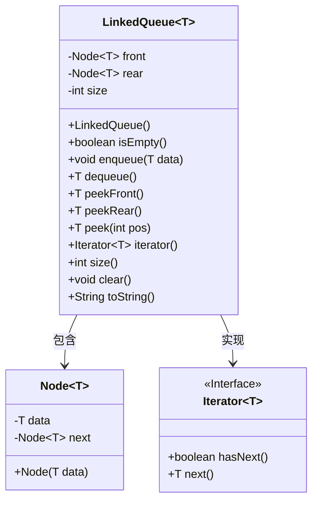

# 基础信息

|      |      |
|------|------|
| 名称 | LinkedQueue |
| 编码语言 | .java |
| 代码路径 | Java/src/main/java/com/thealgorithms/datastructures/queues/LinkedQueue.java |
| 包名 | com.thealgorithms.datastructures.queues |
| 依赖项 | ['java.util.Iterator', 'java.util.NoSuchElementException'] |
| 概述说明 | 实现了链表队列，支持入队、出队、查看首尾、遍历和清空操作。 |

# 说明

该内容描述了一个基于链表实现的队列数据结构，具备多种操作功能。具体包括入队操作，用于在队列尾部添加元素；出队操作，用于移除并返回队列头部的元素；查看队首和队尾元素的功能，分别返回队列的第一个和最后一个元素；遍历操作，用于依次访问队列中的所有元素；以及清空操作，用于移除队列中的所有元素，使其变为空队列。这些操作共同构成了一个完整的队列实现，适用于需要先进先出（FIFO）处理顺序的场景。

# 类列表 Class Summary

| 名称   | 类型  | 说明 |
|-------|------|-------------|
| LinkedQueue | class | 实现了一个基于链表的队列，支持入队、出队、查看队首队尾、遍历、清空等操作。 |

## 类 LinkedQueue

|      |      |
|------|------|
| 访问范围 | public |
| 类型 | class |
| 名称 | LinkedQueue |
| 说明 | 实现了一个基于链表的队列，支持入队、出队、查看队首队尾、遍历、清空等操作。 |

### UML类图

这段代码定义了一个泛型队列类 `LinkedQueue<T>`，它实现了 `Iterable<T>` 接口，允许对队列中的元素进行迭代。队列通过链表实现，内部使用 `Node<T>` 类来表示每个元素。`LinkedQueue` 提供了常见的队列操作，如入队、出队、查看队首和队尾元素、获取队列大小、清空队列等。此外，它还实现了 `toString` 方法，用于生成队列的字符串表示。`Iterator` 接口用于遍历队列中的元素。

### 内部方法调用关系图

```mermaid
graph TD
    A["类LinkedQueue<T>"]
    B["内部类Node<T>"]
    C["属性: T data"]
    D["属性: Node<T> next"]
    E["构造方法: Node(T data)"]
    F["属性: Node<T> front"]
    G["属性: Node<T> rear"]
    H["属性: int size"]
    I["构造方法: LinkedQueue()"]
    J["方法: boolean isEmpty()"]
    K["方法: void enqueue(T data)"]
    L["方法: T dequeue()"]
    M["方法: T peekFront()"]
    N["方法: T peekRear()"]
    O["方法: T peek(int pos)"]
    P["方法: Iterator<T> iterator()"]
    Q["方法: int size()"]
    R["方法: void clear()"]
    S["方法: String toString()"]

    A --> B
    B --> C
    B --> D
    B --> E
    A --> F
    A --> G
    A --> H
    A --> I
    A --> J
    A --> K
    A --> L
    A --> M
    A --> N
    A --> O
    A --> P
    A --> Q
    A --> R
    A --> S
```

该流程图展示了`LinkedQueue<T>`类及其内部类`Node<T>`的结构和功能。`LinkedQueue<T>`类实现了队列的基本操作，如入队、出队、查看队首和队尾元素、迭代等。内部类`Node<T>`用于表示队列中的每个元素，包含数据和指向下一个节点的引用。通过该流程图，可以清晰地看到类的各个方法和属性之间的关系，以及它们如何协同工作来实现队列的功能。

### 字段列表 Field List

| 名称  | 类型  | 说明 |
|-------|-------|------|
| size | int | 私有整型变量size。 |
| rear | Node<T> | 私有成员变量rear，类型为Node<T>。 |
| front | Node<T> | 类中定义了一个私有的Node类型变量front。 |

### 方法列表 Method List

| 名称  | 类型  | 说明 |
|-------|-------|------|
| iterator | Iterator<T> | 重写iterator方法，返回遍历链表的迭代器。 |
| size | int | 返回当前对象的元素数量。 |
| peekFront | T | 队列为空时抛出异常，否则返回队首元素数据。 |
| isEmpty | boolean | 判断集合是否为空，返回size是否为0。 |
| peekRear | T | 队列非空时返回尾部元素，否则抛出异常。 |
| toString | String | 重写toString方法，返回链表数据字符串表示。 |
| enqueue | void | 入队方法，拒绝空数据，更新前后节点，增加队列大小。 |
| dequeue | T | 队列出队操作，检查空队列异常，更新队首和大小，返回出队元素。 |
| clear | void | clear方法清空队列，重置头尾指针和大小为0。 |
| peek | T | peek方法检查位置有效性，返回链表中指定位置节点的数据。 |

