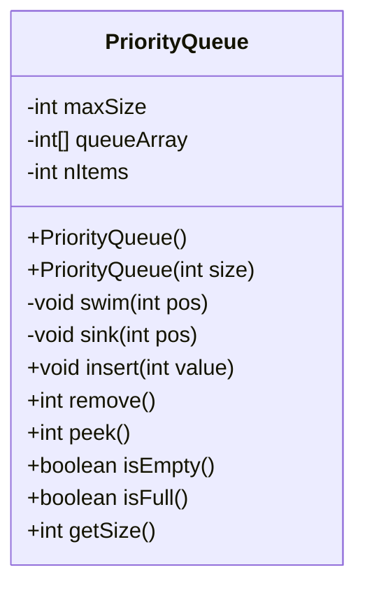
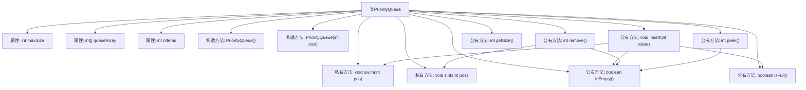

# 基础信息

|      |      |
|------|------|
| 名称 | PriorityQueues |
| 编码语言 | .java |
| 代码路径 | Java/src/main/java/com/thealgorithms/datastructures/queues/PriorityQueues.java |
| 包名 | com.thealgorithms.datastructures.queues |
| 依赖项 | [] |
| 概述说明 | PriorityQueue类实现最大堆，支持插入、删除、查看队首、检查空满及获取大小操作。 |

# 说明

PriorityQueue类实现了一个最大堆数据结构，支持多种操作。用户可以插入新元素，删除堆顶元素，查看当前堆顶元素，检查堆是否为空或已满，以及获取堆的当前大小。这些功能使得PriorityQueue类能够高效地管理和操作最大堆，适用于需要优先处理最大值的场景。

# 类列表 Class Summary

| 名称   | 类型  | 说明 |
|-------|------|-------------|
| PriorityQueue | class | PriorityQueue类实现最大堆，支持插入、删除、查看队首、检查空满及获取大小操作。 |

## 类 PriorityQueue

|      |      |
|------|------|
| 访问范围 | None |
| 类型 | class |
| 名称 | PriorityQueue |
| 说明 | PriorityQueue类实现最大堆，支持插入、删除、查看队首、检查空满及获取大小操作。 |

### UML类图

**描述：**  
`PriorityQueue` 类实现了一个基于最大堆的优先队列。它通过两个构造函数初始化队列，默认大小为11，或通过参数指定大小。类中的 `swim` 和 `sink` 方法用于维护堆的性质，`insert` 方法用于插入新元素，`remove` 方法用于移除并返回最大元素。`peek` 方法查看队列前端元素，`isEmpty` 和 `isFull` 方法分别检查队列是否为空或满，`getSize` 方法返回队列中的元素数量。

### 内部方法调用关系图

这段代码定义了一个基于最大堆的优先队列（PriorityQueue）类。类中包含两个构造函数，分别用于初始化默认大小和指定大小的队列。核心方法包括`insert`用于插入元素，`remove`用于移除最大元素，`peek`用于查看队首元素。辅助方法`swim`和`sink`用于维护堆的性质，确保插入和删除操作后堆仍然保持最大堆的结构。此外，类中还提供了`isEmpty`、`isFull`和`getSize`等方法用于检查队列状态。

### 字段列表 Field List

| 名称  | 类型  | 说明 |
|-------|-------|------|
| maxSize | int | 定义私有整型变量maxSize。 |
| nItems | int | 定义私有整型变量nItems。 |
| queueArray | int[] | 声明一个私有整型数组变量queueArray。 |

### 方法列表 Method List

| 名称  | 类型  | 说明 |
|-------|-------|------|
| isFull | boolean | 该方法检查项目数是否等于最大容量减一。 |
| peek | int | peek方法返回队列数组的第二个元素。 |
| insert | void | 插入元素时检查队列是否满，满则抛出异常，否则插入并调整位置。 |
| getSize | int | 该方法返回当前项目数量。 |
| isEmpty | boolean | isEmpty方法检查nItems是否为0，返回布尔值。 |
| sink | void | 下沉操作：比较父子节点，若父节点较小则交换位置，直至父节点大于子节点。 |
| remove | int | 移除队列最大元素，若空则抛异常，否则交换并置零，下沉调整后返回最大值。 |
| swim | void | 方法swim用于调整堆中节点位置，确保子节点不大于父节点。 |

