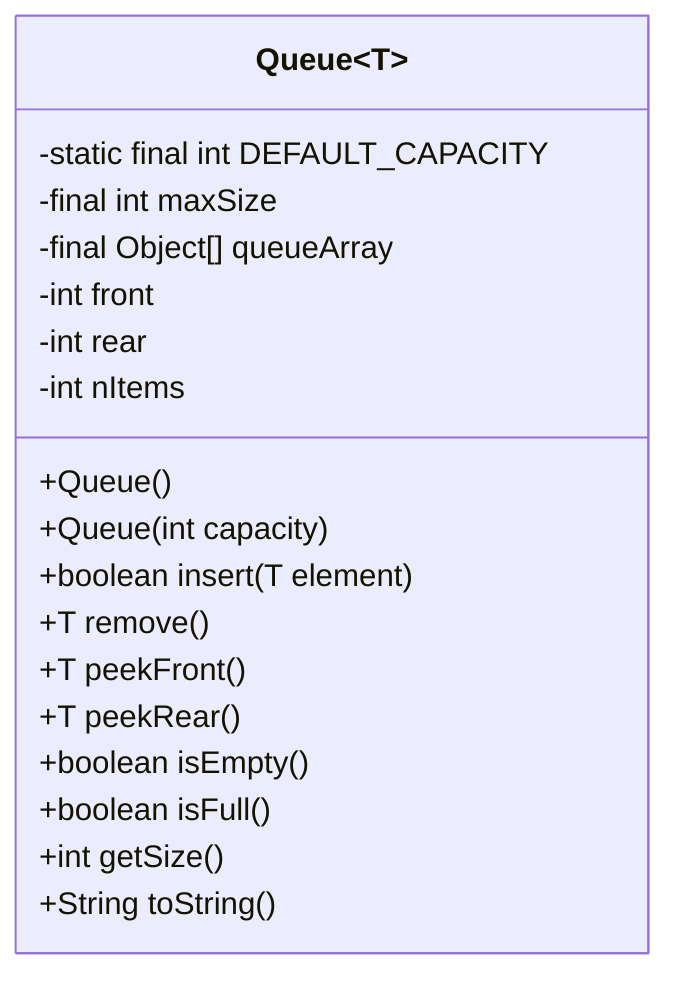
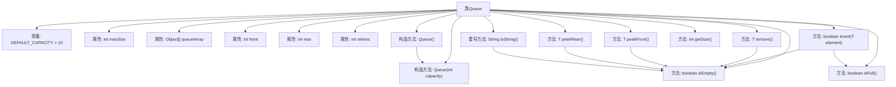

# 基础信息

|      |      |
|------|------|
| 名称 | Queue |
| 编码语言 | .java |
| 代码路径 | Java/src/main/java/com/thealgorithms/datastructures/queues/Queue.java |
| 包名 | com.thealgorithms.datastructures.queues |
| 依赖项 | [] |
| 概述说明 | 队列类支持插入、移除、查看前后元素、判断空满、获取大小及字符串表示。 |

# 说明

队列类提供了一系列基本操作功能，包括在队列中插入元素、移除元素、查看队列的前后元素、判断队列是否为空或已满、获取队列的当前大小以及将队列内容转换为字符串表示。这些功能使得队列类能够有效地管理和操作数据，适用于各种需要先进先出处理逻辑的场景。

# 类列表 Class Summary

| 名称   | 类型  | 说明 |
|-------|------|-------------|
| Queue | class | 队列类，支持插入、移除、查看前后元素，判断空满，获取大小及字符串表示。 |

## 类 Queue

|      |      |
|------|------|
| 访问范围 | public final |
| 类型 | class |
| 名称 | Queue |
| 说明 | 队列类，支持插入、移除、查看前后元素，判断空满，获取大小及字符串表示。 |

### UML类图

**描述：**  
`Queue<T>` 类实现了一个泛型队列数据结构，支持插入、删除、查看队首和队尾元素等操作。队列内部使用循环数组实现，避免了频繁的内存分配和释放。类中包含两个构造函数，分别用于初始化默认容量和指定容量的队列。队列提供了检查是否为空、是否已满、获取当前元素数量等功能，并通过 `toString` 方法生成队列的字符串表示。该类设计合理，能够有效处理队列的常见操作，并具备良好的可扩展性。

### 内部方法调用关系图

这段代码定义了一个泛型队列类 `Queue<T>`，实现了队列的基本操作，如插入、移除、查看队首和队尾元素，以及检查队列是否为空或已满。代码通过数组实现队列，并使用模运算处理循环队列的边界情况。流程图展示了类的结构和各个方法之间的调用关系，帮助理解队列的内部工作原理。

### 字段列表 Field List

| 名称  | 类型  | 说明 |
|-------|-------|------|
| queueArray | Object[] | 私有最终对象数组队列。 |
| rear | int | 定义了一个私有的整型变量rear。 |
| front | int | 私有整型变量front声明。 |
| maxSize | int | 私有整型变量maxSize，表示最大容量。 |
| DEFAULT_CAPACITY = 10 | int | 定义了默认容量为10的静态常量。 |
| nItems | int | 私有整型变量nItems用于存储项目数量。 |

### 方法列表 Method List

| 名称  | 类型  | 说明 |
|-------|-------|------|
| getSize | int | 获取当前项目数量。 |
| peekRear | T | 队列空时抛出异常，否则返回队尾元素。 |
| isEmpty | boolean | 检查集合是否为空，返回布尔值。 |
| peekFront | T | 该方法检查队列是否为空，若为空则抛出异常，否则返回队列前端元素。 |
| remove | T | 队列移除元素方法，检查空队列，返回移除元素并更新队列状态。 |
| toString | String | 重写toString方法，返回队列元素的字符串表示，格式为方括号内逗号分隔。 |
| insert | boolean | 队列插入元素，若满返回假，否则更新尾指针并存储元素。 |
| isFull | boolean | 检查项目数是否达到最大容量。 |

