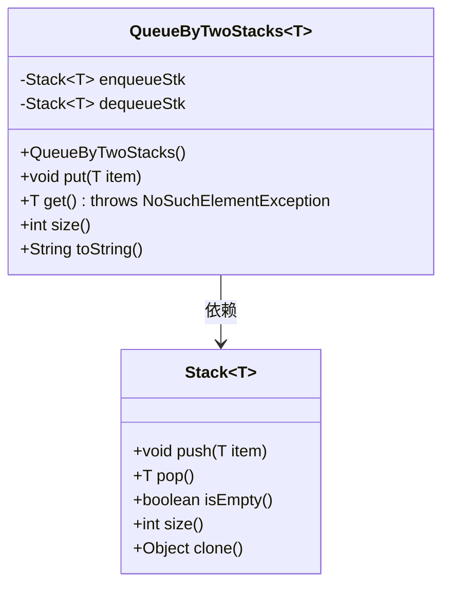
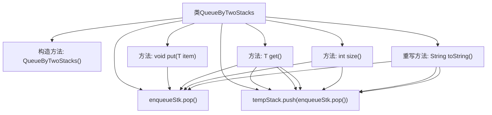

# 基础信息

|      |      |
|------|------|
| 名称 | QueueByTwoStacks |
| 编码语言 | .java |
| 代码路径 | Java/src/main/java/com/thealgorithms/datastructures/queues/QueueByTwoStacks.java |
| 包名 | com.thealgorithms.datastructures.queues |
| 依赖项 | ['java.util.NoSuchElementException', 'java.util.Stack'] |
| 概述说明 | 双栈实现队列，支持入队、出队、大小和字符串表示。 |

# 说明

双栈实现队列是一种利用两个栈结构来模拟队列操作的方法。该实现支持基本的队列操作，包括入队、出队、获取队列大小以及将队列内容转换为字符串表示。通过两个栈的协同工作，入队操作将元素压入第一个栈，而出队操作则通过将第一个栈的元素转移到第二个栈后再弹出，确保队列的先进先出特性。这种方法有效地利用了栈的特性，实现了队列的功能，同时提供了获取队列大小和字符串表示的功能，便于调试和查看队列状态。

# 类列表 Class Summary

| 名称   | 类型  | 说明 |
|-------|------|-------------|
| QueueByTwoStacks | class | 双栈实现队列，支持入队、出队、大小和字符串表示。 |

## 类 QueueByTwoStacks

|      |      |
|------|------|
| 访问范围 | public |
| 类型 | class |
| 名称 | QueueByTwoStacks |
| 说明 | 双栈实现队列，支持入队、出队、大小和字符串表示。 |

### UML类图

这段代码定义了一个使用两个栈实现的队列类 `QueueByTwoStacks`，它通过 `enqueueStk` 和 `dequeueStk` 两个栈来模拟队列的 FIFO（先进先出）行为。`put` 方法将元素压入 `enqueueStk`，而 `get` 方法在 `dequeueStk` 为空时将 `enqueueStk` 的元素转移到 `dequeueStk` 并弹出栈顶元素。`size` 方法返回队列中元素的总数，`toString` 方法生成队列的字符串表示。

### 内部方法调用关系图

这段代码实现了一个使用两个栈来模拟队列的类。`enqueueStk`用于入队操作，`dequeueStk`用于出队操作。当`dequeueStk`为空时，`get`方法会将`enqueueStk`中的所有元素转移到`dequeueStk`中，以保持队列的FIFO顺序。`size`方法返回队列中元素的总数，`toString`方法返回队列的字符串表示。

### 字段列表 Field List

| 名称  | 类型  | 说明 |
|-------|-------|------|
| enqueueStk | Stack<T> | 私有栈用于存储入队元素。 |
| dequeueStk | Stack<T> | 私有栈用于出队操作。 |

### 方法列表 Method List

| 名称  | 类型  | 说明 |
|-------|-------|------|
| put | void | 将元素压入入队栈。 |
| size | int | 该方法返回两个栈大小之和。 |
| toString | String | 重写toString方法，克隆出队栈，将入队栈元素压入，返回队列字符串表示。 |
| get | T | 方法检查并处理栈，若为空则抛出异常，返回出栈元素。 |

