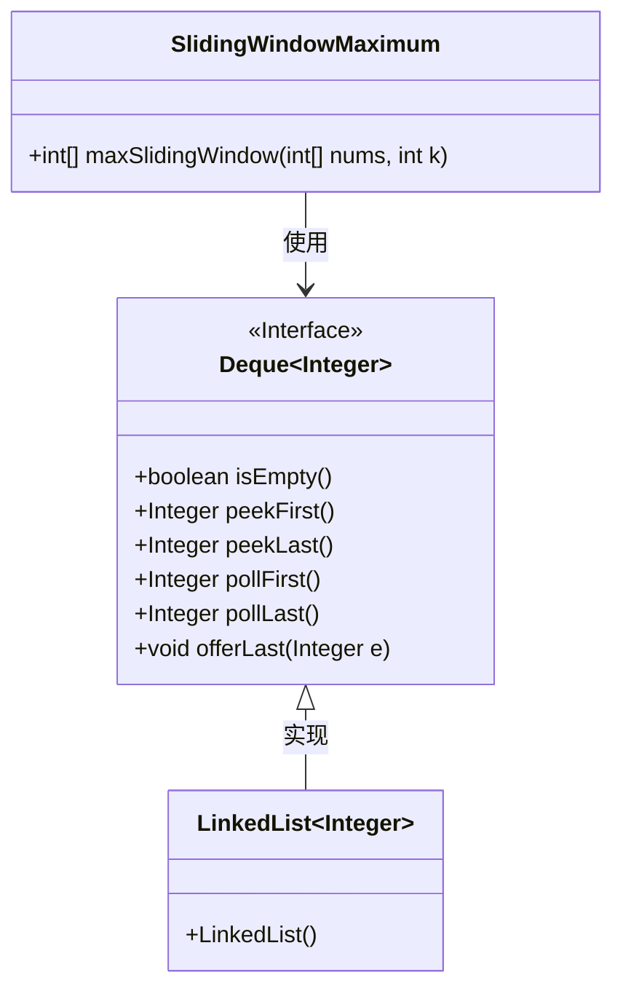
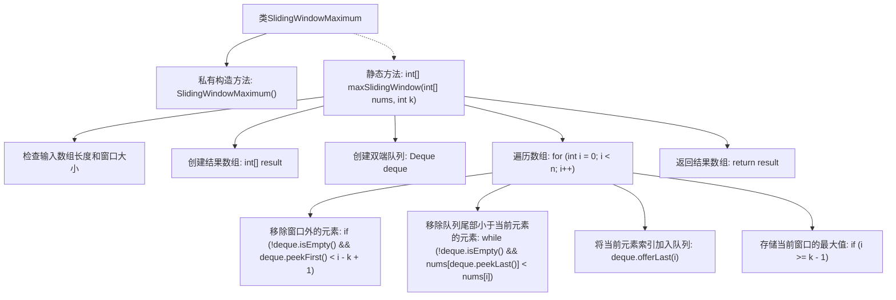

# 基础信息

|      |      |
|------|------|
| 名称 | SlidingWindowMaximum |
| 编码语言 | .java |
| 代码路径 | Java/src/main/java/com/thealgorithms/datastructures/queues/SlidingWindowMaximum.java |
| 包名 | com.thealgorithms.datastructures.queues |
| 依赖项 | ['java.util.Deque', 'java.util.LinkedList'] |
| 概述说明 | SlidingWindowMaximum类计算滑动窗口最大值并返回结果数组。 |

# 说明

SlidingWindowMaximum类用于实现滑动窗口最大值计算功能。该类的主要作用是通过滑动窗口的方式，遍历给定数组，计算每个窗口内的最大值，并将这些最大值按顺序存储在一个数组中返回。该方法适用于需要在固定大小的滑动窗口内快速找到最大值的场景，提高了计算效率。

# 类列表 Class Summary

| 名称   | 类型  | 说明 |
|-------|------|-------------|
| SlidingWindowMaximum | class | SlidingWindowMaximum类实现滑动窗口最大值计算，返回每个窗口的最大值数组。 |

## 类 SlidingWindowMaximum

|      |      |
|------|------|
| 访问范围 | public final |
| 类型 | class |
| 名称 | SlidingWindowMaximum |
| 说明 | SlidingWindowMaximum类实现滑动窗口最大值计算，返回每个窗口的最大值数组。 |

### UML类图

这段代码定义了一个名为 `SlidingWindowMaximum` 的类，其中包含一个静态方法 `maxSlidingWindow`，用于计算滑动窗口的最大值。该方法接受一个整数数组 `nums` 和窗口大小 `k`，并返回每个窗口的最大值组成的数组。代码中使用了 `Deque` 接口及其实现类 `LinkedList` 来维护窗口内的元素索引，确保在每次滑动窗口时能够高效地获取最大值。`Deque` 接口定义了队列的基本操作，如 `peekFirst`、`pollFirst` 等，而 `LinkedList` 则是 `Deque` 的具体实现类。

### 内部方法调用关系图

这段代码实现了一个滑动窗口最大值算法。通过使用双端队列（Deque）来维护当前窗口中的最大元素，并在遍历数组时动态更新队列中的元素。代码首先检查输入数组的长度和窗口大小，然后遍历数组，移除窗口外的元素和队列尾部小于当前元素的元素，最后将当前元素索引加入队列并存储当前窗口的最大值。最终返回包含每个窗口最大值的数组。

### 字段列表 Field List

| 名称  | 类型  | 说明 |
|-------|-------|------|

### 方法列表 Method List

| 名称  | 类型  | 说明 |
|-------|-------|------|
| maxSlidingWindow | int[] | 滑动窗口最大值算法，使用双端队列维护窗口内最大值索引。 |

