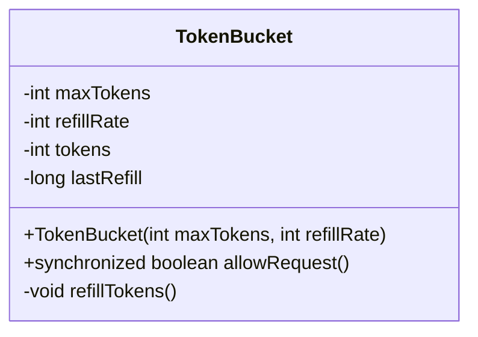
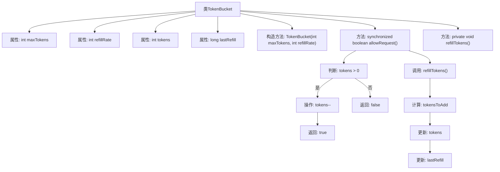

# 基础信息

|      |      |
|------|------|
| 名称 | TokenBucket |
| 编码语言 | .java |
| 代码路径 | Java/src/main/java/com/thealgorithms/datastructures/queues/TokenBucket.java |
| 包名 | com.thealgorithms.datastructures.queues |
| 依赖项 | ['java.util.concurrent.TimeUnit'] |
| 概述说明 | TokenBucket类实现令牌桶算法，用于请求限流。 |

# 说明

TokenBucket类实现了令牌桶算法，主要用于请求限流。该算法通过维护一个固定容量的令牌桶，按照一定速率向桶中添加令牌，当请求到达时，若桶中有足够令牌则允许请求通过并消耗相应令牌，否则拒绝请求，从而有效控制请求速率，避免系统过载。

# 类列表 Class Summary

| 名称   | 类型  | 说明 |
|-------|------|-------------|
| TokenBucket | class | TokenBucket类实现令牌桶算法，用于请求限流。 |

## 类 TokenBucket

|      |      |
|------|------|
| 访问范围 | public final |
| 类型 | class |
| 名称 | TokenBucket |
| 说明 | TokenBucket类实现令牌桶算法，用于请求限流。 |

### UML类图

**描述：**
`TokenBucket` 类实现了一个令牌桶算法，用于控制请求的速率。它通过维护一个最大令牌数 (`maxTokens`) 和令牌的补充速率 (`refillRate`) 来管理令牌的生成和消耗。`allowRequest` 方法用于检查是否允许请求，如果令牌可用则允许请求并减少令牌数量；否则拒绝请求。`refillTokens` 方法根据时间差和补充速率来更新令牌数量，确保令牌数量不超过最大值。

### 内部方法调用关系图

这段代码实现了一个令牌桶算法，用于控制请求的速率。`TokenBucket`类包含最大令牌数、令牌补充速率、当前令牌数和上次补充时间等属性。`allowRequest`方法用于判断是否允许请求，并在允许时减少令牌数。`refillTokens`方法根据时间间隔和补充速率更新令牌数，确保不超过最大令牌数。流程图展示了类的结构和方法之间的调用关系。

### 字段列表 Field List

| 名称  | 类型  | 说明 |
|-------|-------|------|
| maxTokens | int | 私有整型变量maxTokens用于存储最大令牌数。 |
| tokens | int | 私有整型变量tokens。 |
| refillRate | int | 私有整型变量refillRate，用于存储补充速率。 |
| lastRefill | long | 记录最后一次填充时间的私有长整型变量。 |

### 方法列表 Method List

| 名称  | 类型  | 说明 |
|-------|-------|------|
| allowRequest | boolean | 同步方法检查并允许请求，消耗令牌。 |
| refillTokens | void | 该方法用于更新令牌数量，基于时间差和补充速率计算新增令牌数，确保不超过最大限制。 |

