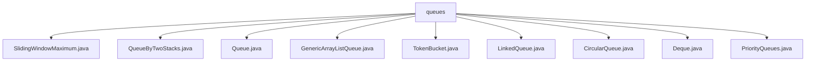

# 基础信息

|      |      |
|------|------|
| 名称 | queues |
| 编码语言 | .java |
| 代码路径 | Java/src/main/java/com/thealgorithms/datastructures/queues |
| 包名 | Java.src.main.java.com.thealgorithms.datastructures.queues |
| 概述说明 | 多个队列相关类实现，涵盖滑动窗口、双栈队列、泛型队列、令牌桶、链表队列、循环队列、双向队列和最大堆等功能。 |

# 说明

## 概述
该代码模块主要实现了多种队列相关的数据结构及其操作，涵盖了从基础队列到高级队列（如优先队列、循环队列、双向队列等）的多种实现方式。此外，还包含了一些与队列相关的算法实现，如滑动窗口最大值计算和令牌桶限流算法。这些实现提供了灵活且高效的数据管理方式，适用于各种需要先进先出（FIFO）或优先处理逻辑的场景。

## 主要业务场景
1. **滑动窗口最大值计算**：适用于需要在固定大小的滑动窗口内快速找到最大值的场景，如数据流分析、时间序列数据处理等。
2. **队列操作**：适用于需要先进先出（FIFO）处理逻辑的场景，如任务调度、消息队列、事件处理等。
3. **双栈实现队列**：利用两个栈模拟队列操作，适用于需要队列功能但底层实现受限的场景。
4. **泛型队列**：支持处理各种类型的数据，适用于需要灵活数据管理的场景。
5. **令牌桶限流**：用于请求限流，控制请求速率，避免系统过载，适用于API限流、流量控制等场景。
6. **链表队列**：基于链表实现的队列，适用于需要频繁插入和删除操作的场景。
7. **循环队列**：利用固定大小的数组模拟队列，避免空间浪费，适用于内存受限的场景。
8. **双向队列**：支持在头部和尾部进行添加、删除及查看元素操作，适用于需要频繁在两端进行操作的场景。
9. **优先队列**：实现最大堆数据结构，适用于需要优先处理最大值的场景，如任务优先级调度、事件处理等。

这些实现共同构成了一个完整的队列相关数据结构与算法的集合，能够满足不同业务场景的需求。

### 包内部结构视图

该流程图展示了`queues`文件夹下的所有Java文件。`queues`作为根节点，直接包含了多个队列相关的实现文件，如`SlidingWindowMaximum.java`、`QueueByTwoStacks.java`等。每个文件都代表了不同的队列数据结构或算法实现，清晰地展示了`queues`文件夹中的内容结构。

# 文件列表 File List

| 名称   | 类型  | 说明 |
|-------|------|-------------|
| [Queue.java](Queue.md) | file | 队列类支持插入、移除、查看前后元素、判断空满、获取大小及字符串表示。 |
| [LinkedQueue.java](LinkedQueue.md) | file | 实现了链表队列，支持入队、出队、查看首尾、遍历和清空操作。 |
| [PriorityQueues.java](PriorityQueues.md) | file | PriorityQueue类实现最大堆，支持插入、删除、查看队首、检查空满及获取大小操作。 |
| [Deque.java](Deque.md) | file | 实现双向队列，支持头尾增删查操作。 |
| [CircularQueue.java](CircularQueue.md) | file | 实现循环队列，支持入队、出队、查看队首、删除及判断空满操作。 |
| [TokenBucket.java](TokenBucket.md) | file | TokenBucket类实现令牌桶算法，用于请求限流。 |
| [GenericArrayListQueue.java](GenericArrayListQueue.md) | file | 泛型队列类，基于ArrayList实现，支持增删查及空检查。 |
| [QueueByTwoStacks.java](QueueByTwoStacks.md) | file | 双栈实现队列，支持入队、出队、大小和字符串表示。 |
| [SlidingWindowMaximum.java](SlidingWindowMaximum.md) | file | SlidingWindowMaximum类计算滑动窗口最大值并返回结果数组。 |

