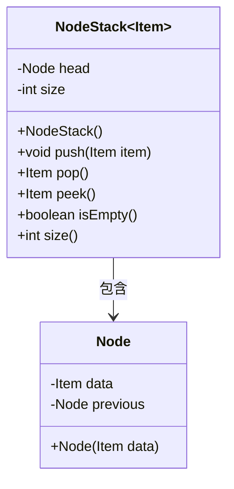
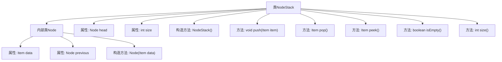

# 基础信息

|      |      |
|------|------|
| 名称 | NodeStack |
| 编码语言 | .java |
| 代码路径 | Java/src/main/java/com/thealgorithms/datastructures/stacks/NodeStack.java |
| 包名 | com.thealgorithms.datastructures.stacks |
| 依赖项 | [] |
| 概述说明 | NodeStack类实现链表栈，支持push、pop、peek、isEmpty和size操作。 |

# 说明

NodeStack类是一个基于链表实现的栈数据结构，提供了五种主要操作。push操作用于将元素添加到栈顶，pop操作用于移除并返回栈顶元素，peek操作用于查看栈顶元素而不移除它，isEmpty操作用于检查栈是否为空，size操作用于返回栈中元素的数量。这些操作共同实现了栈的基本功能，确保数据按照后进先出的原则进行管理。

# 类列表 Class Summary

| 名称   | 类型  | 说明 |
|-------|------|-------------|
| NodeStack | class | NodeStack类实现了一个基于链表的栈，支持push、pop、peek、isEmpty和size操作。 |

## 类 NodeStack

|      |      |
|------|------|
| 访问范围 | public |
| 类型 | class |
| 名称 | NodeStack |
| 说明 | NodeStack类实现了一个基于链表的栈，支持push、pop、peek、isEmpty和size操作。 |

### UML类图

类图描述：  
`NodeStack` 是一个泛型类，用于实现栈数据结构。它包含一个内部类 `Node`，用于表示栈中的每个元素。`NodeStack` 提供了常见的栈操作，如 `push`、`pop`、`peek`、`isEmpty` 和 `size`。`Node` 类用于存储栈中的数据，并通过 `previous` 属性链接到前一个节点。`NodeStack` 通过 `head` 属性指向栈顶节点，并通过 `size` 属性记录栈中元素的数量。

### 内部方法调用关系图

这段代码实现了一个基于链表的栈数据结构 `NodeStack<Item>`。栈的每个元素由一个内部类 `Node` 表示，包含数据和指向前一个节点的引用。`NodeStack` 类提供了常见的栈操作，如 `push`、`pop`、`peek`、`isEmpty` 和 `size`。`push` 方法将元素压入栈顶，`pop` 方法移除并返回栈顶元素，`peek` 方法返回栈顶元素但不移除，`isEmpty` 方法检查栈是否为空，`size` 方法返回栈中元素的数量。

### 字段列表 Field List

| 名称  | 类型  | 说明 |
|-------|-------|------|
| head | Node | 类中包含一个名为head的私有Node类型变量。 |
| size | int | 定义了一个私有的整型变量size。 |

### 方法列表 Method List

| 名称  | 类型  | 说明 |
|-------|-------|------|
| push | void | 实现链表头部插入新节点并更新大小。 |
| size | int | 该方法返回当前对象的size属性值。 |
| pop | Item | 弹出栈顶元素，若栈为空则抛出异常。 |
| isEmpty | boolean | 该方法检查链表是否为空，返回头节点是否为null。 |
| peek | Item | peek方法检查栈是否为空，若空则抛异常，否则返回栈顶元素数据。 |

