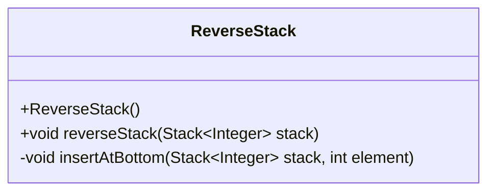
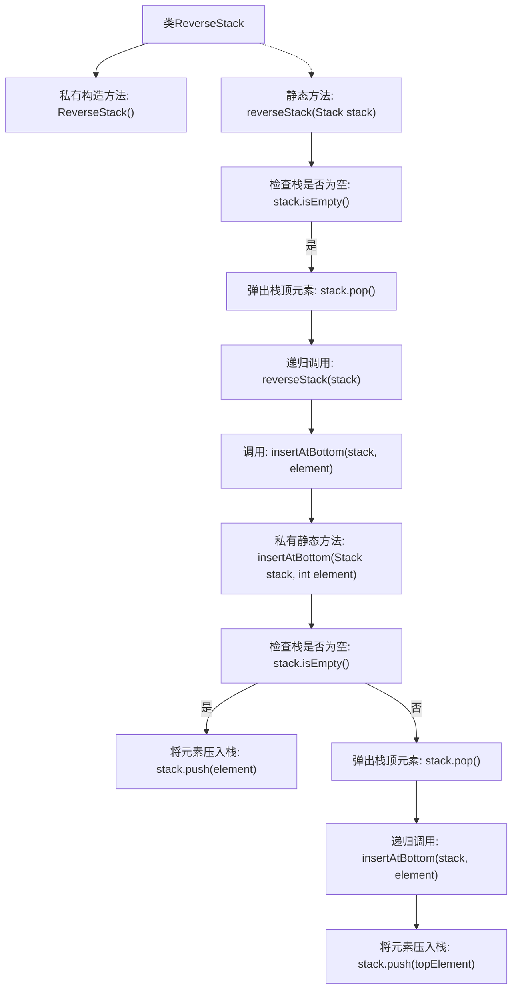

# 基础信息

|      |      |
|------|------|
| 名称 | ReverseStack |
| 编码语言 | .java |
| 代码路径 | Java/src/main/java/com/thealgorithms/datastructures/stacks/ReverseStack.java |
| 包名 | com.thealgorithms.datastructures.stacks |
| 依赖项 | ['java.util.Stack'] |
| 概述说明 | 递归反转栈顺序，辅助方法将元素插入栈底。 |

# 说明

该方法通过递归方式反转栈中元素的顺序。主要思路是利用一个辅助方法，将栈顶元素逐个取出并插入到栈底，从而实现整个栈的反转。递归过程不断将栈顶元素移除并暂存，直到栈为空，然后再将这些元素依次插入到栈底，最终完成反转。这种方法避免了使用额外的数据结构，直接在原栈上进行操作，确保了空间效率。

# 类列表 Class Summary

| 名称   | 类型  | 说明 |
|-------|------|-------------|
| ReverseStack | class | 使用递归反转栈元素顺序，辅助方法将元素插入栈底。 |

## 类 ReverseStack

|      |      |
|------|------|
| 访问范围 | public final |
| 类型 | class |
| 名称 | ReverseStack |
| 说明 | 使用递归反转栈元素顺序，辅助方法将元素插入栈底。 |

### UML类图

这段代码定义了一个 `ReverseStack` 类，包含一个公有的 `reverseStack` 方法和一个私有的 `insertAtBottom` 方法。`reverseStack` 方法用于递归地反转栈中的元素顺序，而 `insertAtBottom` 方法则是一个辅助方法，用于将元素插入到栈的底部。这两个方法都依赖于 `Stack` 类来操作栈中的元素。`ReverseStack` 类的构造函数是私有的，意味着该类不能被实例化，所有方法都是静态的，可以直接通过类名调用。

### 内部方法调用关系图

这段代码定义了一个名为 `ReverseStack` 的类，其中包含两个静态方法：`reverseStack` 和 `insertAtBottom`。`reverseStack` 方法用于递归地反转栈中的元素顺序，而 `insertAtBottom` 方法则用于将元素插入栈的底部。流程图展示了这两个方法的调用顺序和条件判断，清晰地描述了栈反转和元素插入的递归过程。

### 字段列表 Field List

| 名称  | 类型  | 说明 |
|-------|-------|------|

### 方法列表 Method List

| 名称  | 类型  | 说明 |
|-------|-------|------|
| insertAtBottom | void | 递归方法将元素插入栈底。 |
| reverseStack | void | 递归反转栈元素，底部插入。 |

