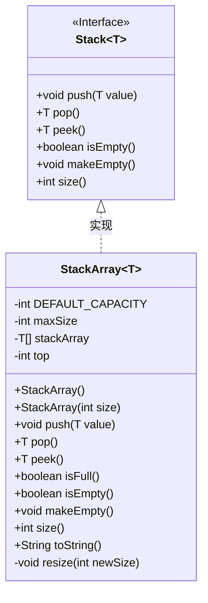
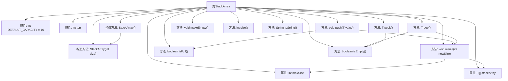

# 基础信息

|      |      |
|------|------|
| 名称 | StackArray |
| 编码语言 | .java |
| 代码路径 | Java/src/main/java/com/thealgorithms/datastructures/stacks/StackArray.java |
| 包名 | com.thealgorithms.datastructures.stacks |
| 依赖项 | [] |
| 概述说明 | 实现动态扩容缩容的栈，支持入栈、出栈、查看栈顶、判空和清空操作。 |

# 说明

实现栈数据结构，支持动态扩容与缩容，包含入栈、出栈、查看栈顶、判空、清空等功能。栈是一种后进先出的数据结构，动态扩容与缩容机制确保栈在元素数量变化时能够灵活调整存储空间，避免资源浪费。入栈操作将元素添加到栈顶，出栈操作移除并返回栈顶元素。查看栈顶操作返回栈顶元素但不移除。判空操作检查栈是否为空，清空操作移除所有元素，恢复栈的初始状态。这些功能共同提供了完整且高效的栈操作支持。

# 类列表 Class Summary

| 名称   | 类型  | 说明 |
|-------|------|-------------|
| StackArray | class | 实现栈数据结构，支持动态扩容与缩容，包含入栈、出栈、查看栈顶、判空、清空等功能。 |

## 类 StackArray

|      |      |
|------|------|
| 访问范围 | public |
| 类型 | class |
| 名称 | StackArray |
| 说明 | 实现栈数据结构，支持动态扩容与缩容，包含入栈、出栈、查看栈顶、判空、清空等功能。 |

### UML类图

**描述：**  
`StackArray` 是一个基于数组实现的泛型栈类，实现了 `Stack` 接口。它提供了栈的基本操作，如 `push`、`pop`、`peek`、`isEmpty`、`makeEmpty` 和 `size`。`StackArray` 在栈满时会自动扩容，在栈元素减少到一定程度时会自动缩容，以确保内存的高效使用。该类还提供了 `toString` 方法用于获取栈的字符串表示。`Stack` 接口定义了栈的基本操作，`StackArray` 通过实现该接口提供了具体的功能。

### 内部方法调用关系图

这段代码实现了一个基于数组的栈数据结构 `StackArray<T>`，支持泛型。栈的主要操作包括压入 (`push`)、弹出 (`pop`)、查看栈顶元素 (`peek`)、检查栈是否为空 (`isEmpty`) 或满 (`isFull`)、清空栈 (`makeEmpty`)、获取栈的大小 (`size`) 以及将栈转换为字符串 (`toString`)。栈的容量可以动态调整，当栈满时会自动扩容，当栈的元素数量低于容量的四分之一时会自动缩容，但不会低于默认容量。

### 字段列表 Field List

| 名称  | 类型  | 说明 |
|-------|-------|------|
| DEFAULT_CAPACITY = 10 | int | 定义私有静态常量DEFAULT_CAPACITY，默认值为10。 |
| top | int | 定义私有整型变量top。 |
| stackArray | T[] | 私有数组变量stackArray，类型为泛型T。 |
| maxSize | int | 定义私有整型变量maxSize。 |

### 方法列表 Method List

| 名称  | 类型  | 说明 |
|-------|-------|------|
| size | int | 重写size方法，返回栈顶索引加一。 |
| isFull | boolean | 检查栈是否已满，返回布尔值。 |
| isEmpty | boolean | isEmpty方法检查栈顶是否为-1，判断栈是否为空。 |
| pop | T | 栈弹出元素，若空则抛异常，否则返回并调整大小。 |
| push | void | 方法push在栈满时扩容并将值压入栈顶。 |
| makeEmpty | void | 重写makeEmpty方法，将top设为-1以清空栈。 |
| peek | T | 方法peek检查栈是否为空，若空则抛异常，否则返回栈顶元素。 |
| toString | String | 重写toString方法，输出栈数组内容。 |
| resize | void | 方法resize调整栈大小，复制原数组到新数组，更新栈数组和最大大小。 |

