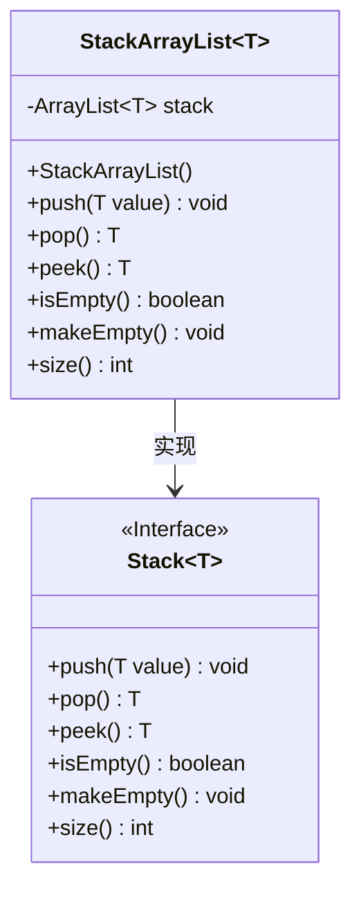
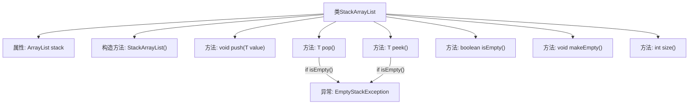

# 基础信息

|      |      |
|------|------|
| 名称 | StackArrayList |
| 编码语言 | .java |
| 代码路径 | Java/src/main/java/com/thealgorithms/datastructures/stacks/StackArrayList.java |
| 包名 | com.thealgorithms.datastructures.stacks |
| 依赖项 | ['java.util.ArrayList', 'java.util.EmptyStackException'] |
| 概述说明 | 基于ArrayList实现栈，支持入栈、出栈、查看栈顶、判空、清空和获取大小功能。 |

# 说明

基于ArrayList实现的栈数据结构，提供了入栈、出栈、查看栈顶元素、判断栈是否为空、清空栈以及获取栈大小等核心操作。这种实现方式利用ArrayList的动态数组特性，确保栈的基本功能高效且易于管理。入栈操作将元素添加到列表末尾，出栈操作移除并返回末尾元素，查看栈顶元素则返回列表最后一个元素。判空操作检查列表是否为空，清空操作移除所有元素，获取大小操作返回列表当前元素数量。这种实现简洁且功能全面，适用于需要栈结构的各种场景。

# 类列表 Class Summary

| 名称   | 类型  | 说明 |
|-------|------|-------------|
| StackArrayList | class | 基于ArrayList实现栈，支持入栈、出栈、查看栈顶、判空、清空和获取大小操作。 |

## 类 StackArrayList

|      |      |
|------|------|
| 访问范围 | public |
| 类型 | class |
| 名称 | StackArrayList |
| 说明 | 基于ArrayList实现栈，支持入栈、出栈、查看栈顶、判空、清空和获取大小操作。 |

### UML类图

这段代码定义了一个泛型类 `StackArrayList<T>`，它实现了 `Stack<T>` 接口。`StackArrayList` 使用 `ArrayList` 作为底层数据结构来存储栈中的元素。类中提供了常见的栈操作方法，如 `push`、`pop`、`peek`、`isEmpty`、`makeEmpty` 和 `size`。`pop` 和 `peek` 方法在栈为空时会抛出 `EmptyStackException` 异常。`makeEmpty` 方法用于清空栈，`size` 方法返回栈中元素的数量。这个实现展示了如何使用 `ArrayList` 来实现栈的基本功能。

### 内部方法调用关系图

这段代码定义了一个基于ArrayList的栈实现类`StackArrayList<T>`，它实现了`Stack<T>`接口。类中包含了对栈的基本操作，如`push`、`pop`、`peek`、`isEmpty`、`makeEmpty`和`size`。其中，`pop`和`peek`方法在栈为空时会抛出`EmptyStackException`异常。流程图清晰地展示了类的结构及其方法之间的关系，突出了异常处理的条件分支。

### 字段列表 Field List

| 名称  | 类型  | 说明 |
|-------|-------|------|
| stack | ArrayList<T> | 私有成员变量，类型为ArrayList<T>，命名为stack。 |

### 方法列表 Method List

| 名称  | 类型  | 说明 |
|-------|-------|------|
| push | void | 重写push方法，将值加入栈中。 |
| size | int | 重写size方法，返回栈的大小。 |
| isEmpty | boolean | 重写isEmpty方法，检查栈是否为空。 |
| makeEmpty | void | 重写makeEmpty方法，清空栈内所有元素。 |
| pop | T | 重写pop方法，若栈为空则抛出异常，否则移除并返回栈顶元素。 |
| peek | T | 重写peek方法，检查栈空抛出异常，否则返回栈顶元素。 |

