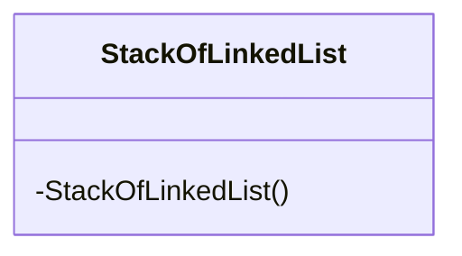
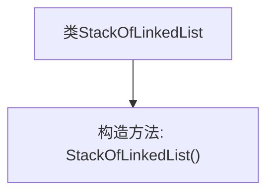
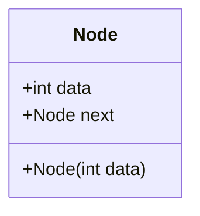
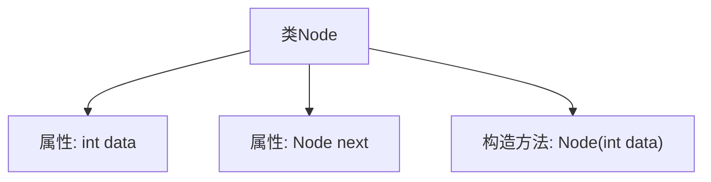
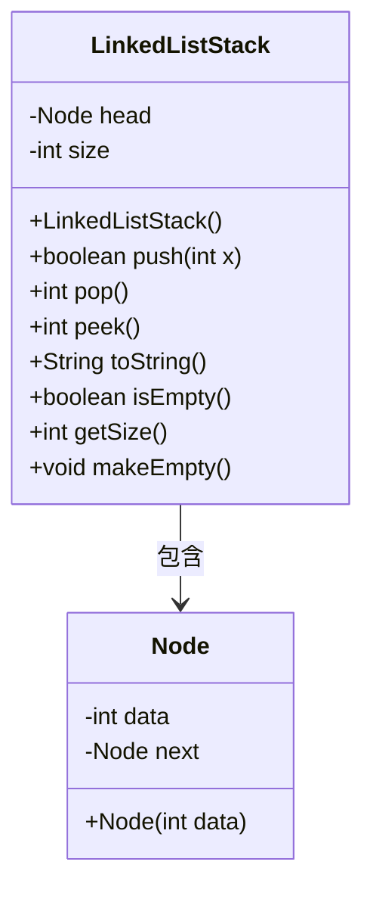
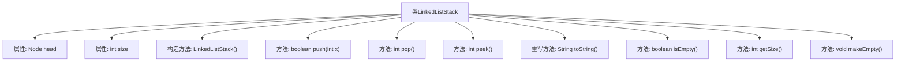

# 基础信息

|      |      |
|------|------|
| 名称 | StackOfLinkedList |
| 编码语言 | .java |
| 代码路径 | Java/src/main/java/com/thealgorithms/datastructures/stacks/StackOfLinkedList.java |
| 包名 | com.thealgorithms.datastructures.stacks |
| 依赖项 | ['java.util.NoSuchElementException'] |
| 概述说明 | StackOfLinkedList类私有构造，Node类含数据和指针，链表栈支持多种操作。 |

# 说明

StackOfLinkedList类采用私有构造函数，防止外部实例化。Node类包含数据成员和指向下一个节点的指针。该链表实现的栈支持多种操作，包括入栈、出栈、查看栈顶元素、判断栈是否为空、获取栈的大小以及清空栈。这些功能确保了栈的基本操作需求得到满足。

# 类列表 Class Summary

| 名称   | 类型  | 说明 |
|-------|------|-------------|
| StackOfLinkedList | class | StackOfLinkedList类为私有构造函数，禁止外部实例化。 |
| Node | class | Node类包含数据和指向下一个节点的指针。 |
| LinkedListStack | class | 链表实现的栈，支持入栈、出栈、查看栈顶、判断空栈、获取大小和清空操作。 |

## 类 StackOfLinkedList

|      |      |
|------|------|
| 访问范围 | final |
| 类型 | class |
| 名称 | StackOfLinkedList |
| 说明 | StackOfLinkedList类为私有构造函数，禁止外部实例化。 |

### UML类图

这段代码定义了一个名为 `StackOfLinkedList` 的最终类，该类包含一个私有的构造函数。由于构造函数是私有的，这意味着该类不能被外部实例化，通常用于实现单例模式或工具类，确保类的实例化控制权在类内部。这种设计模式常用于提供静态方法或工具类，防止外部代码创建不必要的实例。

### 内部方法调用关系图

这段代码定义了一个名为 `StackOfLinkedList` 的 final 类，该类包含一个私有的构造方法。由于构造方法是私有的，外部无法直接实例化该类，通常用于实现单例模式或工具类。代码结构简单，仅包含一个类的定义和一个私有的构造方法。

### 字段列表 Field List

| 名称  | 类型  | 说明 |
|-------|-------|------|

### 方法列表 Method List

| 名称  | 类型  | 说明 |
|-------|-------|------|

## 类 Node

|      |      |
|------|------|
| 访问范围 | None |
| 类型 | class |
| 名称 | Node |
| 说明 | Node类包含数据和指向下一个节点的指针。 |

### UML类图

这段代码定义了一个名为 `Node` 的类，用于表示链表中的一个节点。该类包含两个公有成员变量：`data` 用于存储节点的数据，`next` 用于指向下一个节点。构造函数 `Node(int data)` 用于初始化节点的数据，并将 `next` 初始化为 `null`。这个类通常用于实现链表数据结构，其中每个节点包含数据和指向下一个节点的引用。

### 内部方法调用关系图

这段代码定义了一个名为`Node`的类，该类包含两个属性：`data`和`next`，分别表示节点的数据和指向下一个节点的指针。构造方法`Node(int data)`用于初始化节点的数据，并将`next`指针设置为`null`。这段代码通常用于实现链表数据结构，其中每个节点包含数据和一个指向下一个节点的引用。

### 字段列表 Field List

| 名称  | 类型  | 说明 |
|-------|-------|------|
| next | Node | 声明一个名为next的Node类型公共变量。 |
| data | int | 定义了一个名为data的公共整型变量。 |

### 方法列表 Method List

| 名称  | 类型  | 说明 |
|-------|-------|------|

## 类 LinkedListStack

|      |      |
|------|------|
| 访问范围 | None |
| 类型 | class |
| 名称 | LinkedListStack |
| 说明 | 链表实现的栈，支持入栈、出栈、查看栈顶、判断空栈、获取大小和清空操作。 |

### UML类图

类图描述：
`LinkedListStack` 类实现了一个基于链表的栈结构，包含一个私有成员 `head` 指向栈顶节点，以及一个 `size` 表示栈中元素的数量。它提供了 `push`、`pop`、`peek` 等方法来操作栈，并包含 `isEmpty`、`getSize`、`makeEmpty` 等辅助方法。`Node` 类表示链表中的节点，包含数据 `data` 和指向下一个节点的指针 `next`。`LinkedListStack` 类依赖于 `Node` 类来构建栈结构。

### 内部方法调用关系图

这段代码定义了一个基于链表的栈数据结构 `LinkedListStack`，包含了栈的基本操作如 `push`、`pop`、`peek` 等。`push` 方法用于将元素压入栈顶，`pop` 方法用于移除并返回栈顶元素，`peek` 方法用于返回栈顶元素但不移除。`toString` 方法用于将栈内容转换为字符串表示，`isEmpty` 方法用于检查栈是否为空，`getSize` 方法用于获取栈的大小，`makeEmpty` 方法用于清空栈。

### 字段列表 Field List

| 名称  | 类型  | 说明 |
|-------|-------|------|
| size | int | 定义了一个私有整型变量size。 |
| head | Node | 私有成员变量head，类型为Node。 |

### 方法列表 Method List

| 名称  | 类型  | 说明 |
|-------|-------|------|
| getSize | int | 该方法返回变量size的整数值。 |
| peek | int | 栈为空时抛出异常，否则返回栈顶元素。 |
| push | boolean | 方法push将新节点插入链表头部，并返回true。 |
| isEmpty | boolean | 判断集合是否为空，依据大小为0。 |
| pop | int | 栈弹出操作，检查空栈异常，更新头节点，返回数据，释放内存，减少栈大小。 |
| makeEmpty | void | 清空链表，头指针置空，大小归零。 |
| toString | String | 重写toString方法，遍历链表并生成字符串，移除末尾的"->"。 |

