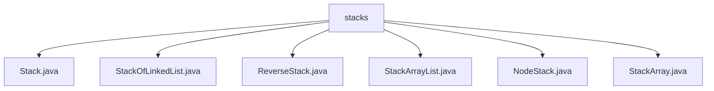

# 基础信息

|      |      |
|------|------|
| 名称 | stacks |
| 编码语言 | .java |
| 代码路径 | Java/src/main/java/com/thealgorithms/datastructures/stacks |
| 包名 | Java.src.main.java.com.thealgorithms.datastructures.stacks |
| 概述说明 | 各类栈实现支持入栈、出栈、查看栈顶、判空、清空等操作，涵盖链表、数组和动态扩容机制。 |

# 说明

## 概述

该代码模块主要实现了多种栈（Stack）数据结构的变体，涵盖了基于链表、数组和动态数组的实现方式。栈是一种后进先出（LIFO）的数据结构，该模块通过不同的底层数据结构实现了栈的核心功能，包括入栈、出栈、查看栈顶元素、判断栈是否为空、清空栈以及获取栈的大小等操作。此外，模块还提供了栈的反转功能，展示了如何通过递归方式在不使用额外数据结构的情况下反转栈中元素的顺序。

## 主要业务场景

1. **基本栈操作**：
   - 所有栈实现均支持入栈（push）、出栈（pop）、查看栈顶元素（peek）、判断栈是否为空（isEmpty）、清空栈（clear）以及获取栈大小（size）等基本操作。这些功能确保了栈能够按照后进先出的原则管理数据，适用于需要临时存储和按顺序处理数据的场景。

2. **动态扩容与缩容**：
   - `StackArray` 实现了动态扩容与缩容机制，确保栈在元素数量变化时能够灵活调整存储空间，避免资源浪费。这种实现适用于元素数量不固定且需要高效管理内存的场景。

3. **栈的反转**：
   - `ReverseStack` 提供了通过递归方式反转栈中元素顺序的功能。该方法避免了使用额外的数据结构，直接在原栈上进行操作，适用于需要在不增加空间复杂度的情况下反转栈中元素的场景。

4. **多种底层实现**：
   - 模块提供了基于链表（`StackOfLinkedList`、`NodeStack`）、数组（`StackArray`）和动态数组（`StackArrayList`）的栈实现，开发者可以根据具体需求选择合适的实现方式。例如，链表实现适用于频繁插入和删除操作的场景，而数组实现则适用于需要高效随机访问的场景。

5. **防止外部实例化**：
   - `StackOfLinkedList` 类采用私有构造函数，防止外部实例化，确保了类的封装性和安全性。这种设计适用于需要严格控制对象创建的场景。

通过多种实现方式和功能的组合，该模块为开发者提供了灵活且高效的栈数据结构支持，适用于广泛的业务场景，包括算法实现、数据处理、内存管理等。

### 包内部结构视图

该流程图展示了`stacks`文件夹下的所有文件层级关系。`stacks`作为根节点，包含了六个不同的Java文件，分别是`Stack.java`、`StackOfLinkedList.java`、`ReverseStack.java`、`StackArrayList.java`、`NodeStack.java`和`StackArray.java`。这些文件都属于栈数据结构的实现，展示了不同方式实现的栈类。

# 文件列表 File List

| 名称   | 类型  | 说明 |
|-------|------|-------------|
| [NodeStack.java](NodeStack.md) | file | NodeStack类实现链表栈，支持push、pop、peek、isEmpty和size操作。 |
| [StackOfLinkedList.java](StackOfLinkedList.md) | file | StackOfLinkedList类私有构造，Node类含数据和指针，链表栈支持多种操作。 |
| [StackArray.java](StackArray.md) | file | 实现动态扩容缩容的栈，支持入栈、出栈、查看栈顶、判空和清空操作。 |
| [StackArrayList.java](StackArrayList.md) | file | 基于ArrayList实现栈，支持入栈、出栈、查看栈顶、判空、清空和获取大小功能。 |
| [ReverseStack.java](ReverseStack.md) | file | 递归反转栈顺序，辅助方法将元素插入栈底。 |
| [Stack.java](Stack.md) | file | 信息为空，无法生成概要描述。 |

