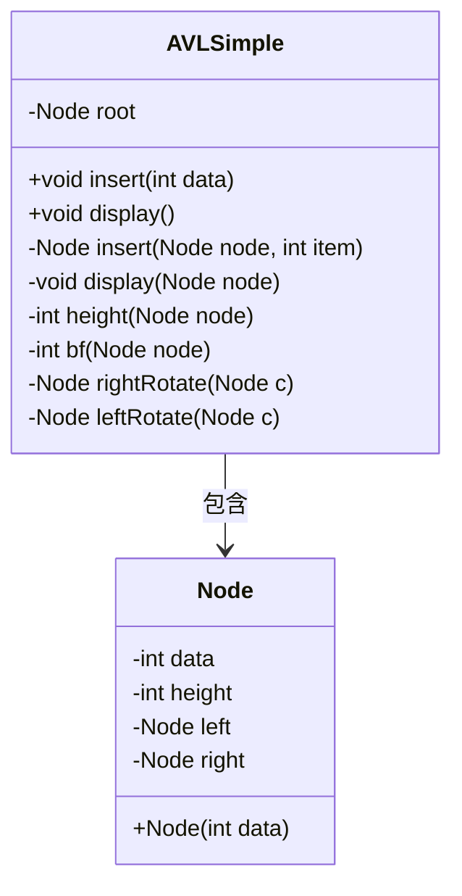
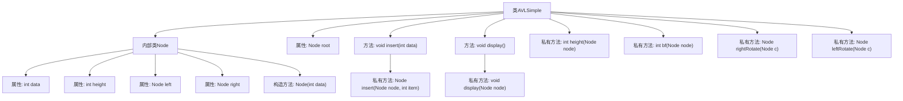

# 基础信息

|      |      |
|------|------|
| 名称 | AVLSimple |
| 编码语言 | .java |
| 代码路径 | Java/src/main/java/com/thealgorithms/datastructures/trees/AVLSimple.java |
| 包名 | com.thealgorithms.datastructures.trees |
| 依赖项 | [] |
| 概述说明 | AVL树实现，支持插入、显示、旋转及平衡操作。 |

# 说明

该内容描述了一个AVL树的实现，涵盖了插入、显示、旋转及平衡操作。AVL树是一种自平衡二叉搜索树，通过旋转操作确保树的高度平衡，从而维持高效的查找、插入和删除性能。插入操作涉及节点的添加和后续的平衡检查，显示操作用于展示树的结构，旋转操作包括左旋和右旋，用于调整树的不平衡状态，平衡操作则通过计算平衡因子并执行必要的旋转来维持树的平衡。这些操作共同确保了AVL树的高效性和稳定性。

# 类列表 Class Summary

| 名称   | 类型  | 说明 |
|-------|------|-------------|
| AVLSimple | class | AVL树实现，包含插入、显示、旋转及平衡操作。 |

## 类 AVLSimple

|      |      |
|------|------|
| 访问范围 | public |
| 类型 | class |
| 名称 | AVLSimple |
| 说明 | AVL树实现，包含插入、显示、旋转及平衡操作。 |

### UML类图

这段代码实现了一个简单的AVL树数据结构。`AVLSimple`类包含一个内部类`Node`，用于表示树的节点。`AVLSimple`类提供了插入数据和显示树结构的功能。插入操作通过递归实现，并在插入后检查树的平衡因子，进行必要的旋转操作以保持树的平衡。`Node`类包含节点数据、高度以及左右子节点的引用。`AVLSimple`类通过`Node`类来构建和操作AVL树。

### 内部方法调用关系图

这段代码实现了一个简单的AVL树数据结构。AVL树是一种自平衡二叉搜索树，通过旋转操作保持树的平衡。代码中包含了插入节点、显示树结构、计算节点高度、计算平衡因子以及左右旋转等操作。流程图展示了类与内部类之间的关系，以及各个方法的调用关系。

### 字段列表 Field List

| 名称  | 类型  | 说明 |
|-------|-------|------|
| root | Node | 私有根节点变量。 |

### 方法列表 Method List

| 名称  | 类型  | 说明 |
|-------|-------|------|
| bf | int | 计算二叉树节点左右子树高度差。 |
| insert | void | 在二叉搜索树中插入数据的方法。 |
| insert | Node | 递归插入节点并平衡二叉搜索树。 |
| display | void | 该方法显示根节点及其高度。 |
| leftRotate | Node | 左旋操作：调整节点c的右子树，更新节点高度并返回新根节点b。 |
| rightRotate | Node | 右旋操作：调整节点及其左子节点，更新高度，返回新根节点。 |
| height | int | 计算节点高度，空节点返回0。 |
| display | void | 递归显示二叉树节点及其左右子节点数据。 |

