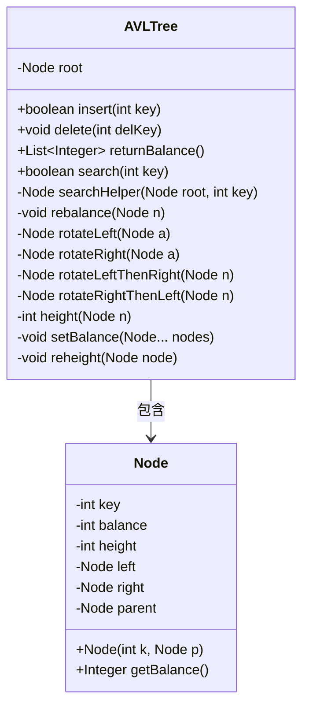

# 基础信息

|      |      |
|------|------|
| 名称 | AVLTree |
| 编码语言 | .java |
| 代码路径 | Java/src/main/java/com/thealgorithms/datastructures/trees/AVLTree.java |
| 包名 | com.thealgorithms.datastructures.trees |
| 依赖项 | ['java.util.ArrayList', 'java.util.List'] |
| 概述说明 | AVL树实现插入、删除、搜索及平衡功能。 |

# 说明

AVL树是一种自平衡二叉搜索树，通过插入、删除、搜索及平衡操作来维持其平衡性。插入操作在添加新节点后，通过旋转操作调整树的结构，确保左右子树的高度差不超过1。删除操作在移除节点后，同样通过旋转来恢复平衡。搜索操作利用二叉搜索树的性质，高效地查找目标节点。平衡操作是AVL树的核心，通过四种基本旋转（左旋、右旋、左右旋、右左旋）来调整树的高度，确保其始终处于平衡状态。这些操作共同保证了AVL树在各种动态操作下仍能保持高效的查询性能。

# 类列表 Class Summary

| 名称   | 类型  | 说明 |
|-------|------|-------------|
| AVLTree | class | AVL树实现，包含插入、删除、搜索及平衡操作。 |

## 类 AVLTree

|      |      |
|------|------|
| 访问范围 | public |
| 类型 | class |
| 名称 | AVLTree |
| 说明 | AVL树实现，包含插入、删除、搜索及平衡操作。 |

### UML类图

**描述：**  
该代码实现了一个AVL树（自平衡二叉搜索树），包含插入、删除、搜索和返回平衡因子等操作。`AVLTree`类管理树的根节点，并提供了平衡树的机制。`Node`类表示树的节点，包含键值、平衡因子、高度以及左右子节点和父节点的引用。`AVLTree`类通过`rebalance`方法在插入和删除操作后保持树的平衡，确保树的高度始终保持在O(log n)级别。

### 内部方法调用关系图

```mermaid
graph TD
    A["类AVLTree"]
    B["属性: Node root"]
    C["内部类: Node"]
    D["属性: int key"]
    E["属性: int balance"]
    F["属性: int height"]
    G["属性: Node left"]
    H["属性: Node right"]
    I["属性: Node parent"]
    J["构造方法: Node(int k, Node p)"]
    K["方法: Integer getBalance()"]
    L["方法: boolean insert(int key)"]
    M["方法: void delete(int delKey)"]
    N["方法: void delete(Node node)"]
    O["方法: List<Integer> returnBalance()"]
    P["方法: void returnBalance(Node n, List<Integer> balances)"]
    Q["方法: boolean search(int key)"]
    R["方法: Node searchHelper(Node root, int key)"]
    S["方法: void rebalance(Node n)"]
    T["方法: Node rotateLeft(Node a)"]
    U["方法: Node rotateRight(Node a)"]
    V["方法: Node rotateLeftThenRight(Node n)"]
    W["方法: Node rotateRightThenLeft(Node n)"]
    X["方法: int height(Node n)"]
    Y["方法: void setBalance(Node... nodes)"]
    Z["方法: void reheight(Node node)"]

    A --> B
    A --> C
    C --> D
    C --> E
    C --> F
    C --> G
    C --> H
    C --> I
    C --> J
    C --> K
    A --> L
    A --> M
    M --> N
    A --> O
    O --> P
    A --> Q
    Q --> R
    A --> S
    S --> T
    S --> U
    S --> V
    S --> W
    S --> X
    S --> Y
    Y --> Z
```

这段代码实现了一个AVL树数据结构，包含插入、删除、搜索和平衡操作。AVL树是一种自平衡二叉搜索树，通过旋转操作保持树的平衡。代码中定义了`Node`类来表示树的节点，并提供了`insert`、`delete`、`search`等方法来进行树的操作。`rebalance`方法用于在插入或删除后调整树的平衡，`rotateLeft`、`rotateRight`等方法用于执行具体的旋转操作。`returnBalance`方法返回所有节点的平衡因子，用于调试和验证树的平衡性。

### 字段列表 Field List

| 名称  | 类型  | 说明 |
|-------|-------|------|
| root | Node | 代码定义了一个私有节点变量root。 |

### 方法列表 Method List

| 名称  | 类型  | 说明 |
|-------|-------|------|
| search | boolean | 搜索方法检查树中是否存在指定键值。 |
| returnBalance | List<Integer> | 返回二叉树节点余额的列表。 |
| rotateLeftThenRight | Node | 左旋后右旋节点n。 |
| delete | void | 删除二叉树中指定键值的节点，若不存在则直接返回。 |
| rotateRightThenLeft | Node | 右旋后左旋节点n。 |
| searchHelper | Node | 递归搜索二叉树的节点，根据键值决定向左或向右查找。 |
| reheight | void | 重新计算节点高度，更新为左右子树高度的最大值加一。 |
| delete | void | 删除二叉树节点，处理叶子节点和单双子树情况。 |
| returnBalance | void | 递归遍历二叉树节点，将节点余额存入列表。 |
| height | int | 计算节点高度的函数，空节点返回-1。 |
| setBalance | void | 该方法遍历节点数组，重新计算高度并更新平衡因子。 |
| rotateRight | Node | 右旋操作：调整节点及其左子节点的父子关系，并更新平衡状态。 |
| insert | boolean | 在二叉搜索树中插入节点，若存在相同键则返回false，否则插入并重新平衡树。 |
| rebalance | void | 二叉树平衡调整方法，根据节点平衡因子进行旋转操作，确保树结构平衡。 |
| rotateLeft | Node | 左旋转操作：调整节点及其右子节点的父子关系并返回新根节点。 |

