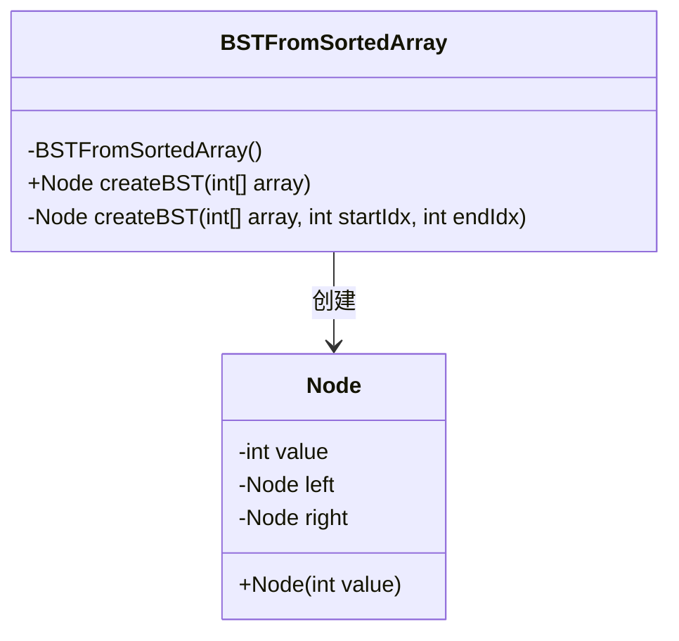
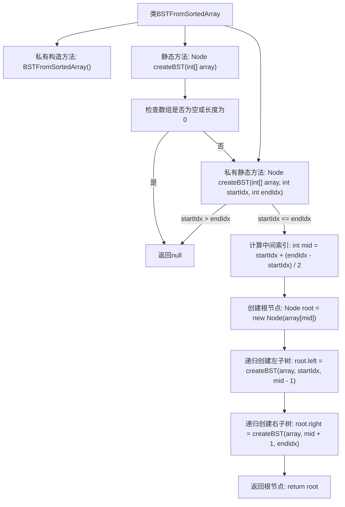

# 基础信息

|      |      |
|------|------|
| 名称 | BSTFromSortedArray |
| 编码语言 | .java |
| 代码路径 | Java/src/main/java/com/thealgorithms/datastructures/trees/BSTFromSortedArray.java |
| 包名 | com.thealgorithms.datastructures.trees |
| 依赖项 | ['com.thealgorithms.datastructures.trees.BinaryTree.Node'] |
| 概述说明 | 将有序数组转换为平衡二叉搜索树。 |

# 说明

从有序数组创建平衡二叉搜索树的过程涉及将数组中间元素作为根节点，然后递归地对数组的左半部分和右半部分进行相同操作，分别构建左子树和右子树。这种方法确保生成的二叉搜索树高度平衡，即左右子树的高度差不超过一。通过这种方式，可以高效地将有序数组转换为平衡二叉搜索树，保持树的搜索性能最优。

# 类列表 Class Summary

| 名称   | 类型  | 说明 |
|-------|------|-------------|
| BSTFromSortedArray | class | 从有序数组创建平衡二叉搜索树。 |

## 类 BSTFromSortedArray

|      |      |
|------|------|
| 访问范围 | public final |
| 类型 | class |
| 名称 | BSTFromSortedArray |
| 说明 | 从有序数组创建平衡二叉搜索树。 |

### UML类图

这段代码定义了一个`BSTFromSortedArray`类，用于从一个已排序的数组构建二叉搜索树（BST）。`BSTFromSortedArray`类包含一个私有的构造方法和两个静态方法：`createBST(int[] array)`和`createBST(int[] array, int startIdx, int endIdx)`。`Node`类表示二叉搜索树的节点，包含节点的值、左子节点和右子节点。`BSTFromSortedArray`类通过递归方式将数组的中间元素作为根节点，并分别构建左子树和右子树，最终返回整个二叉搜索树的根节点。

### 内部方法调用关系图

这段代码描述了一个用于从已排序数组创建二叉搜索树（BST）的类。代码首先检查输入数组是否为空或长度为0，如果是则返回null。否则，通过递归方法找到数组的中间元素作为根节点，然后递归地创建左子树和右子树。整个过程通过计算中间索引并分割数组来实现，最终返回构建好的二叉搜索树的根节点。

### 字段列表 Field List

| 名称  | 类型  | 说明 |
|-------|-------|------|

### 方法列表 Method List

| 名称  | 类型  | 说明 |
|-------|-------|------|
| createBST | Node | 静态方法创建二叉搜索树，数组为空返回null。 |
| createBST | Node | 创建二叉搜索树，递归选取中间元素为根节点，左右子树递归生成。 |

