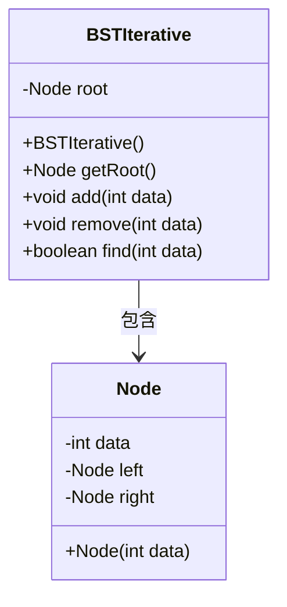
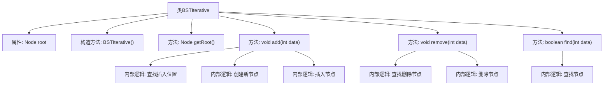

# 基础信息

|      |      |
|------|------|
| 名称 | BSTIterative |
| 编码语言 | .java |
| 代码路径 | Java/src/main/java/com/thealgorithms/datastructures/trees/BSTIterative.java |
| 包名 | com.thealgorithms.datastructures.trees |
| 依赖项 | ['com.thealgorithms.datastructures.trees.BinaryTree.Node'] |
| 概述说明 | BSTIterative类实现二叉搜索树的插入、删除和查找功能。 |

# 说明

BSTIterative类是一个实现二叉搜索树的数据结构，提供了插入、删除和查找三种核心操作。该类通过迭代而非递归的方式实现这些功能，确保在处理大规模数据时具有更高的效率和更低的内存消耗。插入操作允许将新节点添加到树中，同时保持二叉搜索树的有序性。删除操作能够移除指定节点，并调整树结构以维持其平衡。查找操作则用于快速定位特定节点，验证其是否存在。这些操作共同确保了二叉搜索树的高效管理和数据检索能力。

# 类列表 Class Summary

| 名称   | 类型  | 说明 |
|-------|------|-------------|
| BSTIterative | class | BSTIterative类实现二叉搜索树，支持插入、删除和查找操作。 |

## 类 BSTIterative

|      |      |
|------|------|
| 访问范围 | public |
| 类型 | class |
| 名称 | BSTIterative |
| 说明 | BSTIterative类实现二叉搜索树，支持插入、删除和查找操作。 |

### UML类图

**描述：**
`BSTIterative` 类实现了一个二叉搜索树（BST），包含插入、删除和查找操作。`Node` 类表示树的节点，包含数据和左右子节点的引用。`BSTIterative` 通过 `root` 引用树的根节点，并提供 `add`、`remove` 和 `find` 方法来管理树的结构和查询节点。插入和删除操作通过迭代方式实现，确保树的结构符合二叉搜索树的规则。

### 内部方法调用关系图

**描述：**  
这段代码实现了一个二叉搜索树（BST）的迭代版本，包含插入、删除和查找操作。`BSTIterative`类通过`add`方法在树中插入新节点，`remove`方法删除指定节点，`find`方法查找节点是否存在。每个方法内部通过迭代方式遍历树结构，确保操作的正确性和效率。插入和删除操作分别处理了不同的节点情况，如叶子节点、单子节点和双子节点，以维护BST的性质。查找操作通过比较节点值快速定位目标节点。

### 字段列表 Field List

| 名称  | 类型  | 说明 |
|-------|-------|------|
| root | Node | 代码定义了一个私有根节点变量。 |

### 方法列表 Method List

| 名称  | 类型  | 说明 |
|-------|-------|------|
| getRoot | Node | 该方法返回根节点对象。 |
| find | boolean | 在二叉搜索树中查找指定数据，找到返回true，否则返回false。 |
| add | void | 二叉搜索树插入新节点，确保数据不重复，按规则定位插入位置。 |
| remove | void | 从二叉搜索树中删除指定节点，处理叶子节点和子节点情况，保持树平衡。 |

