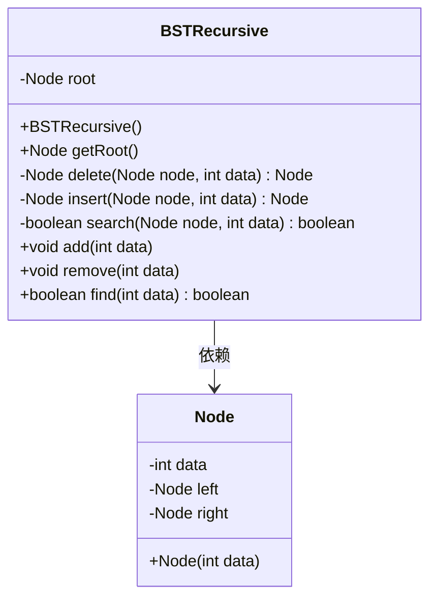
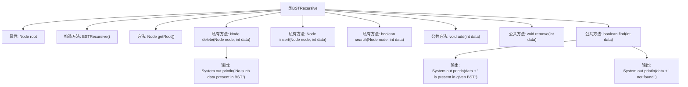

# 基础信息

|      |      |
|------|------|
| 名称 | BSTRecursive |
| 编码语言 | .java |
| 代码路径 | Java/src/main/java/com/thealgorithms/datastructures/trees/BSTRecursive.java |
| 包名 | com.thealgorithms.datastructures.trees |
| 依赖项 | ['com.thealgorithms.datastructures.trees.BinaryTree.Node'] |
| 概述说明 | BSTRecursive类实现二叉搜索树的递归插入、删除和查找功能。 |

# 说明

BSTRecursive类实现了二叉搜索树的递归操作，涵盖了插入、删除和查找功能。插入操作通过递归找到合适位置添加新节点。删除操作递归处理节点删除及子树调整。查找操作递归遍历树结构定位目标节点。该类通过递归方法简化了二叉搜索树的核心操作，确保了代码的简洁性和可读性。

# 类列表 Class Summary

| 名称   | 类型  | 说明 |
|-------|------|-------------|
| BSTRecursive | class | BSTRecursive类实现二叉搜索树的递归操作，包括插入、删除和查找功能。 |

## 类 BSTRecursive

|      |      |
|------|------|
| 访问范围 | public |
| 类型 | class |
| 名称 | BSTRecursive |
| 说明 | BSTRecursive类实现二叉搜索树的递归操作，包括插入、删除和查找功能。 |

### UML类图

**描述：**  
`BSTRecursive` 类实现了一个递归的二叉搜索树（BST），包含插入、删除、查找等操作。`Node` 类表示树中的节点，包含数据和左右子节点的引用。`BSTRecursive` 类通过递归方法 `insert`、`delete` 和 `search` 来管理树的节点，并通过公有方法 `add`、`remove` 和 `find` 提供对外接口。类图展示了 `BSTRecursive` 与 `Node` 之间的依赖关系，`BSTRecursive` 依赖于 `Node` 类来构建和操作树结构。

### 内部方法调用关系图

**描述：**
这段代码实现了一个递归的二叉搜索树（BST）数据结构。类`BSTRecursive`包含一个根节点`root`，并提供了插入、删除、查找等操作。`insert`方法用于递归插入节点，`delete`方法用于递归删除节点，`search`方法用于递归查找节点。公共方法`add`、`remove`和`find`分别用于插入数据、删除数据和查找数据，并在查找时输出结果。流程图展示了类的结构及其方法之间的调用关系。

### 字段列表 Field List

| 名称  | 类型  | 说明 |
|-------|-------|------|
| root | Node | 私有变量root用于存储树的根节点。 |

### 方法列表 Method List

| 名称  | 类型  | 说明 |
|-------|-------|------|
| getRoot | Node | 获取根节点的方法。 |
| remove | void | 删除指定数据的二叉树节点。 |
| search | boolean | 递归搜索二叉树节点数据，返回是否匹配。 |
| add | void | 在二叉树中添加新数据节点。 |
| delete | Node | 二叉搜索树删除节点方法，处理叶子节点、单子节点和双子节点情况。 |
| find | boolean | 方法find检查BST中是否存在指定数据，存在则返回true并打印信息，否则返回false。 |
| insert | Node | 递归插入节点，左小右大，返回根节点。 |

