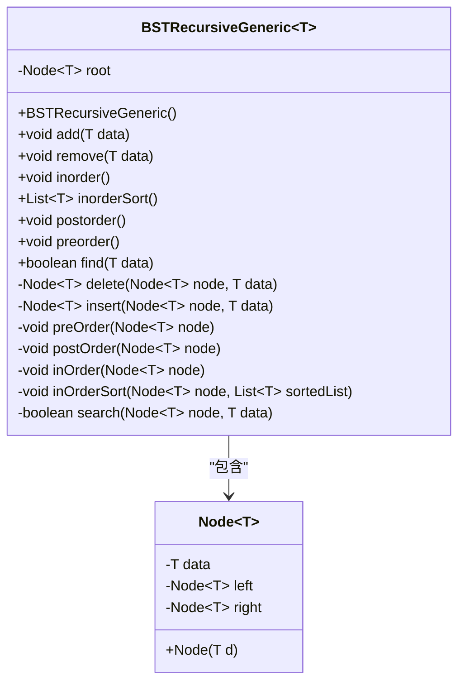

# 基础信息

|      |      |
|------|------|
| 名称 | BSTRecursiveGeneric |
| 编码语言 | .java |
| 代码路径 | Java/src/main/java/com/thealgorithms/datastructures/trees/BSTRecursiveGeneric.java |
| 包名 | com.thealgorithms.datastructures.trees |
| 依赖项 | ['java.util.ArrayList', 'java.util.List'] |
| 概述说明 | 递归二叉搜索树支持增删查和遍历操作。 |

# 说明

该内容描述了一个递归实现的二叉搜索树，支持插入、删除、查找和遍历等基本操作。二叉搜索树是一种数据结构，其中每个节点的左子树包含小于该节点的值，右子树包含大于该节点的值。递归方法通过函数自身调用来处理子树，简化了树的操作逻辑。插入操作将新节点放置在合适的位置以维持树的有序性；删除操作根据节点情况调整树结构；查找操作通过递归比较快速定位目标节点；遍历操作包括前序、中序和后序三种方式，分别以不同顺序访问节点。该实现确保了树的高效管理和数据检索。

# 类列表 Class Summary

| 名称   | 类型  | 说明 |
|-------|------|-------------|
| BSTRecursiveGeneric | class | 实现递归二叉搜索树，支持增删查和遍历操作。 |

## 类 BSTRecursiveGeneric

|      |      |
|------|------|
| 访问范围 | public |
| 类型 | class |
| 名称 | BSTRecursiveGeneric |
| 说明 | 实现递归二叉搜索树，支持增删查和遍历操作。 |

### UML类图

该代码实现了一个泛型的二叉搜索树（BST），支持插入、删除、查找以及三种遍历方式（前序、中序、后序）。`BSTRecursiveGeneric`类通过递归方法处理树的插入、删除和查找操作，`Node`类表示树的节点。代码通过泛型支持多种数据类型，并通过递归实现树的各种操作。

### 内部方法调用关系图

```mermaid
graph TD
    A["类BSTRecursiveGeneric<T extends Comparable<T>>"]
    B["属性: Node<T> root"]
    C["构造方法: BSTRecursiveGeneric()"]
    D["方法: add(T data)"]
    E["方法: remove(T data)"]
    F["方法: inorder()"]
    G["方法: inorderSort()"]
    H["方法: postorder()"]
    I["方法: preorder()"]
    J["方法: find(T data)"]
    K["内部类: Node<T>"]
    L["属性: T data"]
    M["属性: Node<T> left"]
    N["属性: Node<T> right"]
    O["构造方法: Node(T d)"]
    P["方法: delete(Node<T> node, T data)"]
    Q["方法: insert(Node<T> node, T data)"]
    R["方法: preOrder(Node<T> node)"]
    S["方法: postOrder(Node<T> node)"]
    T["方法: inOrder(Node<T> node)"]
    U["方法: inOrderSort(Node<T> node, List<T> sortedList)"]
    V["方法: search(Node<T> node, T data)"]
    W["main方法: main(String[] args)"]
    X["输出: System.out.println('Testing for integer data...')"]
    Y["输出: System.out.println('Testing for string data...')"]

    A --> B
    A --> C
    A --> D
    A --> E
    A --> F
    A --> G
    A --> H
    A --> I
    A --> J
    A -.-> K
    K --> L
    K --> M
    K --> N
    K --> O
    A --> P
    A --> Q
    A --> R
    A --> S
    A --> T
    A --> U
    A --> V
    A -.-> W
    W --> X
    W --> Y
```

这段代码实现了一个泛型的二叉搜索树（BST），支持插入、删除、查找以及中序、前序、后序遍历等操作。代码通过递归方法实现了这些功能，并且提供了测试用例来验证整数和字符串类型的数据在BST中的操作。流程图展示了类的主要方法和属性，以及它们之间的调用关系。

### 字段列表 Field List

| 名称  | 类型  | 说明 |
|-------|-------|------|
| root | Node<T> | 私有根节点变量。 |

### 方法列表 Method List

| 名称  | 类型  | 说明 |
|-------|-------|------|
| remove | void | 删除指定数据的二叉树节点。 |
| preOrder | void | 递归前序遍历二叉树，输出节点数据。 |
| inorder | void | 该方法用于中序遍历二叉树并输出结果。 |
| add | void | 在根节点插入数据并更新根节点。 |
| preorder | void | 该方法实现树的先序遍历，输出遍历结果并换行。 |
| search | boolean | 递归搜索二叉树节点，返回是否找到目标数据。 |
| insert | Node<T> | 递归插入节点，左小右大，返回当前节点。 |
| postOrder | void | 后序遍历二叉树，先左后右再根节点。 |
| inOrderSort | void | 中序遍历二叉树，将节点数据按顺序添加到列表中。 |
| main | void | 测试整数和字符串在二叉搜索树中的增删查操作。 |
| postorder | void | 该方法用于后序遍历树并打印结果。 |
| inOrder | void | 中序遍历二叉树节点并打印数据。 |
| find | boolean | 方法find用于在二叉搜索树中查找指定数据，存在返回true，否则返回false并提示未找到。 |
| delete | Node<T> | 二叉搜索树删除节点，处理叶子节点、单子节点和双子节点情况。 |
| inorderSort | List<T> | 实现二叉树中序遍历并返回有序列表。 |

