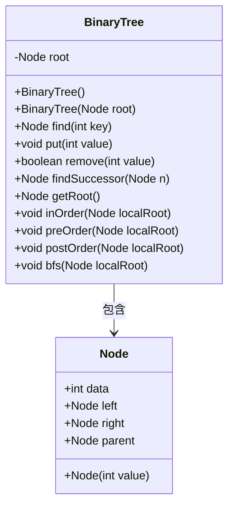

# 基础信息

|      |      |
|------|------|
| 名称 | BinaryTree |
| 编码语言 | .java |
| 代码路径 | Java/src/main/java/com/thealgorithms/datastructures/trees/BinaryTree.java |
| 包名 | com.thealgorithms.datastructures.trees |
| 依赖项 | ['java.util.LinkedList', 'java.util.Queue'] |
| 概述说明 | 二叉树类实现插入、删除、查找及遍历操作。 |

# 说明

该内容描述了一个二叉树类的实现，该类具备插入、删除、查找及遍历等核心功能。插入功能允许在树中添加新节点，删除功能用于移除指定节点，查找功能用于定位特定节点，而遍历功能则支持以不同顺序访问树中的所有节点。这些功能共同构成了一个完整的二叉树数据结构，适用于各种需要树形结构处理的场景。

# 类列表 Class Summary

| 名称   | 类型  | 说明 |
|-------|------|-------------|
| BinaryTree | class | 二叉树类实现插入、删除、查找及遍历功能。 |

## 类 BinaryTree

|      |      |
|------|------|
| 访问范围 | public |
| 类型 | class |
| 名称 | BinaryTree |
| 说明 | 二叉树类实现插入、删除、查找及遍历功能。 |

### UML类图

这段代码实现了一个二叉树数据结构，包含插入、删除、查找等操作。`BinaryTree`类包含一个`Node`类，用于表示树中的节点。`Node`类包含节点的数据、左右子节点以及父节点的引用。`BinaryTree`类提供了多种遍历方法，包括中序、前序、后序和广度优先搜索（BFS）。通过这些方法，可以对二叉树进行各种操作和遍历。

### 内部方法调用关系图

```mermaid
graph TD
    A["类BinaryTree"]
    B["静态内部类Node"]
    C["属性: int data"]
    D["属性: Node left"]
    E["属性: Node right"]
    F["属性: Node parent"]
    G["构造方法: Node(int value)"]
    H["属性: Node root"]
    I["构造方法: BinaryTree()"]
    J["构造方法: BinaryTree(Node root)"]
    K["方法: Node find(int key)"]
    L["方法: void put(int value)"]
    M["方法: boolean remove(int value)"]
    N["方法: Node findSuccessor(Node n)"]
    O["方法: Node getRoot()"]
    P["方法: void inOrder(Node localRoot)"]
    Q["方法: void preOrder(Node localRoot)"]
    R["方法: void postOrder(Node localRoot)"]
    S["方法: void bfs(Node localRoot)"]

    A --> B
    B --> C
    B --> D
    B --> E
    B --> F
    B --> G
    A --> H
    A --> I
    A --> J
    A --> K
    A --> L
    A --> M
    A --> N
    A --> O
    A --> P
    A --> Q
    A --> R
    A --> S
```

这段代码实现了一个二叉树数据结构，包含节点的定义、二叉树的构造、节点的查找、插入、删除以及四种遍历方式（中序、前序、后序和广度优先搜索）。代码通过静态内部类`Node`表示树的节点，每个节点包含数据、左右子节点和父节点。`BinaryTree`类提供了对二叉树的各种操作，包括查找、插入、删除和遍历。

### 字段列表 Field List

| 名称  | 类型  | 说明 |
|-------|-------|------|
| root | Node | 定义了一个私有节点类型的根节点变量。 |

### 方法列表 Method List

| 名称  | 类型  | 说明 |
|-------|-------|------|
| getRoot | Node | 该方法返回根节点对象。 |
| remove | boolean | 删除指定值的节点，处理无子节点、单子节点和双子节点情况。 |
| preOrder | void | 前序遍历二叉树，输出节点数据。 |
| put | void | 插入节点到二叉搜索树，根据值大小决定左或右子节点。 |
| postOrder | void | 后序遍历二叉树，先左后右，最后输出根节点数据。 |
| find | Node | 查找二叉树中指定键的节点，若不存在则返回其父节点。 |
| inOrder | void | 中序遍历二叉树，先左子树，再根节点，最后右子树。 |
| bfs | void | 广度优先搜索算法，遍历二叉树节点并打印数据。 |
| findSuccessor | Node | 查找节点n的后继节点，若无右子节点则返回n，否则返回右子树的最左节点。 |

