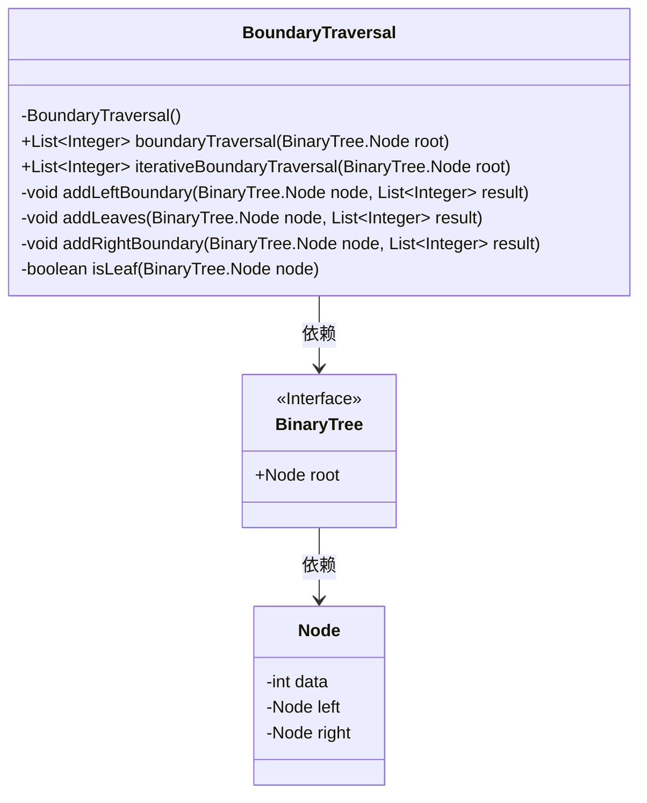

# 基础信息

|      |      |
|------|------|
| 名称 | BoundaryTraversal |
| 编码语言 | .java |
| 代码路径 | Java/src/main/java/com/thealgorithms/datastructures/trees/BoundaryTraversal.java |
| 包名 | com.thealgorithms.datastructures.trees |
| 依赖项 | ['java.util.ArrayList', 'java.util.Deque', 'java.util.LinkedList', 'java.util.List'] |
| 概述说明 | 边界遍历算法按序返回二叉树的左边界、叶节点和右边界。 |

# 说明

边界遍历算法是一种用于二叉树的方法，旨在按特定顺序返回树的边界节点。该算法首先遍历树的左边界，从根节点开始，沿着左子节点依次访问，直到到达最左侧的叶节点。接着，算法遍历所有叶节点，从左到右依次访问。最后，算法遍历树的右边界，从最右侧的叶节点开始，沿着右子节点依次向上访问，直到回到根节点。通过这种方式，边界遍历算法能够全面捕捉二叉树的边界结构，确保所有边界节点都被包含在返回的结果中。

# 类列表 Class Summary

| 名称   | 类型  | 说明 |
|-------|------|-------------|
| BoundaryTraversal | class | 边界遍历算法，按顺序返回二叉树的边界节点，包括左边界、叶节点和右边界。 |

## 类 BoundaryTraversal

|      |      |
|------|------|
| 访问范围 | public final |
| 类型 | class |
| 名称 | BoundaryTraversal |
| 说明 | 边界遍历算法，按顺序返回二叉树的边界节点，包括左边界、叶节点和右边界。 |

### UML类图

**描述：**  
`BoundaryTraversal` 类提供了两种方法来遍历二叉树的边界节点：递归遍历和迭代遍历。它依赖于 `BinaryTree` 接口和 `Node` 类，分别表示二叉树和节点。`boundaryTraversal` 方法通过递归处理左边界、叶节点和右边界，而 `iterativeBoundaryTraversal` 方法则使用迭代方式处理相同的逻辑。`isLeaf` 方法用于检查节点是否为叶节点。

### 内部方法调用关系图

```mermaid
graph TD
    A["类BoundaryTraversal"]
    B["构造方法: BoundaryTraversal()"]
    C["方法: List<Integer> boundaryTraversal(BinaryTree.Node root)"]
    D["方法: void addLeftBoundary(BinaryTree.Node node, List<Integer> result)"]
    E["方法: void addLeaves(BinaryTree.Node node, List<Integer> result)"]
    F["方法: void addRightBoundary(BinaryTree.Node node, List<Integer> result)"]
    G["方法: boolean isLeaf(BinaryTree.Node node)"]
    H["方法: List<Integer> iterativeBoundaryTraversal(BinaryTree.Node root)"]

    A --> B
    A --> C
    A --> D
    A --> E
    A --> F
    A --> G
    A --> H

    C -->|"检查root是否为空"| I["返回空列表"]
    C -->|"检查root是否为叶子节点"| J["添加root数据到结果列表"]
    C -->|"调用addLeftBoundary"| D
    C -->|"调用addLeaves"| E
    C -->|"调用addRightBoundary"| F
    C -->|"返回结果列表"| K["返回结果列表"]

    D -->|"初始化cur为node.left"| L["检查cur是否为空"]
    D -->|"如果cur为空且node.right不为空"| M["将cur设置为node.right"]
    D -->|"遍历cur"| N["检查cur是否为叶子节点"]
    D -->|"添加cur数据到结果列表"| O["添加数据"]
    D -->|"移动到左子节点或右子节点"| P["更新cur"]
    D -->|"停止遍历"| Q["结束循环"]

    E -->|"检查node是否为空"| R["返回"]
    E -->|"检查node是否为叶子节点"| S["添加node数据到结果列表"]
    E -->|"递归调用addLeaves"| T["递归左子树"]
    E -->|"递归调用addLeaves"| U["递归右子树"]

    F -->|"初始化cur为node.right"| V["检查cur是否为空"]
    F -->|"遍历cur"| W["检查cur是否为叶子节点"]
    F -->|"添加cur数据到临时列表"| X["添加数据"]
    F -->|"移动到右子节点或左子节点"| Y["更新cur"]
    F -->|"停止遍历"| Z["结束循环"]
    F -->|"反转临时列表并添加到结果列表"| AA["反转并添加"]

    G -->|"检查node是否为叶子节点"| AB["返回true或false"]

    H -->|"检查root是否为空"| AC["返回空列表"]
    H -->|"检查root是否为叶子节点"| AD["添加root数据到结果列表"]
    H -->|"初始化cur为root.left"| AE["检查cur是否为空"]
    H -->|"如果cur为空且root.right不为空"| AF["将cur设置为root.right"]
    H -->|"遍历cur"| AG["检查cur是否为叶子节点"]
    H -->|"添加cur数据到结果列表"| AH["添加数据"]
    H -->|"移动到左子节点或右子节点"| AI["更新cur"]
    H -->|"停止遍历"| AJ["结束循环"]
    H -->|"调用addLeaves"| E
    H -->|"初始化cur为root.right"| AK["检查cur是否为空"]
    H -->|"遍历cur"| AL["检查cur是否为叶子节点"]
    H -->|"添加cur数据到栈"| AM["添加数据"]
    H -->|"移动到右子节点或左子节点"| AN["更新cur"]
    H -->|"停止遍历"| AO["结束循环"]
    H -->|"从栈中弹出数据并添加到结果列表"| AP["弹出并添加"]
    H -->|"返回结果列表"| AQ["返回结果列表"]
```

这段代码实现了二叉树的边界遍历，包括左边界、叶子节点和右边界的遍历。`boundaryTraversal`方法通过递归方式遍历树的左边界、叶子节点和右边界，并将结果存储在列表中。`iterativeBoundaryTraversal`方法则通过迭代方式实现相同的功能，使用栈来处理右边界的节点顺序。代码中还包含了一个辅助方法`isLeaf`，用于判断节点是否为叶子节点。整体流程清晰，逻辑严谨，适用于各种二叉树的边界遍历场景。

### 字段列表 Field List

| 名称  | 类型  | 说明 |
|-------|-------|------|

### 方法列表 Method List

| 名称  | 类型  | 说明 |
|-------|-------|------|
| isLeaf | boolean | 判断二叉树节点是否为叶子节点。 |
| addLeaves | void | 递归遍历二叉树，将叶子节点数据加入结果列表。 |
| boundaryTraversal | List<Integer> | 二叉树边界遍历，先根节点，再左边界、叶子节点、右边界。 |
| addRightBoundary | void | 该方法遍历二叉树右边界，存储非叶节点并逆序添加到结果列表。 |
| addLeftBoundary | void | 递归遍历二叉树左边界，非叶子节点数据加入结果集。 |
| iterativeBoundaryTraversal | List<Integer> | 迭代遍历二叉树边界节点，返回非叶节点和叶节点数据。 |

