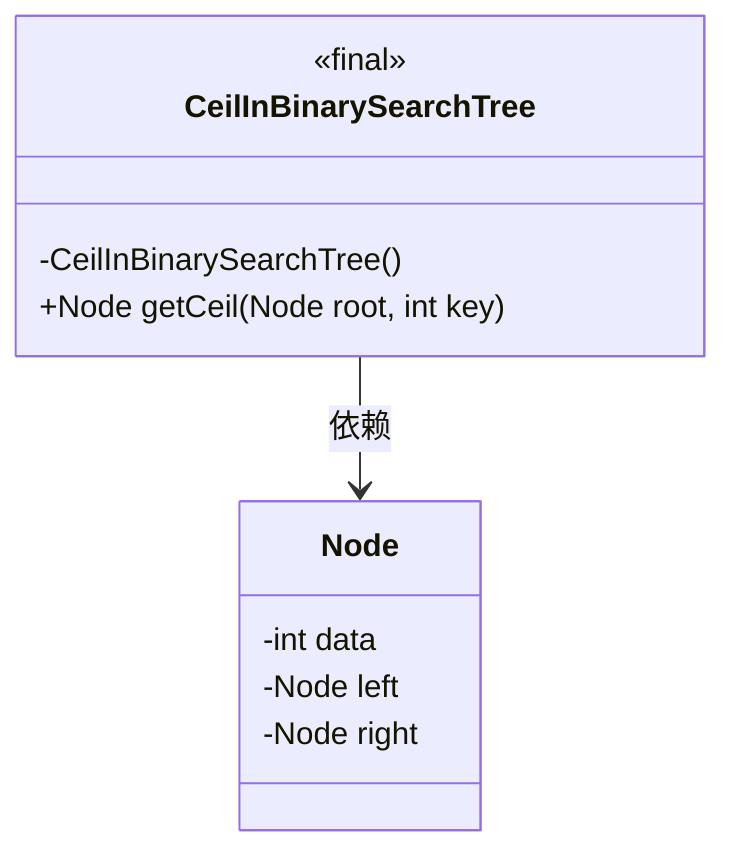
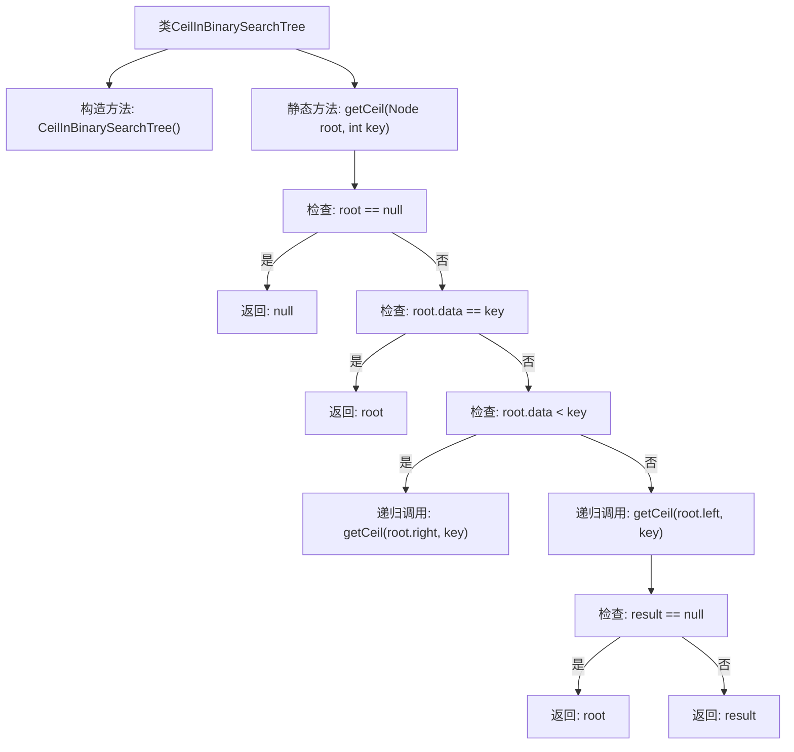

# 基础信息

|      |      |
|------|------|
| 名称 | CeilInBinarySearchTree |
| 编码语言 | .java |
| 代码路径 | Java/src/main/java/com/thealgorithms/datastructures/trees/CeilInBinarySearchTree.java |
| 包名 | com.thealgorithms.datastructures.trees |
| 依赖项 | ['com.thealgorithms.datastructures.trees.BinaryTree.Node'] |
| 概述说明 | CeilInBinarySearchTree类提供getCeil方法，查找二叉搜索树中大于等于指定键的最小节点。 |

# 说明

CeilInBinarySearchTree类中的getCeil方法用于在二叉搜索树中查找大于或等于指定键的最小节点。该方法通过遍历二叉搜索树，比较节点值与指定键，找到满足条件的最小节点。二叉搜索树的性质确保了查找过程的高效性，即左子树的所有节点值小于当前节点值，右子树的所有节点值大于当前节点值。该方法适用于需要快速查找满足特定条件节点的场景。

# 类列表 Class Summary

| 名称   | 类型  | 说明 |
|-------|------|-------------|
| CeilInBinarySearchTree | class | CeilInBinarySearchTree类提供getCeil方法，用于在二叉搜索树中查找大于等于指定键的最小节点。 |

## 类 CeilInBinarySearchTree

|      |      |
|------|------|
| 访问范围 | public final |
| 类型 | class |
| 名称 | CeilInBinarySearchTree |
| 说明 | CeilInBinarySearchTree类提供getCeil方法，用于在二叉搜索树中查找大于等于指定键的最小节点。 |

### UML类图

**描述：**  
`CeilInBinarySearchTree` 是一个不可继承的工具类，用于在二叉搜索树中查找给定键值的上限节点。该类包含一个私有构造函数，确保无法实例化，并提供一个静态方法 `getCeil`，该方法递归地在树中查找并返回最接近且大于或等于给定键值的节点。`Node` 类表示二叉搜索树的节点，包含数据、左子节点和右子节点。`CeilInBinarySearchTree` 依赖于 `Node` 类来执行查找操作。

### 内部方法调用关系图

这段代码实现了一个二叉搜索树中查找给定键值的上限节点（ceil）的功能。通过递归遍历树结构，代码首先检查当前节点是否为空，然后根据当前节点的值与键值的关系决定向左子树或右子树递归查找。最终，如果左子树中没有找到合适的节点，则当前节点即为上限节点。

### 字段列表 Field List

| 名称  | 类型  | 说明 |
|-------|-------|------|

### 方法列表 Method List

| 名称  | 类型  | 说明 |
|-------|-------|------|
| getCeil | Node | 查找二叉搜索树中大于等于给定键的最小节点。 |

