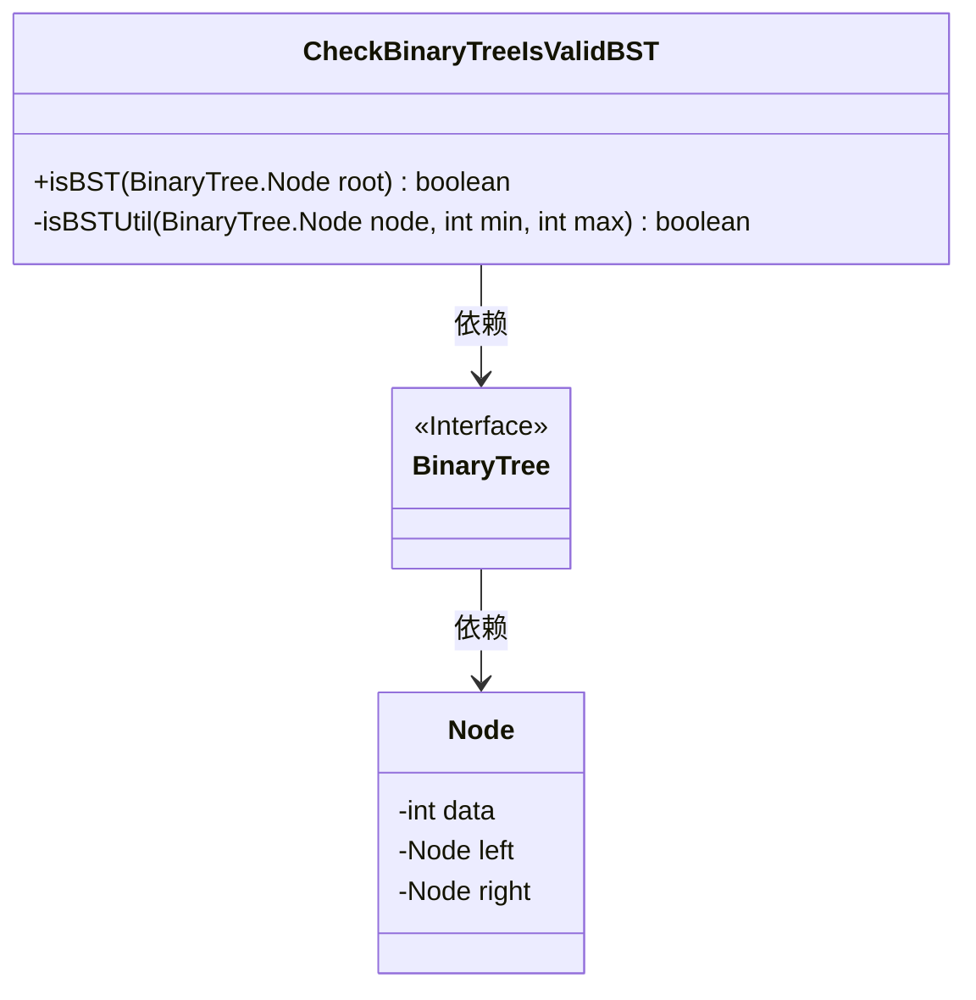
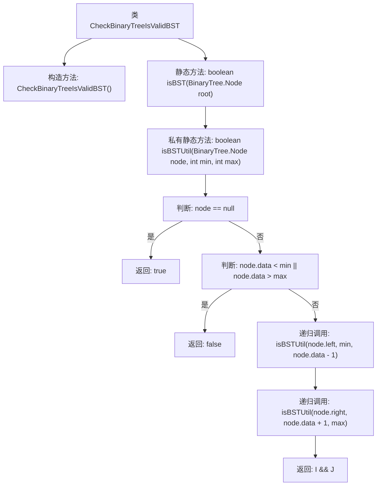

# 基础信息

|      |      |
|------|------|
| 名称 | CheckBinaryTreeIsValidBST |
| 编码语言 | .java |
| 代码路径 | Java/src/main/java/com/thealgorithms/datastructures/trees/CheckBinaryTreeIsValidBST.java |
| 包名 | com.thealgorithms.datastructures.trees |
| 依赖项 | [] |
| 概述说明 | 验证二叉树是否为有效的二叉搜索树。 |

# 说明

检查二叉树是否为有效二叉搜索树的关键在于验证树中每个节点是否满足二叉搜索树的性质。具体来说，对于每个节点，其左子树中的所有节点值必须小于该节点值，而右子树中的所有节点值必须大于该节点值。此外，还需要确保整个树的中序遍历结果是一个严格递增的序列。通过递归或迭代方法遍历树的所有节点，并在遍历过程中检查这些条件是否成立，可以确定二叉树是否为有效的二叉搜索树。

# 类列表 Class Summary

| 名称   | 类型  | 说明 |
|-------|------|-------------|
| CheckBinaryTreeIsValidBST | class | 检查二叉树是否为有效二叉搜索树。 |

## 类 CheckBinaryTreeIsValidBST

|      |      |
|------|------|
| 访问范围 | public final |
| 类型 | class |
| 名称 | CheckBinaryTreeIsValidBST |
| 说明 | 检查二叉树是否为有效二叉搜索树。 |

### UML类图

这段代码定义了一个名为 `CheckBinaryTreeIsValidBST` 的类，用于检查一个二叉树是否是有效的二叉搜索树（BST）。该类包含一个公有静态方法 `isBST`，它接受二叉树的根节点作为参数，并调用私有静态方法 `isBSTUtil` 来递归地验证树的结构。`isBSTUtil` 方法通过比较节点的值与其允许的最小值和最大值来确定树的有效性。代码依赖于 `BinaryTree` 接口和 `Node` 类，分别表示二叉树和树节点。

### 内部方法调用关系图

这段代码定义了一个名为 `CheckBinaryTreeIsValidBST` 的类，用于检查给定的二叉树是否为有效的二叉搜索树（BST）。`isBST` 方法是入口方法，调用 `isBSTUtil` 方法进行递归检查。`isBSTUtil` 方法通过比较节点值与给定的最小值和最大值范围，判断当前节点是否满足BST的条件，并递归检查左右子树。如果所有节点都满足条件，则返回 `true`，否则返回 `false`。

### 字段列表 Field List

| 名称  | 类型  | 说明 |
|-------|-------|------|

### 方法列表 Method List

| 名称  | 类型  | 说明 |
|-------|-------|------|
| isBST | boolean | 静态方法isBST检查二叉树是否为二叉搜索树。 |
| isBSTUtil | boolean | 检查二叉树是否为二叉搜索树的递归工具函数。 |

