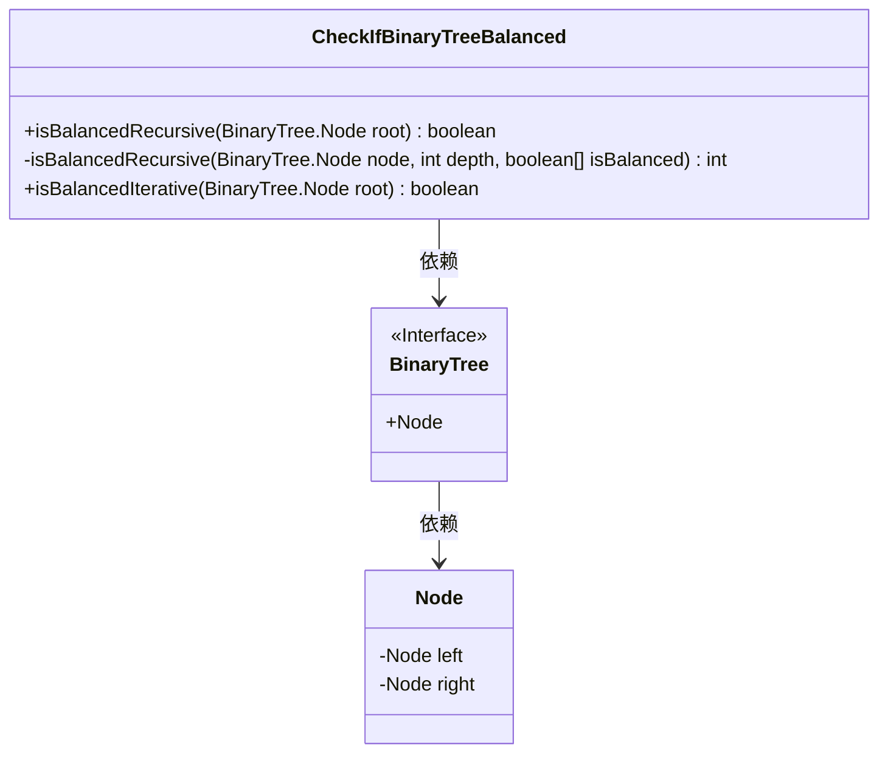
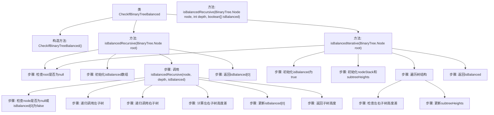

# 基础信息

|      |      |
|------|------|
| 名称 | CheckIfBinaryTreeBalanced |
| 编码语言 | .java |
| 代码路径 | Java/src/main/java/com/thealgorithms/datastructures/trees/CheckIfBinaryTreeBalanced.java |
| 包名 | com.thealgorithms.datastructures.trees |
| 依赖项 | ['java.util.HashMap', 'java.util.Stack'] |
| 概述说明 | 递归和迭代方法检查二叉树平衡性。 |

# 说明

该内容讨论了如何检查二叉树是否平衡的两种实现方法：递归和迭代。递归方法通过计算每个节点的左右子树高度差来判断平衡性，若所有节点的高度差不超过1，则二叉树平衡。迭代方法则使用栈或队列遍历树节点，同时记录并比较子树高度，确保平衡条件。两种方法均需遍历所有节点，时间复杂度为O(n)，但递归方法可能因深度过大导致栈溢出，而迭代方法则避免了这一问题。

# 类列表 Class Summary

| 名称   | 类型  | 说明 |
|-------|------|-------------|
| CheckIfBinaryTreeBalanced | class | 检查二叉树是否平衡的递归和迭代实现。 |

## 类 CheckIfBinaryTreeBalanced

|      |      |
|------|------|
| 访问范围 | public final |
| 类型 | class |
| 名称 | CheckIfBinaryTreeBalanced |
| 说明 | 检查二叉树是否平衡的递归和迭代实现。 |

### UML类图

**描述：**  
`CheckIfBinaryTreeBalanced` 类提供了两种方法来判断二叉树是否平衡：递归方法和迭代方法。递归方法通过深度优先搜索（DFS）遍历树，计算每个节点的左右子树高度差，若高度差大于1则树不平衡。迭代方法使用栈和哈希表模拟DFS，同样通过比较左右子树高度差来判断平衡性。`BinaryTree` 是一个接口，包含 `Node` 类，`Node` 类表示二叉树的节点，包含左右子节点的引用。

### 内部方法调用关系图

**描述**：该代码实现了一个用于检查二叉树是否平衡的类`CheckIfBinaryTreeBalanced`。它提供了两种方法：递归方法`isBalancedRecursive`和迭代方法`isBalancedIterative`。递归方法通过遍历树的每个节点，计算左右子树的高度差来判断是否平衡。迭代方法使用栈和哈希表来模拟递归过程，同样通过计算左右子树的高度差来判断平衡性。两种方法最终返回一个布尔值，表示树是否平衡。

### 字段列表 Field List

| 名称  | 类型  | 说明 |
|-------|-------|------|

### 方法列表 Method List

| 名称  | 类型  | 说明 |
|-------|-------|------|
| isBalancedRecursive | boolean | 递归检查二叉树是否平衡，使用数组记录平衡状态。 |
| isBalancedRecursive | int | 递归检查二叉树是否平衡，计算子树高度并判断差值。 |
| isBalancedIterative | boolean | 使用迭代方法检查二叉树是否平衡，通过后序遍历和高度差判断。 |

