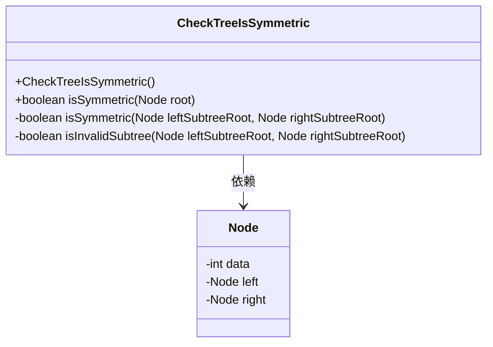
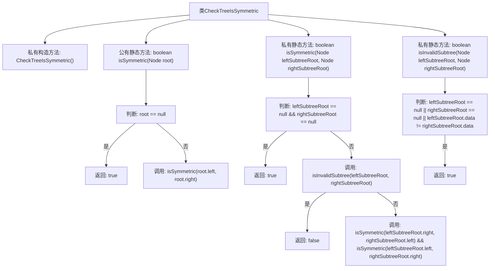

# 基础信息

|      |      |
|------|------|
| 名称 | CheckTreeIsSymmetric |
| 编码语言 | .java |
| 代码路径 | Java/src/main/java/com/thealgorithms/datastructures/trees/CheckTreeIsSymmetric.java |
| 包名 | com.thealgorithms.datastructures.trees |
| 依赖项 | ['com.thealgorithms.datastructures.trees.BinaryTree.Node'] |
| 概述说明 | 静态方法用于检查二叉树是否对称。 |

# 说明

该方法用于检查二叉树是否对称。它通过递归或迭代的方式遍历二叉树的左右子树，比较对应节点的值是否相等，并确保树的结构对称。具体步骤包括检查当前节点的左右子节点是否同时存在或不存在，以及它们的值是否相同。如果所有对应节点都满足对称条件，则二叉树是对称的。该方法适用于各种二叉树结构，能够有效判断树的对称性。

# 类列表 Class Summary

| 名称   | 类型  | 说明 |
|-------|------|-------------|
| CheckTreeIsSymmetric | class | 检查二叉树是否对称的静态方法。 |

## 类 CheckTreeIsSymmetric

|      |      |
|------|------|
| 访问范围 | public final |
| 类型 | class |
| 名称 | CheckTreeIsSymmetric |
| 说明 | 检查二叉树是否对称的静态方法。 |

### UML类图

**描述：**  
`CheckTreeIsSymmetric` 类用于检查二叉树是否对称。它包含一个公共方法 `isSymmetric(Node root)`，用于判断以 `root` 为根的二叉树是否对称。该类还包含两个私有方法 `isSymmetric(Node leftSubtreeRoot, Node rightSubtreeRoot)` 和 `isInvalidSubtree(Node leftSubtreeRoot, Node rightSubtreeRoot)`，分别用于递归判断子树是否对称以及判断子树是否无效。`Node` 类表示二叉树的节点，包含数据 `data` 和左右子节点 `left` 和 `right`。`CheckTreeIsSymmetric` 类依赖于 `Node` 类来完成对称性检查。

### 内部方法调用关系图

这段代码定义了一个名为 `CheckTreeIsSymmetric` 的类，用于检查二叉树是否对称。类中包含一个私有构造方法和三个静态方法。`isSymmetric(Node root)` 方法用于判断根节点是否为空，若为空则返回 `true`，否则调用 `isSymmetric(Node leftSubtreeRoot, Node rightSubtreeRoot)` 方法递归检查左右子树是否对称。`isInvalidSubtree(Node leftSubtreeRoot, Node rightSubtreeRoot)` 方法用于判断左右子树是否无效，若无效则返回 `false`。最终，通过递归调用 `isSymmetric` 方法，确保整个二叉树的结构和节点值对称。

### 字段列表 Field List

| 名称  | 类型  | 说明 |
|-------|-------|------|

### 方法列表 Method List

| 名称  | 类型  | 说明 |
|-------|-------|------|
| isSymmetric | boolean | 检查二叉树左右子树是否对称的递归方法。 |
| isSymmetric | boolean | 判断二叉树是否对称，递归比较左右子树。 |
| isInvalidSubtree | boolean | 检查左右子树是否无效：空或数据不等。 |

