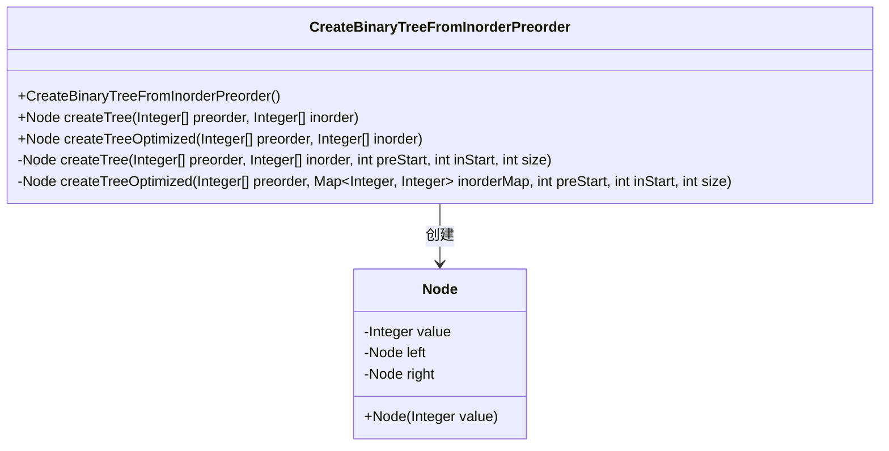
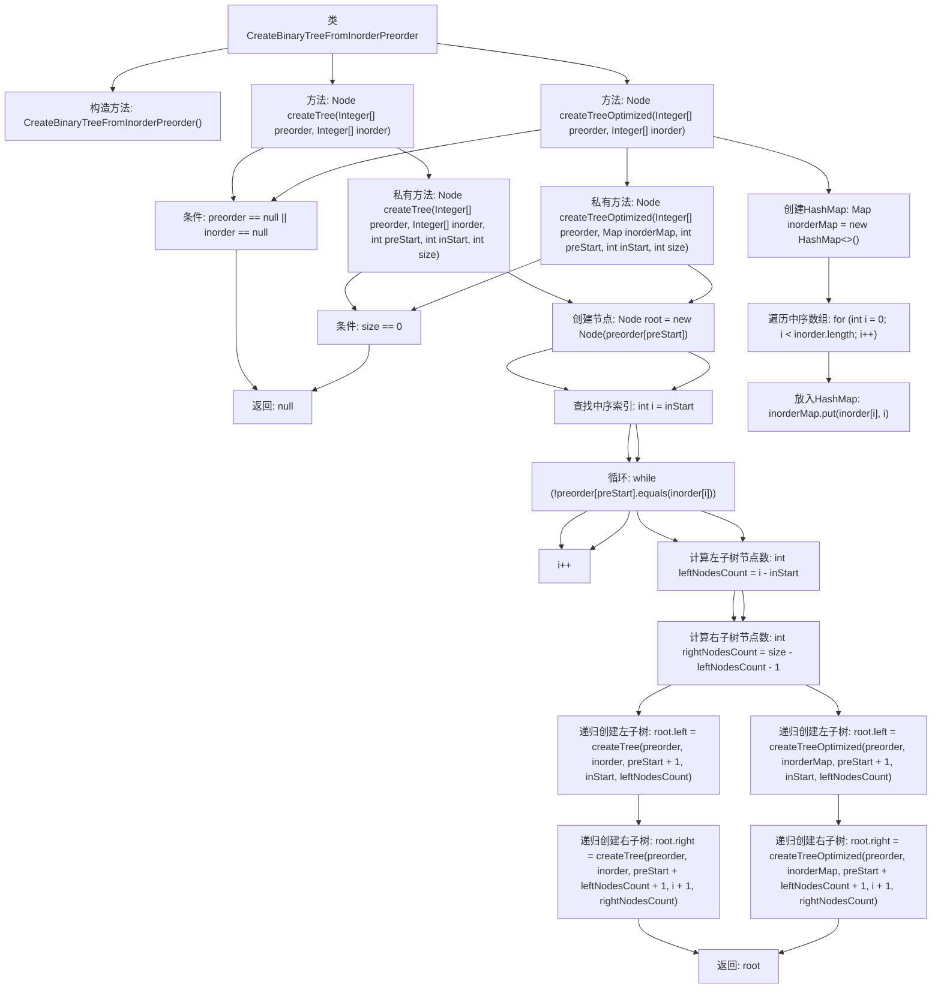

# 基础信息

|      |      |
|------|------|
| 名称 | CreateBinaryTreeFromInorderPreorder |
| 编码语言 | .java |
| 代码路径 | Java/src/main/java/com/thealgorithms/datastructures/trees/CreateBinaryTreeFromInorderPreorder.java |
| 包名 | com.thealgorithms.datastructures.trees |
| 依赖项 | ['com.thealgorithms.datastructures.trees.BinaryTree.Node', 'java.util.HashMap', 'java.util.Map'] |
| 概述说明 | 前序中序遍历构建二叉树的两种方法。 |

# 说明

根据前序和中序遍历构建二叉树的两种实现方法，主要涉及递归和迭代两种策略。递归方法通过在前序遍历中确定根节点，然后在中序遍历中找到根节点的位置，从而将树分为左子树和右子树，递归构建整个二叉树。迭代方法则利用栈结构，通过模拟递归过程，逐步构建二叉树。两种方法均需确保前序和中序遍历的正确性，以保证构建的二叉树结构准确。

# 类列表 Class Summary

| 名称   | 类型  | 说明 |
|-------|------|-------------|
| CreateBinaryTreeFromInorderPreorder | class | 根据前序和中序遍历构建二叉树的两种实现方法。 |

## 类 CreateBinaryTreeFromInorderPreorder

|      |      |
|------|------|
| 访问范围 | public final |
| 类型 | class |
| 名称 | CreateBinaryTreeFromInorderPreorder |
| 说明 | 根据前序和中序遍历构建二叉树的两种实现方法。 |

### UML类图

这段代码定义了一个名为 `CreateBinaryTreeFromInorderPreorder` 的类，用于根据给定的前序遍历和中序遍历数组构建二叉树。类中包含两个公有方法 `createTree` 和 `createTreeOptimized`，分别用于不同的实现方式。`createTree` 方法通过遍历中序数组来查找根节点，而 `createTreeOptimized` 方法则通过使用哈希表来优化查找过程。两个方法都递归地构建二叉树的左右子树，并返回根节点。`Node` 类表示二叉树的节点，包含值、左子节点和右子节点。

### 内部方法调用关系图

这段代码实现了根据前序遍历和中序遍历数组构建二叉树的两种方法。第一种方法通过递归遍历中序数组来查找根节点位置，第二种方法通过HashMap优化了查找过程。流程图展示了从输入数组到构建二叉树的全过程，包括条件判断、递归调用和节点创建等步骤。

### 字段列表 Field List

| 名称  | 类型  | 说明 |
|-------|-------|------|

### 方法列表 Method List

| 名称  | 类型  | 说明 |
|-------|-------|------|
| createTreeOptimized | Node | 根据前序和中序遍历优化构建二叉树，使用哈希映射加速查找。 |
| createTreeOptimized | Node | 根据前序和中序遍历优化生成二叉树。 |
| createTree | Node | 根据前序和中序遍历创建二叉树，处理空值情况。 |
| createTree | Node | 根据前序和中序遍历构建二叉树，递归实现节点创建。 |

