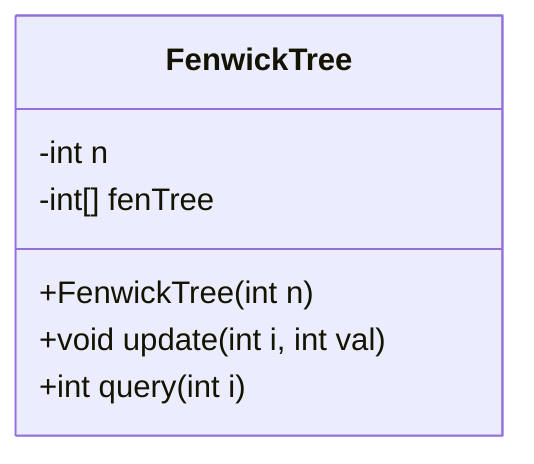
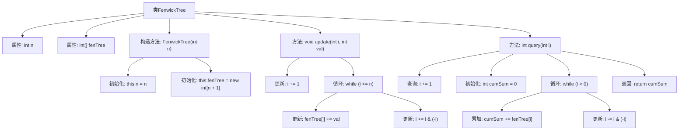

# 基础信息

|      |      |
|------|------|
| 名称 | FenwickTree |
| 编码语言 | .java |
| 代码路径 | Java/src/main/java/com/thealgorithms/datastructures/trees/FenwickTree.java |
| 包名 | com.thealgorithms.datastructures.trees |
| 依赖项 | [] |
| 概述说明 | FenwickTree类实现树状数组，支持更新和查询功能。 |

# 说明

FenwickTree类实现了树状数组的数据结构，主要用于高效处理数组的更新和查询操作。树状数组通过利用二进制索引的特性，能够在对数时间内完成单点更新和区间查询。这种数据结构特别适用于需要频繁更新和查询的场景，如动态统计区间和或最大值等问题。FenwickTree类的核心功能包括对数组元素的快速更新以及对任意区间的快速查询，从而显著提升算法的效率。

# 类列表 Class Summary

| 名称   | 类型  | 说明 |
|-------|------|-------------|
| FenwickTree | class | FenwickTree类实现树状数组，支持更新和查询操作。 |

## 类 FenwickTree

|      |      |
|------|------|
| 访问范围 | public |
| 类型 | class |
| 名称 | FenwickTree |
| 说明 | FenwickTree类实现树状数组，支持更新和查询操作。 |

### UML类图

**描述：**  
`FenwickTree` 类实现了一个树状数组（Fenwick Tree），用于高效地处理前缀和查询和单点更新操作。类中包含两个私有成员：`n` 表示数组的大小，`fenTree` 是树状数组本身。构造函数 `FenwickTree(int n)` 初始化树状数组的大小。`update(int i, int val)` 方法用于在指定索引 `i` 处增加 `val`，而 `query(int i)` 方法返回从索引 `1` 到 `i` 的累积和。这些操作的时间复杂度均为 O(log n)，适用于需要频繁更新和查询前缀和的场景。

### 内部方法调用关系图

**描述：**  
FenwickTree类实现了一个树状数组（Fenwick Tree），用于高效地进行区间更新和查询。构造方法初始化数组大小和树状数组。`update`方法在指定索引处添加值，并通过循环更新相关节点。`query`方法计算从索引1到指定索引的累积和，并通过循环累加相关节点的值。

### 字段列表 Field List

| 名称  | 类型  | 说明 |
|-------|-------|------|
| n | int | 定义私有整型变量n。 |
| fenTree | int[] | 声明一个私有的整型数组fenTree。 |

### 方法列表 Method List

| 名称  | 类型  | 说明 |
|-------|-------|------|
| update | void | 更新数组元素并调整Fenwick树。 |
| query | int | 查询函数：索引加1后累加树状数组值，返回累加和。 |

