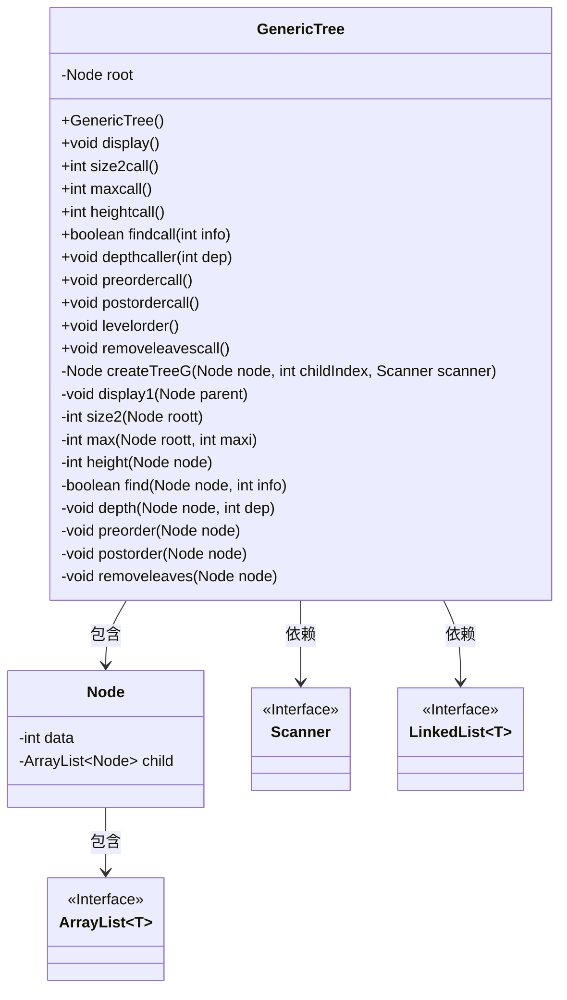

# 基础信息

|      |      |
|------|------|
| 名称 | GenericTree |
| 编码语言 | .java |
| 代码路径 | Java/src/main/java/com/thealgorithms/datastructures/trees/GenericTree.java |
| 包名 | com.thealgorithms.datastructures.trees |
| 依赖项 | ['java.util.ArrayList', 'java.util.LinkedList', 'java.util.Scanner'] |
| 概述说明 | 通用树类提供创建、显示、计算、查找、遍历及删除叶子节点等功能。 |

# 说明

通用树类是一个功能全面的数据结构，支持多种操作。它能够创建树结构，并显示其内容。该类提供了计算树的大小、查找树中的最大值、以及确定树的高度的功能。此外，它还支持在树中查找特定节点，计算节点的深度，以及执行多种遍历操作，如前序、中序和后序遍历。最后，该类还具备删除叶子节点的能力，使得树结构的管理更加灵活和高效。

# 类列表 Class Summary

| 名称   | 类型  | 说明 |
|-------|------|-------------|
| GenericTree | class | 通用树类，包含创建、显示、计算大小、最大值、高度、查找、深度、遍历及删除叶子节点等功能。 |

## 类 GenericTree

|      |      |
|------|------|
| 访问范围 | public |
| 类型 | class |
| 名称 | GenericTree |
| 说明 | 通用树类，包含创建、显示、计算大小、最大值、高度、查找、深度、遍历及删除叶子节点等功能。 |

### UML类图

### 描述
该代码实现了一个通用的树结构（`GenericTree`），其中包含一个内部类`Node`，用于表示树的节点。`GenericTree`类提供了多种方法来操作树，包括树的创建、显示、计算大小、查找最大值、计算高度、查找特定值、计算深度、遍历（前序、后序、层序）以及移除叶子节点等。`Node`类包含数据和子节点列表。`GenericTree`类依赖于`Scanner`和`LinkedList`等外部类来进行输入和队列操作。

### 内部方法调用关系图

```mermaid
graph TD
    A["类GenericTree"]
    B["内部类Node"]
    C["属性: int data"]
    D["属性: ArrayList<Node> child"]
    E["构造方法: GenericTree()"]
    F["方法: Node createTreeG(Node node, int childIndex, Scanner scanner)"]
    G["方法: void display()"]
    H["方法: void display1(Node parent)"]
    I["方法: int size2call()"]
    J["方法: int size2(Node roott)"]
    K["方法: int maxcall()"]
    L["方法: int max(Node roott, int maxi)"]
    M["方法: int heightcall()"]
    N["方法: int height(Node node)"]
    O["方法: boolean findcall(int info)"]
    P["方法: boolean find(Node node, int info)"]
    Q["方法: void depthcaller(int dep)"]
    R["方法: void depth(Node node, int dep)"]
    S["方法: void preordercall()"]
    T["方法: void preorder(Node node)"]
    U["方法: void postordercall()"]
    V["方法: void postorder(Node node)"]
    W["方法: void levelorder()"]
    X["方法: void removeleavescall()"]
    Y["方法: void removeleaves(Node node)"]

    A --> B
    B --> C
    B --> D
    A --> E
    E --> F
    A --> G
    G --> H
    A --> I
    I --> J
    A --> K
    K --> L
    A --> M
    M --> N
    A --> O
    O --> P
    A --> Q
    Q --> R
    A --> S
    S --> T
    A --> U
    U --> V
    A --> W
    A --> X
    X --> Y
```

**描述**：该流程图展示了`GenericTree`类的结构及其内部类`Node`的关系。`GenericTree`类包含多个方法，用于创建、显示、计算大小、最大值、高度、查找元素、深度遍历、前序、后序、层序遍历以及移除叶子节点等操作。每个方法通过箭头指向其内部调用的方法，清晰地展示了类内部函数之间的调用关系。

### 字段列表 Field List

| 名称  | 类型  | 说明 |
|-------|-------|------|
| root | Node | 私有不可变的根节点。 |

### 方法列表 Method List

| 名称  | 类型  | 说明 |
|-------|-------|------|
| max | int | 递归查找树节点最大值。 |
| depthcaller | void | 递归调用深度计算方法。 |
| display1 | void | 递归打印父节点及其子节点数据。 |
| find | boolean | 递归查找节点数据是否匹配给定信息。 |
| postorder | void | 后序遍历递归打印节点数据。 |
| postordercall | void | 后序遍历根节点并输出句号。 |
| maxcall | int | 该方法返回二叉树中的最大值。 |
| removeleaves | void | 递归移除节点所有无子节点的子节点。 |
| removeleavescall | void | 该方法调用移除根节点的所有叶子节点。 |
| depth | void | 递归遍历节点树，输出指定深度节点的数据。 |
| preorder | void | 私有方法preorder递归遍历节点树并打印节点数据。 |
| preordercall | void | 方法preordercall调用preorder遍历并输出句点。 |
| size2call | int | 方法size2call调用size2，返回根节点大小。 |
| levelorder | void | 使用队列实现树的层次遍历，依次输出节点数据。 |
| size2 | int | 递归计算树节点大小，包括子节点和自身。 |
| findcall | boolean | 方法findcall通过调用find在根节点中查找指定信息。 |
| display | void | 定义了一个名为display的辅助函数，用于调用display1函数显示根节点。 |
| height | int | 递归计算节点高度，返回最大子节点高度加一。 |
| createTreeG | Node | 创建树结构，输入节点数据及子节点数量，递归生成子树。 |
| heightcall | int | 返回二叉树高度减一的结果。 |

