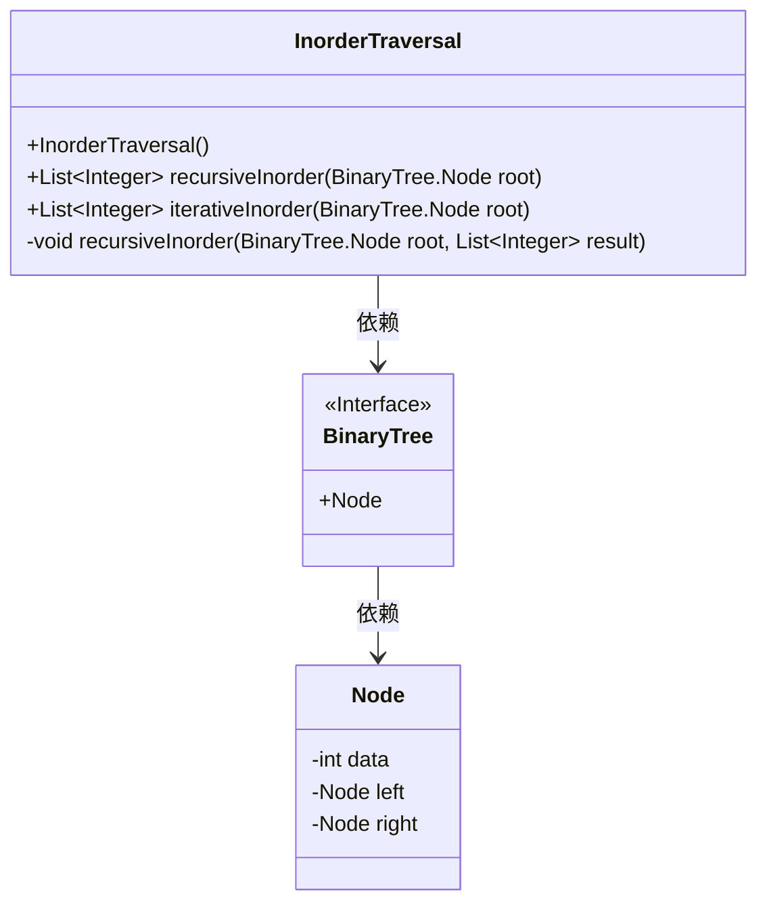
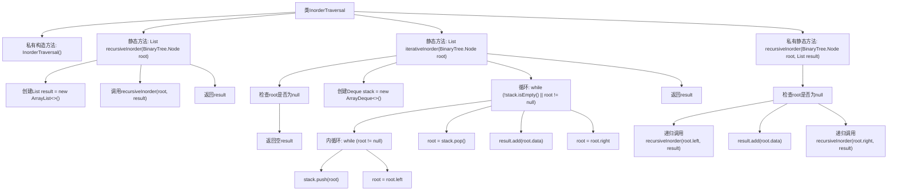

# 基础信息

|      |      |
|------|------|
| 名称 | InorderTraversal |
| 编码语言 | .java |
| 代码路径 | Java/src/main/java/com/thealgorithms/datastructures/trees/InorderTraversal.java |
| 包名 | com.thealgorithms.datastructures.trees |
| 依赖项 | ['java.util.ArrayDeque', 'java.util.ArrayList', 'java.util.Deque', 'java.util.List'] |
| 概述说明 | InorderTraversal类支持递归和迭代的二叉树中序遍历。 |

# 说明

InorderTraversal类提供了两种实现二叉树中序遍历的方法，分别是递归方式和迭代方式。递归方式通过函数自身调用来遍历树的左子树、访问根节点和遍历右子树。迭代方式则使用栈数据结构模拟递归过程，依次处理左子树、根节点和右子树，确保遍历顺序正确。这两种方法都能有效完成二叉树的中序遍历任务。

# 类列表 Class Summary

| 名称   | 类型  | 说明 |
|-------|------|-------------|
| InorderTraversal | class | InorderTraversal类提供递归和迭代方式实现二叉树的中序遍历。 |

## 类 InorderTraversal

|      |      |
|------|------|
| 访问范围 | public final |
| 类型 | class |
| 名称 | InorderTraversal |
| 说明 | InorderTraversal类提供递归和迭代方式实现二叉树的中序遍历。 |

### UML类图

这段代码定义了一个 `InorderTraversal` 类，用于实现二叉树的中序遍历。该类提供了两种遍历方法：递归和迭代。递归方法 `recursiveInorder` 通过递归调用自身来遍历二叉树的左子树、根节点和右子树，并将结果存储在列表中。迭代方法 `iterativeInorder` 使用栈来模拟递归过程，同样实现了中序遍历。`BinaryTree` 是一个接口，包含 `Node` 类，`Node` 类表示二叉树的节点，包含数据、左子节点和右子节点。`InorderTraversal` 类依赖于 `BinaryTree` 接口和 `Node` 类来实现遍历功能。

### 内部方法调用关系图

这段代码实现了二叉树的中序遍历，提供了递归和迭代两种方法。递归方法通过递归调用自身遍历左子树、访问根节点、再遍历右子树。迭代方法使用栈来模拟递归过程，首先将左子树节点压入栈，然后访问根节点，最后处理右子树。两种方法都将遍历结果存储在List中并返回。

### 字段列表 Field List

| 名称  | 类型  | 说明 |
|-------|-------|------|

### 方法列表 Method List

| 名称  | 类型  | 说明 |
|-------|-------|------|
| recursiveInorder | List<Integer> | 递归中序遍历二叉树并返回结果列表。 |
| recursiveInorder | void | 递归中序遍历二叉树，将节点值存入列表。 |
| iterativeInorder | List<Integer> | 迭代中序遍历二叉树，返回节点数据列表。 |

