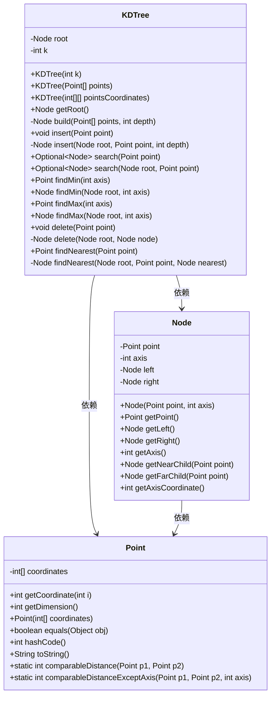

# 基础信息

|      |      |
|------|------|
| 名称 | KDTree |
| 编码语言 | .java |
| 代码路径 | Java/src/main/java/com/thealgorithms/datastructures/trees/KDTree.java |
| 包名 | com.thealgorithms.datastructures.trees |
| 依赖项 | ['java.util.Arrays', 'java.util.Comparator', 'java.util.Objects', 'java.util.Optional'] |
| 概述说明 | KDTree支持构建、插入、删除、搜索、查找最值和最近邻点操作。 |

# 说明

KDTree是一种数据结构，支持构建、插入、删除、搜索、查找最值及最近邻点操作。它通过高效的空间划分和搜索算法，适用于多维数据的快速查询和操作。

# 类列表 Class Summary

| 名称   | 类型  | 说明 |
|-------|------|-------------|
| KDTree | class | KDTree实现，支持构建、插入、删除、搜索、查找最值及最近邻点操作。 |

## 类 KDTree

|      |      |
|------|------|
| 访问范围 | public |
| 类型 | class |
| 名称 | KDTree |
| 说明 | KDTree实现，支持构建、插入、删除、搜索、查找最值及最近邻点操作。 |

### UML类图

这段代码实现了一个K维树（KDTree），用于高效地存储和检索多维空间中的点。KDTree类包含构建、插入、搜索、删除和查找最近邻点等操作。Point类表示多维空间中的一个点，包含坐标和距离计算方法。Node类表示KDTree中的一个节点，包含点、轴和左右子节点。KDTree通过递归方式构建树结构，并在查找和插入操作中利用轴信息进行分割。

### 内部方法调用关系图

```mermaid
graph TD
    A["类KDTree"]
    B["属性: Node root"]
    C["属性: int k"]
    D["构造方法: KDTree(int k)"]
    E["构造方法: KDTree(Point[] points)"]
    F["构造方法: KDTree(int[][] pointsCoordinates)"]
    G["方法: Node getRoot()"]
    H["方法: Node build(Point[] points, int depth)"]
    I["方法: void insert(Point point)"]
    J["方法: Node insert(Node root, Point point, int depth)"]
    K["方法: Optional<Node> search(Point point)"]
    L["方法: Optional<Node> search(Node root, Point point)"]
    M["方法: Point findMin(int axis)"]
    N["方法: Node findMin(Node root, int axis)"]
    O["方法: Point findMax(int axis)"]
    P["方法: Node findMax(Node root, int axis)"]
    Q["方法: void delete(Point point)"]
    R["方法: Node delete(Node root, Node node)"]
    S["方法: Point findNearest(Point point)"]
    T["方法: Node findNearest(Node root, Point point, Node nearest)"]

    A --> B
    A --> C
    A --> D
    A --> E
    A --> F
    A --> G
    A --> H
    A --> I
    I --> J
    A --> K
    K --> L
    A --> M
    M --> N
    A --> O
    O --> P
    A --> Q
    Q --> R
    A --> S
    S --> T
```

该流程图展示了KDTree类的结构及其主要方法。KDTree类用于构建和操作K维树，支持插入、搜索、删除、查找最小值和最大值以及查找最近邻点等操作。每个方法都有其对应的子方法或内部逻辑，如`insert`方法调用`insert(Node root, Point point, int depth)`来实现递归插入。流程图清晰地展示了这些方法之间的调用关系，便于理解KDTree的工作原理。

### 字段列表 Field List

| 名称  | 类型  | 说明 |
|-------|-------|------|
| root | Node | 定义私有根节点变量。 |
| k | int | 声明一个私有的不可变整型变量k。 |

### 方法列表 Method List

| 名称  | 类型  | 说明 |
|-------|-------|------|
| findMin | Node | 在树中沿指定轴查找最小节点，递归比较左右子树。 |
| findNearest | Point | 查找给定点的最近点并返回其坐标。 |
| search | Optional<Node> | 搜索方法检查点维度并返回节点。 |
| findMin | Point | 查找指定轴的最小点。 |
| getRoot | Node | 该方法返回根节点对象。 |
| findMax | Point | 查找指定轴的最大点并返回。 |
| delete | void | 删除指定点的节点，若点不存在则抛出异常。 |
| findNearest | Node | 递归查找树中距离给定点最近的节点。 |
| findMax | Node | 在二叉树中沿指定轴查找最大节点。 |
| build | Node | 递归构建K维树，按轴排序并分割点集。 |
| delete | Node | 删除二叉树节点，递归处理左右子树，保持树结构。 |
| insert | Node | 在K维树中插入节点，根据深度选择轴，递归比较坐标并更新子树。 |
| insert | void | 插入点时检查维度，若不符则抛出异常，否则递归插入。 |
| search | Optional<Node> | 在树中递归查找与给定点匹配的节点，返回匹配节点或空。 |

