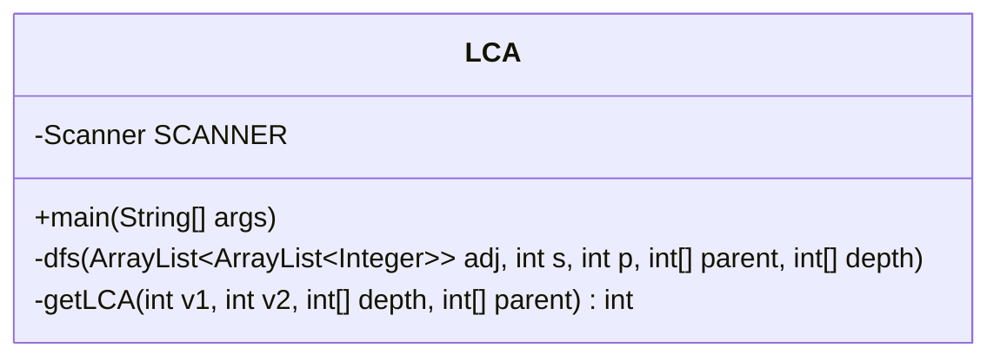

# 基础信息

|      |      |
|------|------|
| 名称 | LCA |
| 编码语言 | .java |
| 代码路径 | Java/src/main/java/com/thealgorithms/datastructures/trees/LCA.java |
| 包名 | com.thealgorithms.datastructures.trees |
| 依赖项 | ['java.util.ArrayList', 'java.util.Scanner'] |
| 概述说明 | Java实现树的最低公共祖先算法。 |

# 说明

该内容描述了使用Java代码实现树的最低公共祖先算法。最低公共祖先是指在树结构中，两个节点的共同祖先中深度最大的那个节点。该算法通常用于解决树结构中的路径和关系问题，能够高效地找到两个节点的最低公共祖先。实现过程中，可能需要遍历树结构，并利用递归或迭代的方法来确定最低公共祖先的位置。该算法在二叉树、多叉树等不同树结构中均有应用，是解决树相关问题的关键技术之一。

# 类列表 Class Summary

| 名称   | 类型  | 说明 |
|-------|------|-------------|
| LCA | class | Java代码实现树的最低公共祖先算法。 |

## 类 LCA

|      |      |
|------|------|
| 访问范围 | public final |
| 类型 | class |
| 名称 | LCA |
| 说明 | Java代码实现树的最低公共祖先算法。 |

### UML类图

类图描述：
`LCA` 类是一个最终类，包含一个私有的 `Scanner` 对象用于输入，以及三个方法：`main` 用于执行程序逻辑，`dfs` 用于深度优先搜索计算每个顶点的父节点和深度，`getLCA` 用于计算两个顶点的最低公共祖先。该类通过深度优先搜索和父节点数组来实现最低公共祖先的计算，适用于树结构的处理。

### 内部方法调用关系图

```mermaid
graph TD
    A["类LCA"]
    B["私有构造方法: LCA()"]
    C["私有静态Scanner对象: SCANNER"]
    D["公有静态方法: main(String[] args)"]
    E["初始化邻接表: ArrayList<ArrayList<Integer>> adj"]
    F["读取顶点数: v = SCANNER.nextInt()"]
    G["计算边数: e = v - 1"]
    H["初始化邻接表: for循环"]
    I["读取边信息: to = SCANNER.nextInt(), from = SCANNER.nextInt()"]
    J["更新邻接表: adj.get(to).add(from), adj.get(from).add(to)"]
    K["初始化parent和depth数组: int[] parent, int[] depth"]
    L["调用dfs方法: dfs(adj, 0, -1, parent, depth)"]
    M["读取顶点v1和v2: v1 = SCANNER.nextInt(), v2 = SCANNER.nextInt()"]
    N["调用getLCA方法: getLCA(v1, v2, depth, parent)"]
    O["输出LCA结果: System.out.println()"]
    P["私有静态方法: dfs(ArrayList<ArrayList<Integer>> adj, int s, int p, int[] parent, int[] depth)"]
    Q["遍历邻接顶点: for (int adjacent : adj.get(s))"]
    R["更新parent和depth: parent[adjacent] = s, depth[adjacent] = 1 + depth[s]"]
    S["递归调用dfs: dfs(adj, adjacent, s, parent, depth)"]
    T["私有静态方法: getLCA(int v1, int v2, int[] depth, int[] parent)"]
    U["交换v1和v2: if (depth[v1] < depth[v2])"]
    V["调整v1深度: while (depth[v1] != depth[v2])"]
    W["返回v1: if (v1 == v2)"]
    X["调整v1和v2: while (v1 != v2)"]
    Y["返回LCA: return v1"]

    A --> B
    A --> C
    A --> D
    D --> E
    D --> F
    D --> G
    D --> H
    D --> I
    D --> J
    D --> K
    D --> L
    D --> M
    D --> N
    D --> O
    A --> P
    P --> Q
    Q --> R
    Q --> S
    A --> T
    T --> U
    T --> V
    T --> W
    T --> X
    T --> Y
```

**描述：**
该代码实现了一个用于计算树中两个节点的最低公共祖先（LCA）的算法。首先，程序通过邻接表表示树结构，并读取顶点和边的信息。接着，使用深度优先搜索（DFS）计算每个节点的深度和父节点。最后，通过调整两个节点的深度并回溯父节点，找到它们的LCA并输出结果。整个流程包括初始化、DFS遍历和LCA计算三个主要步骤。

### 字段列表 Field List

| 名称  | 类型  | 说明 |
|-------|-------|------|
| SCANNER = new Scanner(System.in) | Scanner | 定义静态Scanner对象SCANNER用于读取控制台输入。 |

### 方法列表 Method List

| 名称  | 类型  | 说明 |
|-------|-------|------|
| main | void | Java代码实现树结构，计算两节点最低公共祖先。 |
| getLCA | int | 静态方法计算两节点最低公共祖先，调整深度后回溯父节点。 |
| dfs | void | 深度优先搜索遍历图，更新父节点和深度信息。 |

