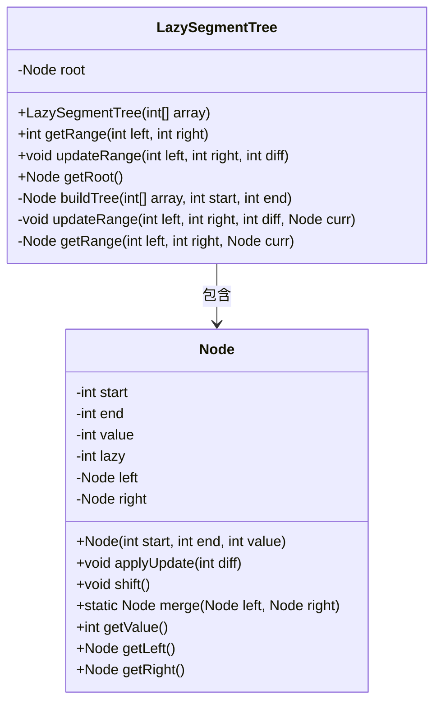

# 基础信息

|      |      |
|------|------|
| 名称 | LazySegmentTree |
| 编码语言 | .java |
| 代码路径 | Java/src/main/java/com/thealgorithms/datastructures/trees/LazySegmentTree.java |
| 包名 | com.thealgorithms.datastructures.trees |
| 依赖项 | [] |
| 概述说明 | 惰性线段树支持区间更新和查询，时间复杂度O(log n)。 |

# 说明

惰性线段树是一种高效的数据结构，主要用于处理区间更新和查询操作。其核心特点是通过延迟更新机制，将部分更新操作暂时存储，仅在必要时才进行实际更新，从而减少不必要的计算。这种实现方式使得区间更新和查询的时间复杂度均为O(log n)，在处理大规模数据时表现出色。惰性线段树广泛应用于需要频繁进行区间操作的场景，如区间求和、区间最值查询等。其设计巧妙地平衡了更新和查询的效率，是解决复杂区间问题的有力工具。

# 类列表 Class Summary

| 名称   | 类型  | 说明 |
|-------|------|-------------|
| LazySegmentTree | class | 惰性线段树实现，支持区间更新和查询，时间复杂度为O(log n)。 |

## 类 LazySegmentTree

|      |      |
|------|------|
| 访问范围 | public |
| 类型 | class |
| 名称 | LazySegmentTree |
| 说明 | 惰性线段树实现，支持区间更新和查询，时间复杂度为O(log n)。 |

### UML类图

**描述：**  
`LazySegmentTree` 类实现了一个惰性线段树，用于高效地处理区间更新和查询操作。`Node` 类是线段树的节点，包含区间的起始和结束索引、节点的值、惰性标记以及左右子节点。`LazySegmentTree` 通过 `buildTree` 方法构建线段树，支持 `updateRange` 方法进行区间更新，以及 `getRange` 方法进行区间查询。`Node` 类的 `applyUpdate` 和 `shift` 方法用于处理惰性更新，`merge` 方法用于合并两个节点。

### 内部方法调用关系图

```mermaid
graph TD
    A["类LazySegmentTree"]
    B["属性: Node root"]
    C["构造方法: LazySegmentTree(int[] array)"]
    D["方法: Node buildTree(int[] array, int start, int end)"]
    E["方法: void updateRange(int left, int right, int diff, Node curr)"]
    F["方法: Node getRange(int left, int right, Node curr)"]
    G["方法: int getRange(int left, int right)"]
    H["方法: void updateRange(int left, int right, int diff)"]
    I["方法: Node getRoot()"]
    J["类Node"]
    K["属性: int start"]
    L["属性: int end"]
    M["属性: int value"]
    N["属性: int lazy"]
    O["属性: Node left"]
    P["属性: Node right"]
    Q["构造方法: Node(int start, int end, int value)"]
    R["方法: void applyUpdate(int diff)"]
    S["方法: void shift()"]
    T["方法: static Node merge(Node left, Node right)"]
    U["方法: int getValue()"]
    V["方法: Node getLeft()"]
    W["方法: Node getRight()"]

    A --> B
    A --> C
    A --> D
    A --> E
    A --> F
    A --> G
    A --> H
    A --> I
    C --> D
    E --> D
    F --> D
    G --> F
    H --> E
    I --> B
    J --> K
    J --> L
    J --> M
    J --> N
    J --> O
    J --> P
    J --> Q
    J --> R
    J --> S
    J --> T
    J --> U
    J --> V
    J --> W
```

这段代码实现了一个Lazy Segment Tree（惰性线段树），用于高效地处理区间更新和查询操作。LazySegmentTree类包含一个内部类Node，用于表示线段树的节点。每个节点包含区间的起始和结束位置、节点的值、惰性标记以及左右子节点。LazySegmentTree类提供了构建树、区间更新和查询的方法，而Node类则提供了更新、惰性标记传递和节点合并等功能。通过惰性标记，线段树可以在O(log n)时间复杂度内完成区间更新和查询操作。

### 字段列表 Field List

| 名称  | 类型  | 说明 |
|-------|-------|------|
| root | Node | 私有常量Node类型根节点 |

### 方法列表 Method List

| 名称  | 类型  | 说明 |
|-------|-------|------|
| getRoot | Node | 获取根节点的方法。 |
| buildTree | Node | 递归构建二叉树，合并左右子树。 |
| getRange | int | 方法获取指定范围的节点值，若节点为空则返回0。 |
| updateRange | void | 更新指定区间值的公共方法，调用内部更新函数。 |
| updateRange | void | 更新指定范围的节点值，递归处理左右子节点并合并结果。 |
| getRange | Node | 获取指定范围的节点，若符合条件返回当前节点，否则递归检查左右子节点。 |

