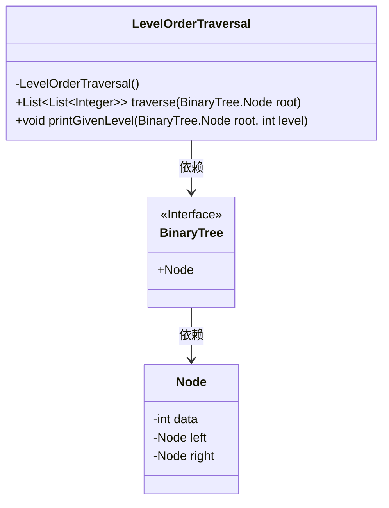
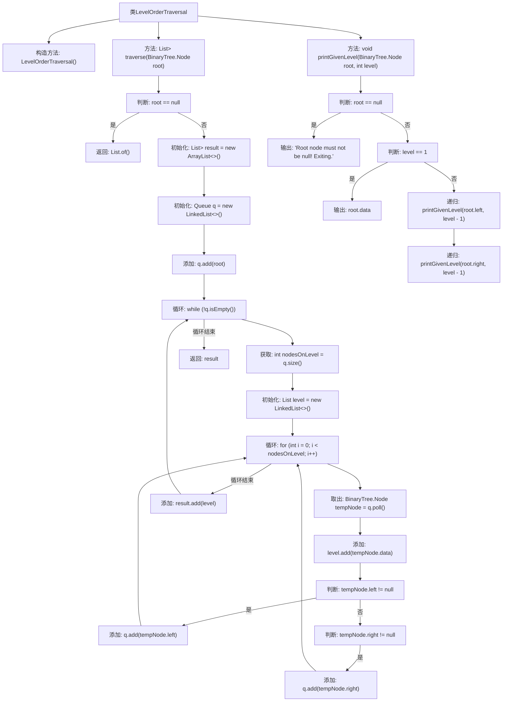

# 基础信息

|      |      |
|------|------|
| 名称 | LevelOrderTraversal |
| 编码语言 | .java |
| 代码路径 | Java/src/main/java/com/thealgorithms/datastructures/trees/LevelOrderTraversal.java |
| 包名 | com.thealgorithms.datastructures.trees |
| 依赖项 | ['java.util.ArrayList', 'java.util.LinkedList', 'java.util.List', 'java.util.Queue'] |
| 概述说明 | 实现二叉树层序遍历并打印指定层级节点。 |

# 说明

该内容描述了一个关于二叉树操作的编程任务，主要涉及层序遍历和指定层级节点的打印。层序遍历是一种按层次从上到下、从左到右访问二叉树节点的方法。任务要求实现这一遍历方式，并能够在遍历过程中打印出指定层级的节点。这一操作通常用于分析二叉树的结构或提取特定层级的数据，适用于多种算法和数据处理场景。

# 类列表 Class Summary

| 名称   | 类型  | 说明 |
|-------|------|-------------|
| LevelOrderTraversal | class | 实现二叉树层序遍历及指定层级节点打印。 |

## 类 LevelOrderTraversal

|      |      |
|------|------|
| 访问范围 | public final |
| 类型 | class |
| 名称 | LevelOrderTraversal |
| 说明 | 实现二叉树层序遍历及指定层级节点打印。 |

### UML类图

这段代码定义了一个名为 `LevelOrderTraversal` 的类，包含两个静态方法：`traverse` 和 `printGivenLevel`。`traverse` 方法用于按层次遍历二叉树，并返回每一层的节点数据列表；`printGivenLevel` 方法用于打印指定层次的节点数据。`BinaryTree` 是一个接口，包含 `Node` 类，`Node` 类表示二叉树的节点，包含数据、左子节点和右子节点。`LevelOrderTraversal` 类依赖于 `BinaryTree` 接口和 `Node` 类来实现其功能。

### 内部方法调用关系图

**描述：**  
这段代码实现了二叉树的层次遍历（Level Order Traversal）。`traverse`方法通过使用队列来逐层遍历二叉树，并将每层的节点数据存储在`List<List<Integer>>`中返回。`printGivenLevel`方法则递归地打印指定层的节点数据。流程图展示了类中方法的调用关系以及每个方法内部的逻辑流程，包括初始化、循环、判断和递归调用等步骤。

### 字段列表 Field List

| 名称  | 类型  | 说明 |
|-------|-------|------|

### 方法列表 Method List

| 名称  | 类型  | 说明 |
|-------|-------|------|
| printGivenLevel | void | 打印二叉树指定层级节点数据，若为空则提示并退出。 |
| traverse | List<List<Integer>> | 二叉树层次遍历，返回每层节点值列表。 |

