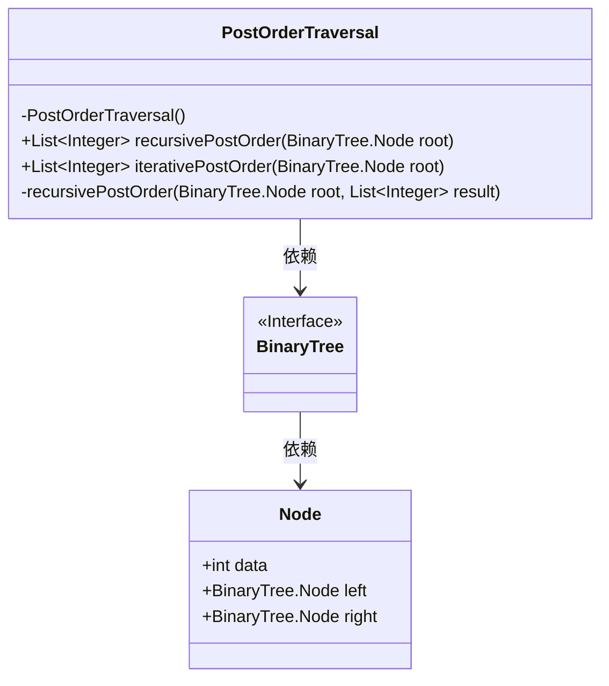
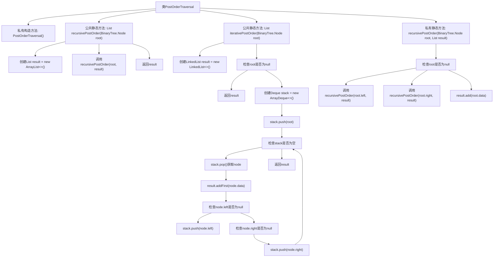

# 基础信息

|      |      |
|------|------|
| 名称 | PostOrderTraversal |
| 编码语言 | .java |
| 代码路径 | Java/src/main/java/com/thealgorithms/datastructures/trees/PostOrderTraversal.java |
| 包名 | com.thealgorithms.datastructures.trees |
| 依赖项 | ['java.util.ArrayDeque', 'java.util.ArrayList', 'java.util.Deque', 'java.util.LinkedList', 'java.util.List'] |
| 概述说明 | 递归和迭代方法实现二叉树后序遍历。 |

# 说明

实现二叉树后序遍历的递归和迭代方法，首先需要理解后序遍历的定义，即按照左子树、右子树、根节点的顺序访问节点。递归方法通过定义递归函数，先递归访问左子树，再递归访问右子树，最后访问根节点。迭代方法则利用栈结构模拟递归过程，通过控制节点入栈和出栈的顺序，确保访问顺序符合后序遍历的要求。两种方法各有优缺点，递归方法简洁但可能受限于栈深度，迭代方法则更灵活但实现稍复杂。

# 类列表 Class Summary

| 名称   | 类型  | 说明 |
|-------|------|-------------|
| PostOrderTraversal | class | 实现二叉树后序遍历的递归和迭代方法。 |

## 类 PostOrderTraversal

|      |      |
|------|------|
| 访问范围 | public final |
| 类型 | class |
| 名称 | PostOrderTraversal |
| 说明 | 实现二叉树后序遍历的递归和迭代方法。 |

### UML类图

该代码定义了一个 `PostOrderTraversal` 类，用于实现二叉树的后序遍历。类中包含两种遍历方法：递归遍历 `recursivePostOrder` 和迭代遍历 `iterativePostOrder`。递归遍历通过递归调用左右子树实现，而迭代遍历则使用栈来模拟递归过程。`BinaryTree` 是一个接口，`Node` 是二叉树的节点类，包含数据域和左右子节点。`PostOrderTraversal` 类依赖于 `BinaryTree` 和 `Node` 来实现遍历功能。

### 内部方法调用关系图

这段代码实现了二叉树的后序遍历，提供了递归和迭代两种方法。递归方法通过深度优先搜索遍历树的左子树、右子树，最后访问根节点；迭代方法使用栈模拟递归过程，先访问根节点，再依次将左、右子节点压入栈中，最后将结果逆序输出。代码结构清晰，逻辑严谨，适用于处理二叉树的后序遍历问题。

### 字段列表 Field List

| 名称  | 类型  | 说明 |
|-------|-------|------|

### 方法列表 Method List

| 名称  | 类型  | 说明 |
|-------|-------|------|
| recursivePostOrder | List<Integer> | 递归实现二叉树后序遍历，返回节点值列表。 |
| recursivePostOrder | void | 递归实现二叉树的后序遍历，将结果存入列表。 |
| iterativePostOrder | List<Integer> | 迭代后序遍历二叉树，返回节点数据列表。 |

