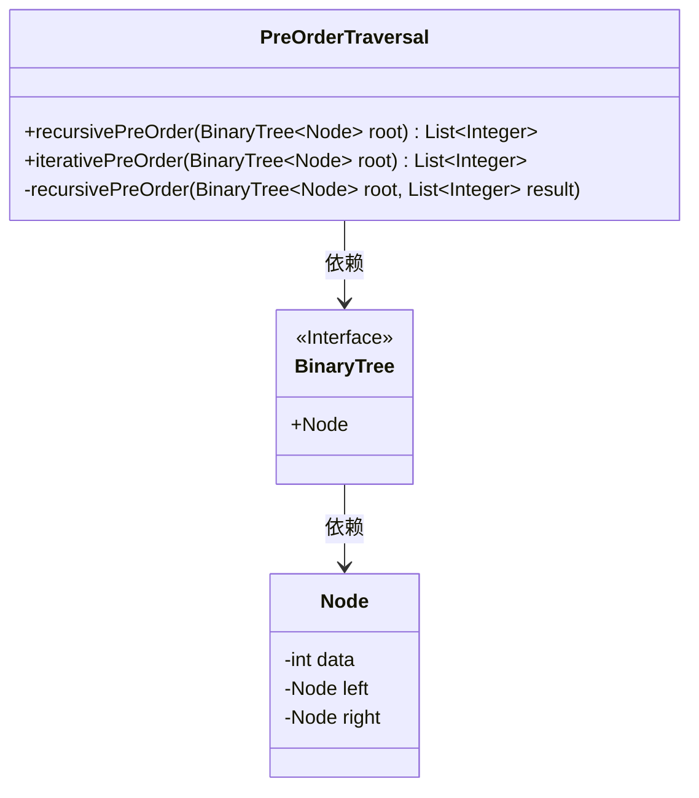
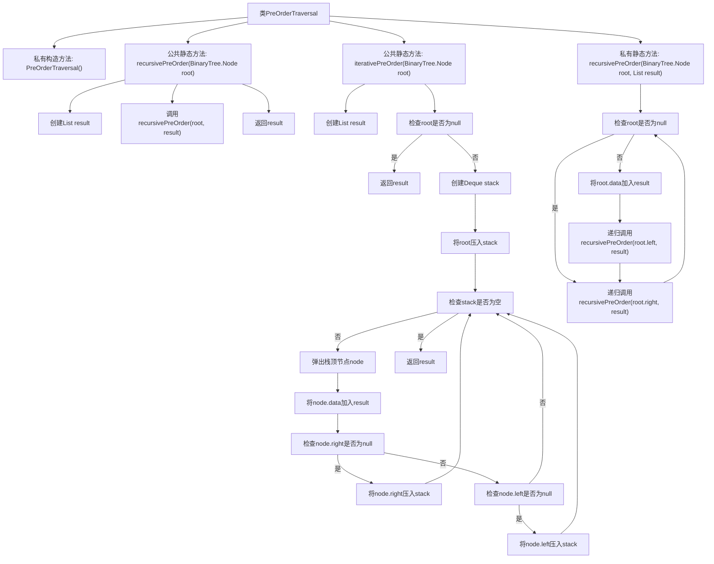

# 基础信息

|      |      |
|------|------|
| 名称 | PreOrderTraversal |
| 编码语言 | .java |
| 代码路径 | Java/src/main/java/com/thealgorithms/datastructures/trees/PreOrderTraversal.java |
| 包名 | com.thealgorithms.datastructures.trees |
| 依赖项 | ['java.util.ArrayList', 'java.util.Deque', 'java.util.LinkedList', 'java.util.List'] |
| 概述说明 | 递归和迭代方法实现二叉树前序遍历。 |

# 说明

本文介绍了实现二叉树前序遍历的两种方法：递归和迭代。递归方法通过调用自身函数，按照根节点、左子树、右子树的顺序遍历二叉树。迭代方法则利用栈数据结构，模拟递归过程，依次访问根节点、左子树和右子树。这两种方法都能有效地完成二叉树的前序遍历，适用于不同的应用场景。

# 类列表 Class Summary

| 名称   | 类型  | 说明 |
|-------|------|-------------|
| PreOrderTraversal | class | 实现二叉树前序遍历的递归和迭代方法。 |

## 类 PreOrderTraversal

|      |      |
|------|------|
| 访问范围 | public final |
| 类型 | class |
| 名称 | PreOrderTraversal |
| 说明 | 实现二叉树前序遍历的递归和迭代方法。 |

### UML类图

类图描述：`PreOrderTraversal` 类提供了两种二叉树前序遍历的实现：递归和迭代。递归方法通过辅助方法 `recursivePreOrder` 实现，迭代方法使用栈结构。`BinaryTree` 是一个接口，包含 `Node` 类，`Node` 类表示二叉树的节点，包含数据、左子节点和右子节点。`PreOrderTraversal` 类依赖于 `BinaryTree` 接口及其 `Node` 类来实现遍历功能。

### 内部方法调用关系图

这段代码实现了二叉树的前序遍历，提供了递归和迭代两种方式。递归方法通过调用自身遍历左子树和右子树，迭代方法使用栈模拟递归过程。代码结构清晰，分别处理了根节点、左子树和右子树的遍历，确保了遍历顺序的正确性。

### 字段列表 Field List

| 名称  | 类型  | 说明 |
|-------|-------|------|

### 方法列表 Method List

| 名称  | 类型  | 说明 |
|-------|-------|------|
| recursivePreOrder | List<Integer> | 递归实现二叉树前序遍历，返回结果列表。 |
| iterativePreOrder | List<Integer> | 迭代实现二叉树前序遍历，返回节点数据列表。 |
| recursivePreOrder | void | 递归实现二叉树前序遍历，将节点值存入结果列表。 |

