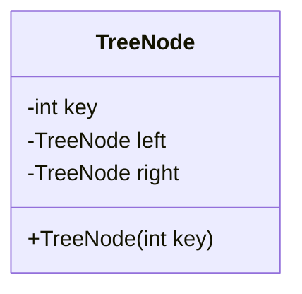
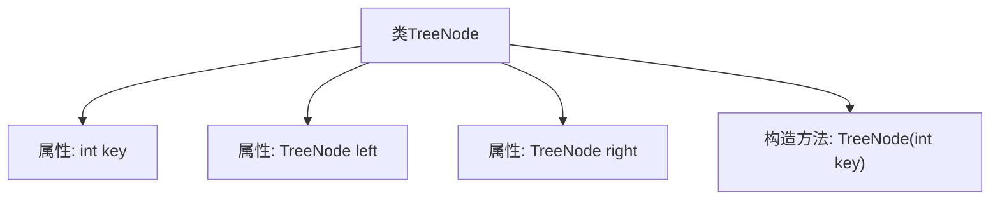
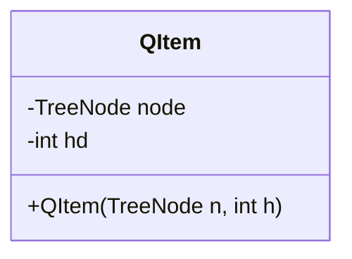
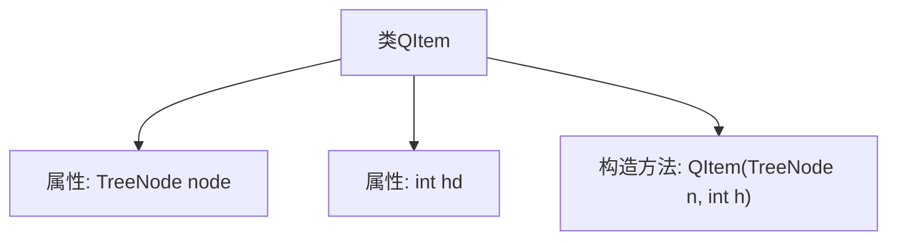
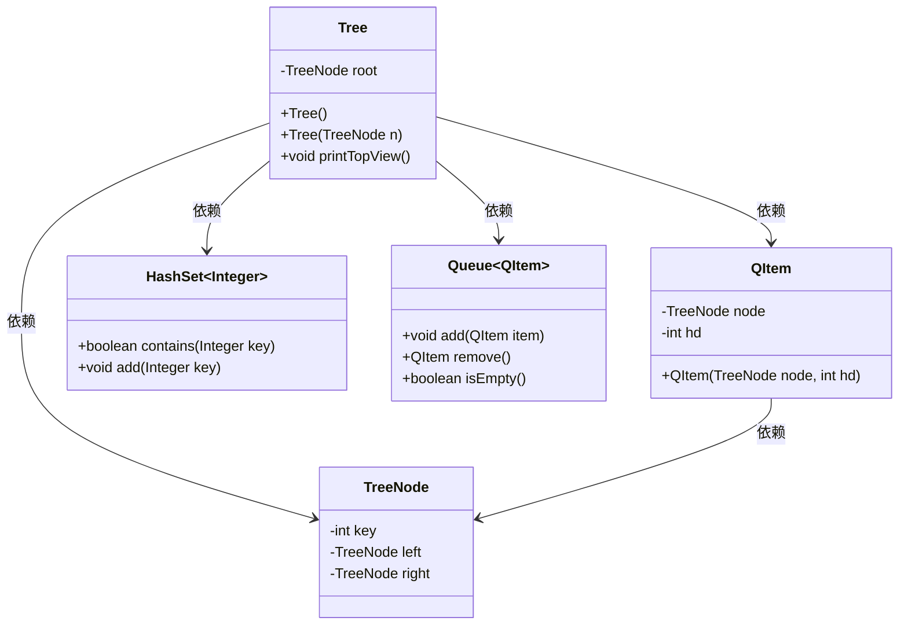
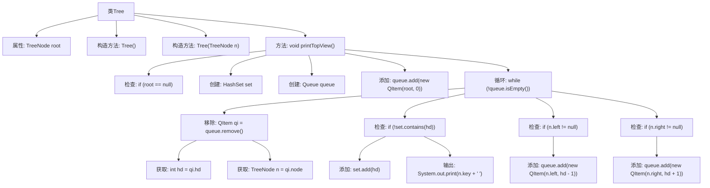
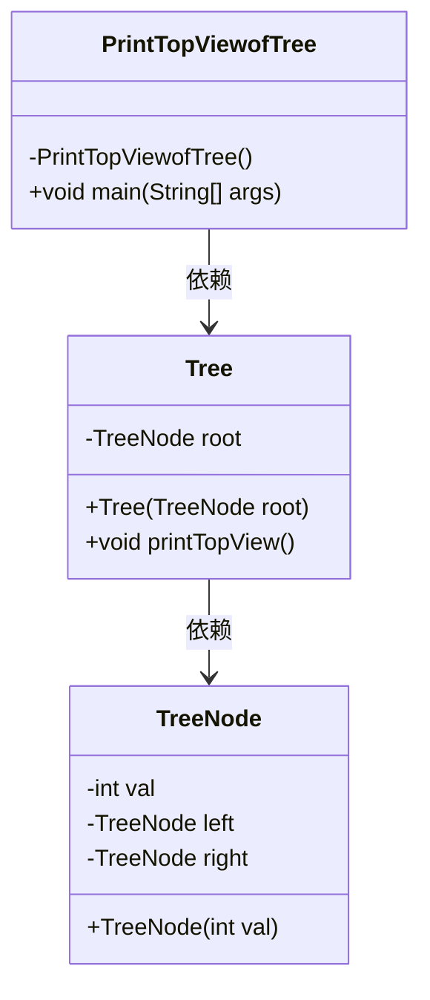
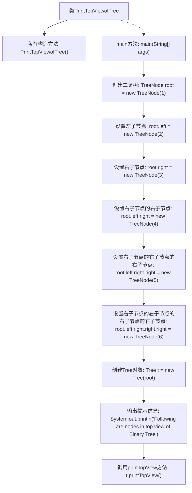

# 基础信息

|      |      |
|------|------|
| 名称 | PrintTopViewofTree |
| 编码语言 | .java |
| 代码路径 | Java/src/main/java/com/thealgorithms/datastructures/trees/PrintTopViewofTree.java |
| 包名 | com.thealgorithms.datastructures.trees |
| 依赖项 | ['java.util.HashSet', 'java.util.LinkedList', 'java.util.Queue'] |
| 概述说明 | 定义二叉树节点类，实现顶部视图打印功能，使用BFS遍历记录水平距离。 |

# 说明

该内容描述了一个用于打印二叉树顶部视图的Java实现。首先定义了一个二叉树节点类，包含键值、左右子节点和构造方法。接着定义了一个QItem类，用于存储树节点及其水平距离。树类实现了二叉树的顶部视图打印功能，采用广度优先搜索（BFS）遍历，并记录每个节点的水平距离。最终通过Java代码实现了二叉树顶部视图的打印功能。

# 类列表 Class Summary

| 名称   | 类型  | 说明 |
|-------|------|-------------|
| TreeNode | class | 定义二叉树节点类，包含键值、左右子节点和构造方法。 |
| QItem | class | QItem类包含TreeNode节点和水平距离hd。 |
| Tree | class | 树类实现二叉树的顶部视图打印功能，使用BFS遍历并记录水平距离。 |
| PrintTopViewofTree | class | Java代码实现二叉树顶部视图打印。 |

## 类 TreeNode

|      |      |
|------|------|
| 访问范围 | None |
| 类型 | class |
| 名称 | TreeNode |
| 说明 | 定义二叉树节点类，包含键值、左右子节点和构造方法。 |

### UML类图

这段代码定义了一个名为 `TreeNode` 的类，用于表示二叉树中的一个节点。该类包含三个私有成员变量：`key` 用于存储节点的值，`left` 和 `right` 分别指向左子节点和右子节点。构造函数 `TreeNode(int key)` 用于初始化节点，并将 `left` 和 `right` 初始化为 `null`。该类的主要作用是构建二叉树的基本结构，每个节点可以存储一个整数值，并包含指向其左右子节点的引用。

### 内部方法调用关系图

这段代码定义了一个名为 `TreeNode` 的类，用于表示二叉树中的节点。该类包含三个成员变量：`key` 用于存储节点的值，`left` 和 `right` 分别指向左子节点和右子节点。构造方法 `TreeNode(int key)` 用于初始化节点的 `key` 值，并将 `left` 和 `right` 初始化为 `null`，表示新创建的节点没有子节点。这段代码是构建二叉树的基础结构。

### 字段列表 Field List

| 名称  | 类型  | 说明 |
|-------|-------|------|
| key | int | 定义了一个整型变量key。 |
| right | TreeNode | 树节点包含右子节点引用。 |
| left | TreeNode | 定义了一个树节点，包含左子节点。 |

### 方法列表 Method List

| 名称  | 类型  | 说明 |
|-------|-------|------|

## 类 QItem

|      |      |
|------|------|
| 访问范围 | None |
| 类型 | class |
| 名称 | QItem |
| 说明 | QItem类包含TreeNode节点和水平距离hd。 |

### UML类图

这段代码定义了一个名为 `QItem` 的类，该类包含两个私有成员变量：`node` 和 `hd`，分别表示树节点和水平距离。类中定义了一个构造函数 `QItem(TreeNode n, int h)`，用于初始化这两个成员变量。`QItem` 类的主要作用是封装树节点及其水平距离信息，以便在算法中使用。

### 内部方法调用关系图

这段代码定义了一个名为 `QItem` 的类，该类包含两个属性：`TreeNode node` 和 `int hd`，以及一个构造方法 `QItem(TreeNode n, int h)`。构造方法用于初始化 `node` 和 `hd` 属性。`QItem` 类的主要作用是封装一个树节点及其水平距离（hd），以便在算法中使用。

### 字段列表 Field List

| 名称  | 类型  | 说明 |
|-------|-------|------|
| node | TreeNode | 定义树节点变量node。 |
| hd | int | 声明一个整型变量hd。 |

### 方法列表 Method List

| 名称  | 类型  | 说明 |
|-------|-------|------|

## 类 Tree

|      |      |
|------|------|
| 访问范围 | None |
| 类型 | class |
| 名称 | Tree |
| 说明 | 树类实现二叉树的顶部视图打印功能，使用BFS遍历并记录水平距离。 |

### UML类图

类图描述：  
`Tree` 类表示二叉树，包含一个 `TreeNode` 类型的根节点。`Tree` 类提供了两个构造函数和一个 `printTopView` 方法，用于打印二叉树的顶视图。`printTopView` 方法使用 `QItem` 类来存储节点及其水平距离，并通过 `HashSet` 和 `Queue` 来实现广度优先搜索（BFS）遍历。`QItem` 类用于在队列中存储节点及其水平距离，`TreeNode` 类表示二叉树的节点，包含键值、左子节点和右子节点。

### 内部方法调用关系图

这段代码定义了一个`Tree`类，其中包含一个`TreeNode`类型的属性`root`，以及两个构造方法和一个`printTopView`方法。`printTopView`方法用于打印二叉树的顶部视图。它使用广度优先搜索（BFS）遍历树，并通过维护一个哈希集合来记录每个水平距离上首次出现的节点，从而实现顶部视图的打印。

### 字段列表 Field List

| 名称  | 类型  | 说明 |
|-------|-------|------|
| root | TreeNode | 定义了一个名为root的TreeNode类型变量。 |

### 方法列表 Method List

| 名称  | 类型  | 说明 |
|-------|-------|------|
| printTopView | void | 二叉树顶部视图打印算法，使用BFS遍历并记录水平距离。 |

## 类 PrintTopViewofTree

|      |      |
|------|------|
| 访问范围 | public final |
| 类型 | class |
| 名称 | PrintTopViewofTree |
| 说明 | Java代码实现二叉树顶部视图打印。 |

### UML类图

**描述：**  
该代码定义了一个`PrintTopViewofTree`类，用于打印二叉树的顶视图。`TreeNode`类表示二叉树的节点，包含节点值、左子节点和右子节点。`Tree`类包含一个`TreeNode`类型的根节点，并提供了打印顶视图的方法。`PrintTopViewofTree`类的`main`方法创建了一个二叉树实例，并调用`Tree`类的`printTopView`方法来打印顶视图。

### 内部方法调用关系图

这段代码定义了一个`PrintTopViewofTree`类，其中包含一个私有的构造方法和一个`main`方法。`main`方法首先创建了一个二叉树，并通过一系列操作设置了树的节点。然后，创建了一个`Tree`对象，并调用其`printTopView`方法，输出二叉树的顶视图节点。流程图展示了从类定义到方法调用的完整流程，清晰地反映了代码的执行顺序。

### 字段列表 Field List

| 名称  | 类型  | 说明 |
|-------|-------|------|

### 方法列表 Method List

| 名称  | 类型  | 说明 |
|-------|-------|------|
| main | void | Java代码创建二叉树并打印其顶视图节点。 |

