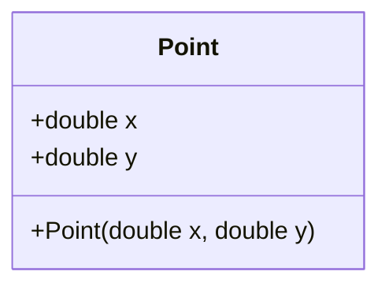
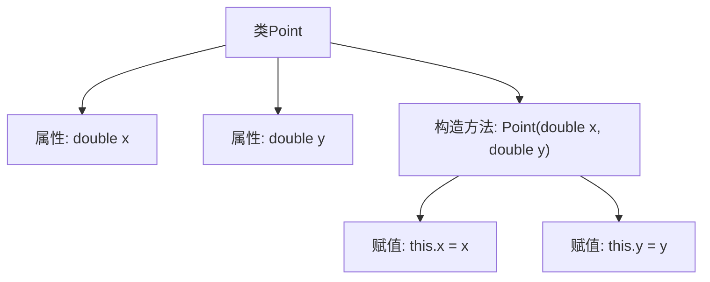
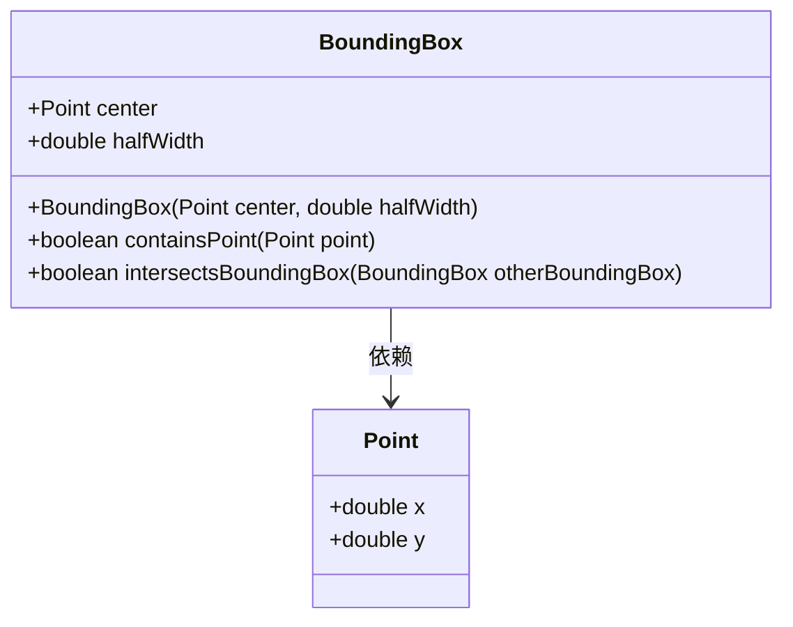
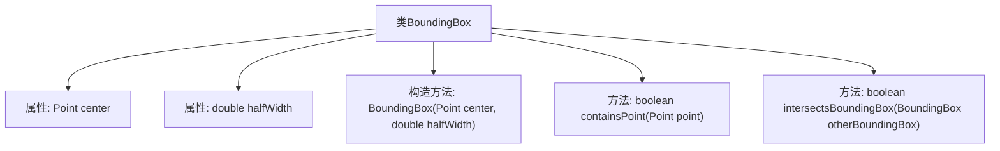
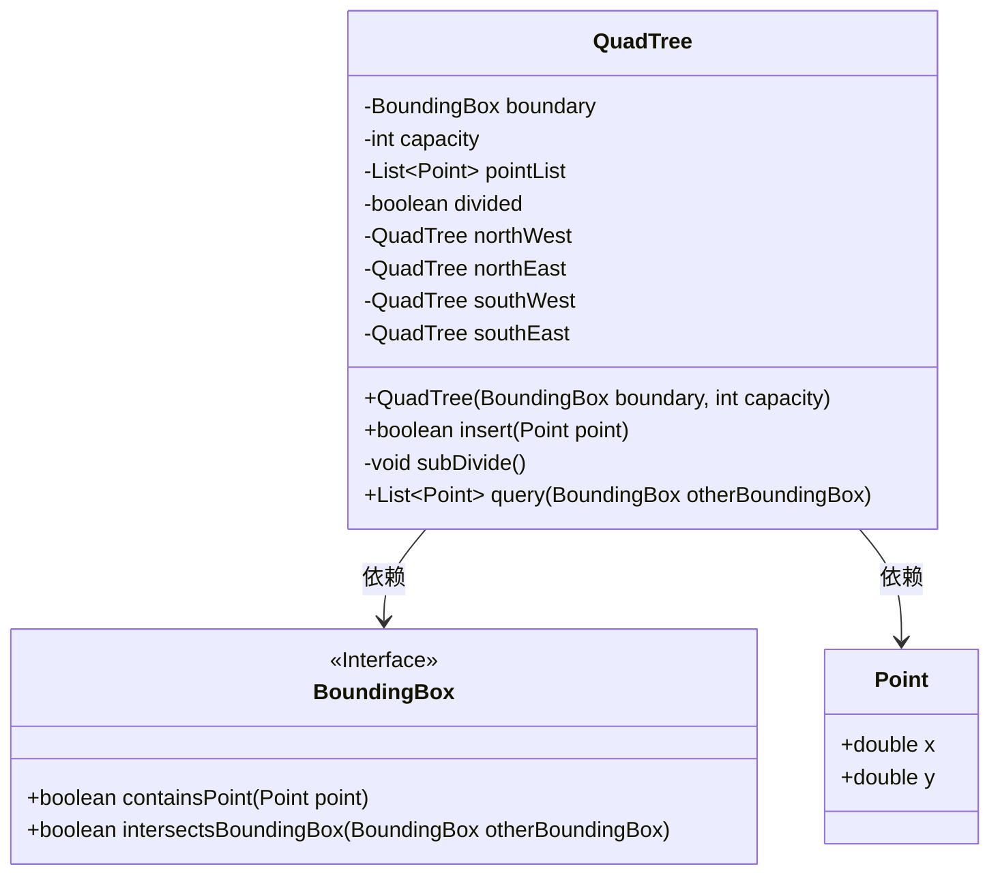
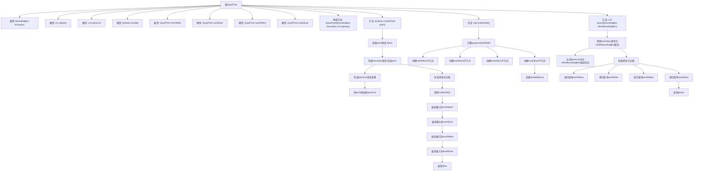

# 基础信息

|      |      |
|------|------|
| 名称 | QuadTree |
| 编码语言 | .java |
| 代码路径 | Java/src/main/java/com/thealgorithms/datastructures/trees/QuadTree.java |
| 包名 | com.thealgorithms.datastructures.trees |
| 依赖项 | ['java.util.ArrayList', 'java.util.List'] |
| 概述说明 | Point类含x、y坐标；BoundingBox类含中心点、半宽，可检测点在内及框相交；四叉树类含边界、容量、点列表及子节点，支持插入、查询点及细分区域。 |

# 说明

定义了一个Point类，包含x和y坐标。BoundingBox类包含中心点和半宽，提供检查点是否在框内及两个框是否相交的方法。四叉树类包含边界、容量、点列表及四个子节点，支持插入点、查询与边界相交的点，并可细分区域。这些类共同构建了一个用于管理和查询空间数据的结构。

# 类列表 Class Summary

| 名称   | 类型  | 说明 |
|-------|------|-------------|
| Point | class | 定义了一个包含x和y坐标的Point类。 |
| BoundingBox | class | BoundingBox类包含中心点和半宽，提供检查点是否在框内及两个框是否相交的方法。 |
| QuadTree | class | 四叉树类，包含边界、容量、点列表及四个子节点，支持插入点、查询与边界相交的点，并可细分区域。 |

## 类 Point

|      |      |
|------|------|
| 访问范围 | None |
| 类型 | class |
| 名称 | Point |
| 说明 | 定义了一个包含x和y坐标的Point类。 |

### UML类图

**描述**：`Point`类表示一个二维平面上的点，包含两个公有属性`x`和`y`，分别表示点的横坐标和纵坐标。类中定义了一个构造函数，用于初始化`x`和`y`的值。这个类可以用于表示和操作平面坐标系中的点。

### 内部方法调用关系图

这段代码定义了一个名为 `Point` 的类，包含两个公共属性 `x` 和 `y`，分别表示点的横坐标和纵坐标。类中定义了一个构造方法 `Point(double x, double y)`，用于初始化这两个属性。构造方法在创建 `Point` 对象时被调用，并将传入的参数赋值给对象的 `x` 和 `y` 属性。

### 字段列表 Field List

| 名称  | 类型  | 说明 |
|-------|-------|------|
| x | double | 声明一个公共的双精度浮点型变量x。 |
| y | double | 定义了一个公共的双精度浮点型变量y。 |

### 方法列表 Method List

| 名称  | 类型  | 说明 |
|-------|-------|------|

## 类 BoundingBox

|      |      |
|------|------|
| 访问范围 | None |
| 类型 | class |
| 名称 | BoundingBox |
| 说明 | BoundingBox类包含中心点和半宽，提供检查点是否在框内及两个框是否相交的方法。 |

### UML类图

这段代码定义了一个`BoundingBox`类，用于表示一个二维空间中的边界框。`BoundingBox`类包含一个`center`点和一个`halfWidth`属性，表示边界框的中心点和半宽。类中提供了两个方法：`containsPoint`用于检查一个点是否在边界框内，`intersectsBoundingBox`用于检查两个边界框是否相交。`Point`类用于表示二维空间中的一个点，包含`x`和`y`坐标。`BoundingBox`类依赖于`Point`类来表示其中心点。

### 内部方法调用关系图

该流程图描述了`BoundingBox`类的结构和主要方法。`BoundingBox`类包含两个属性：`center`和`halfWidth`，分别表示边界框的中心点和半宽度。类中定义了一个构造方法用于初始化这两个属性。此外，类中还包含两个方法：`containsPoint`用于检查一个点是否在边界框内，`intersectsBoundingBox`用于检查两个边界框是否相交。这些方法通过比较点的坐标和边界框的范围来实现其功能。

### 字段列表 Field List

| 名称  | 类型  | 说明 |
|-------|-------|------|
| center | Point | 定义了一个名为center的公共Point类型变量。 |
| halfWidth | double | 双精度浮点数变量，表示半宽度。 |

### 方法列表 Method List

| 名称  | 类型  | 说明 |
|-------|-------|------|
| containsPoint | boolean | 判断点是否在矩形区域内。 |
| intersectsBoundingBox | boolean | 判断两个边界框是否相交。 |

## 类 QuadTree

|      |      |
|------|------|
| 访问范围 | public |
| 类型 | class |
| 名称 | QuadTree |
| 说明 | 四叉树类，包含边界、容量、点列表及四个子节点，支持插入点、查询与边界相交的点，并可细分区域。 |

### UML类图

这段代码定义了一个四叉树（QuadTree）数据结构，用于管理二维空间中的点。`QuadTree`类包含一个边界（`BoundingBox`）和容量（`capacity`），用于存储点（`Point`）。当点的数量超过容量时，四叉树会进行细分，创建四个子节点（`northWest`, `northEast`, `southWest`, `southEast`）。`insert`方法用于插入点，`query`方法用于查询与给定边界框相交的点。`BoundingBox`接口定义了包含点和与另一个边界框相交的方法，`Point`类表示二维空间中的点。

### 内部方法调用关系图

**描述：** 该代码实现了一个四叉树（QuadTree）数据结构，用于管理二维空间中的点。四叉树通过递归地将空间划分为四个象限来组织数据，支持插入点和查询与给定边界框相交的点。代码的核心功能包括插入点、分割四叉树以及查询与特定区域相交的点。通过递归和边界检查，四叉树能够高效地处理空间数据的存储和检索。

### 字段列表 Field List

| 名称  | 类型  | 说明 |
|-------|-------|------|
| divided | boolean | 定义一个私有布尔变量divided。 |
| boundary | BoundingBox | 私有边界框对象定义。 |
| pointList | List<Point> | 私有列表变量，存储点对象集合。 |
| northEast | QuadTree | 四叉树的东北子节点。 |
| capacity | int | 私有整型变量capacity用于存储容量。 |
| northWest | QuadTree | 私有四叉树的西北子节点。 |
| southEast | QuadTree | 私有四叉树对象，表示东南方向子节点。 |
| southWest | QuadTree | 私有四叉树的西南子节点。 |

### 方法列表 Method List

| 名称  | 类型  | 说明 |
|-------|-------|------|
| query | List<Point> | 查询与给定边界框相交的点，递归处理子区域。 |
| subDivide | void | 将四叉树划分为四个子象限，更新边界并标记为已划分。 |
| insert | boolean | 四叉树插入点，检查边界和容量，未满则添加，否则递归插入子节点。 |

