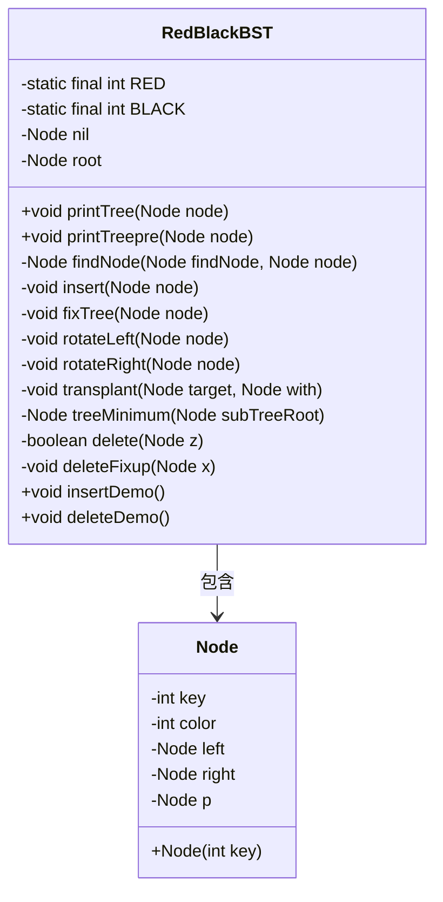
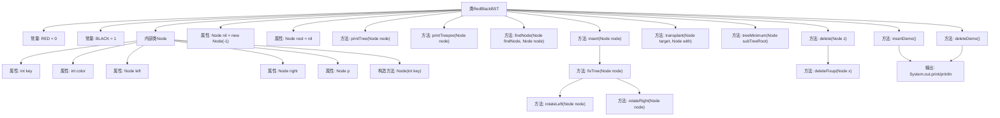

# 基础信息

|      |      |
|------|------|
| 名称 | RedBlackBST |
| 编码语言 | .java |
| 代码路径 | Java/src/main/java/com/thealgorithms/datastructures/trees/RedBlackBST.java |
| 包名 | com.thealgorithms.datastructures.trees |
| 依赖项 | ['java.util.Scanner'] |
| 概述说明 | 红黑树实现插入、删除、旋转及修复操作。 |

# 说明

红黑树是一种自平衡二叉搜索树，其实现包括插入、删除、旋转和修复操作。插入操作通过调整节点颜色和树结构来维持红黑树的性质。删除操作在移除节点后，通过旋转和重新着色修复树的结构。旋转操作包括左旋和右旋，用于调整子树的高度和平衡。修复操作在插入或删除后，通过一系列规则确保树保持平衡和有序。这些操作共同保证了红黑树在动态数据集中高效运行。

# 类列表 Class Summary

| 名称   | 类型  | 说明 |
|-------|------|-------------|
| RedBlackBST | class | 红黑树实现，包含插入、删除、旋转和修复操作。 |

## 类 RedBlackBST

|      |      |
|------|------|
| 访问范围 | public |
| 类型 | class |
| 名称 | RedBlackBST |
| 说明 | 红黑树实现，包含插入、删除、旋转和修复操作。 |

### UML类图

**描述：**  
`RedBlackBST` 类实现了一个红黑树数据结构，用于维护有序元素的平衡二叉搜索树。该类包含插入、删除、查找等操作，并通过颜色标记和旋转操作保持树的平衡。`Node` 类表示树中的节点，包含键值、颜色标记以及左右子节点和父节点的引用。`RedBlackBST` 通过 `insert` 和 `delete` 方法维护树的红黑性质，确保树的高度始终保持在 O(log n) 级别。

### 内部方法调用关系图

**流程图描述：**
该流程图展示了`RedBlackBST`类的结构和主要方法调用关系。`RedBlackBST`类包含常量`RED`和`BLACK`，以及内部类`Node`，后者定义了红黑树节点的属性和构造方法。`RedBlackBST`类的主要方法包括插入、删除、查找、旋转、修复树结构等操作，并通过`insertDemo`和`deleteDemo`方法进行演示。每个方法之间的调用关系通过箭头清晰表示，确保流程的准确性和可读性。

### 字段列表 Field List

| 名称  | 类型  | 说明 |
|-------|-------|------|
| root = nil | Node | 私有变量root初始化为nil。 |
| RED = 0 | int | 定义私有静态常量RED，值为0。 |
| BLACK = 1 | int | 定义了一个私有静态常量BLACK，值为1。 |
| nil = new Node(-1) | Node | 定义了一个不可变的Node对象nil，其值为-1。 |

### 方法列表 Method List

| 名称  | 类型  | 说明 |
|-------|-------|------|
| insert | void | 插入节点并调整红黑树结构。 |
| printTree | void | 递归打印二叉树节点信息，包括颜色、键值和父节点键值。 |
| fixTree | void | 修复红黑树节点颜色和平衡的递归方法。 |
| printTreepre | void | 递归打印二叉树节点信息，包括颜色、键值和父节点键值。 |
| rotateRight | void | 旋转二叉树的右子树，调整节点指针关系。 |
| insertDemo | void | 插入节点并打印二叉树的前序遍历。 |
| rotateLeft | void | 左旋操作调整节点及其子节点关系，确保树结构平衡。 |
| deleteDemo | void | 删除指定节点并输出删除结果及树结构。 |
| transplant | void | 函数transplant用于替换目标节点的子树，调整父子关系。 |
| delete | boolean | 删除节点并修复红黑树结构，确保平衡。 |
| findNode | Node | 递归查找二叉搜索树中的指定节点。 |
| treeMinimum | Node | 查找二叉搜索树的最小节点。 |
| deleteFixup | void | 红黑树删除修复操作，调整节点颜色和旋转以维持平衡。 |

