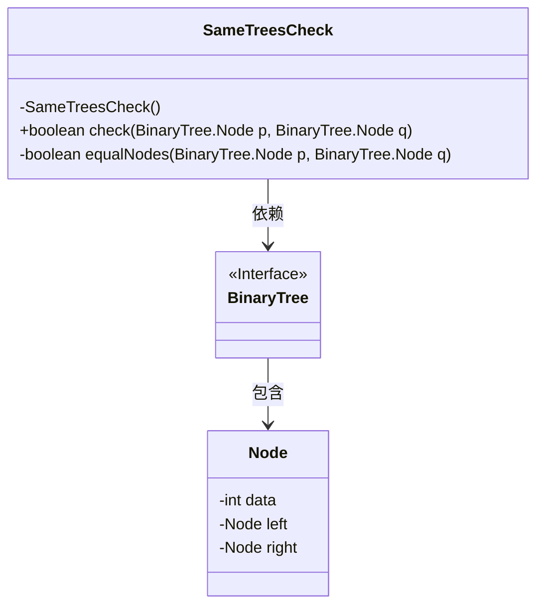
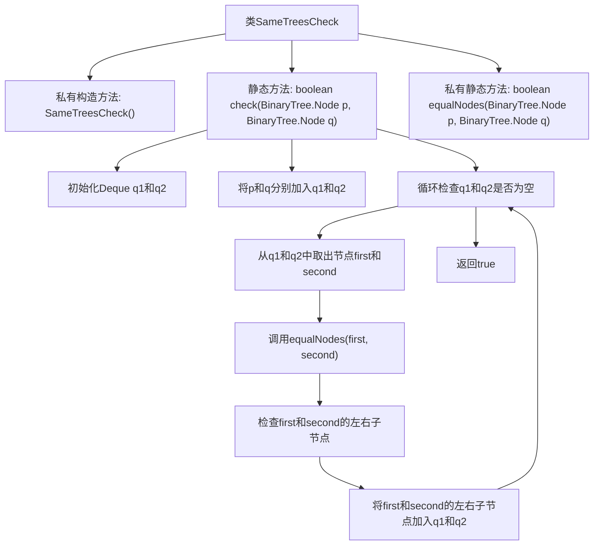

# 基础信息

|      |      |
|------|------|
| 名称 | SameTreesCheck |
| 编码语言 | .java |
| 代码路径 | Java/src/main/java/com/thealgorithms/datastructures/trees/SameTreesCheck.java |
| 包名 | com.thealgorithms.datastructures.trees |
| 依赖项 | ['java.util.ArrayDeque', 'java.util.Deque'] |
| 概述说明 | SameTreesCheck类通过队列层次遍历检查两棵二叉树是否相同。 |

# 说明

SameTreesCheck类用于判断两棵二叉树是否相同。该类采用队列进行层次遍历，通过逐层比较两棵树的节点值来确保它们在结构和内容上完全一致。这种方法能够高效地处理树的比较任务，确保结果的准确性。

# 类列表 Class Summary

| 名称   | 类型  | 说明 |
|-------|------|-------------|
| SameTreesCheck | class | SameTreesCheck类检查两棵二叉树是否相同，使用队列进行层次遍历。 |

## 类 SameTreesCheck

|      |      |
|------|------|
| 访问范围 | public final |
| 类型 | class |
| 名称 | SameTreesCheck |
| 说明 | SameTreesCheck类检查两棵二叉树是否相同，使用队列进行层次遍历。 |

### UML类图

这段代码定义了一个 `SameTreesCheck` 类，用于检查两棵二叉树是否相同。`SameTreesCheck` 类包含一个私有构造函数和一个公有静态方法 `check`，该方法通过广度优先搜索（BFS）遍历两棵树的节点，并使用 `equalNodes` 方法比较节点数据。`BinaryTree` 是一个接口，包含 `Node` 类，`Node` 类表示二叉树的节点，包含数据、左子节点和右子节点。`SameTreesCheck` 类依赖于 `BinaryTree` 接口来获取节点信息。

### 内部方法调用关系图

这段代码实现了一个用于检查两棵二叉树是否相同的算法。通过使用广度优先搜索（BFS）的方式，代码遍历两棵树的节点，并逐个比较它们的值和结构。如果两棵树的节点值和结构完全一致，则返回true，否则返回false。代码通过使用双端队列（Deque）来存储待比较的节点，并在每次循环中比较当前节点的值和其子节点，确保两棵树的结构和值完全一致。

### 字段列表 Field List

| 名称  | 类型  | 说明 |
|-------|-------|------|

### 方法列表 Method List

| 名称  | 类型  | 说明 |
|-------|-------|------|
| check | boolean | 该方法检查两棵二叉树是否相同，使用队列进行层次遍历并比较节点值。 |
| equalNodes | boolean | 比较两二叉树节点是否相等，包括空节点和数据值。 |

