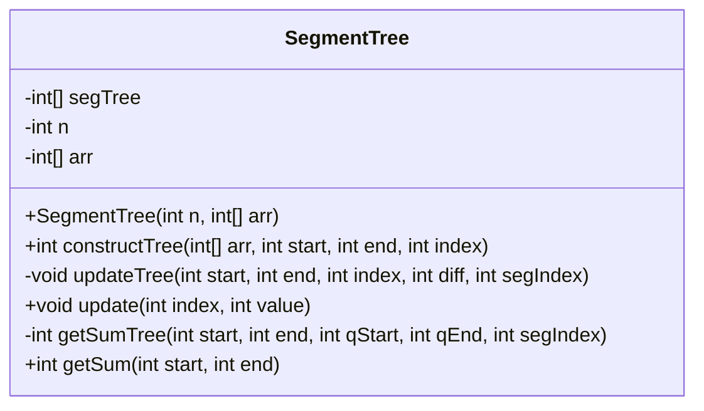
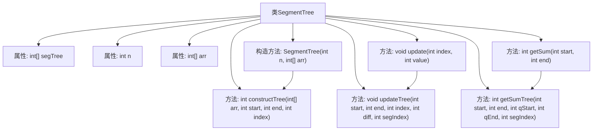

# 基础信息

|      |      |
|------|------|
| 名称 | SegmentTree |
| 编码语言 | .java |
| 代码路径 | Java/src/main/java/com/thealgorithms/datastructures/trees/SegmentTree.java |
| 包名 | com.thealgorithms.datastructures.trees |
| 依赖项 | [] |
| 概述说明 | SegmentTree类实现线段树，支持区间求和与单点更新。 |

# 说明

SegmentTree类实现了一个线段树数据结构，主要用于高效处理数组区间的求和操作以及单点更新操作。线段树通过将数组分割成多个子区间，并在每个子区间上存储相应的信息，从而在查询和更新时能够快速获取结果。该类的主要功能包括对任意区间的元素求和，以及对数组中单个元素进行更新。这种数据结构在处理大规模数据时，能够显著提高查询和更新的效率，适用于需要频繁进行区间查询和单点更新的场景。

# 类列表 Class Summary

| 名称   | 类型  | 说明 |
|-------|------|-------------|
| SegmentTree | class | SegmentTree类实现线段树，支持数组区间求和与单点更新。 |

## 类 SegmentTree

|      |      |
|------|------|
| 访问范围 | public |
| 类型 | class |
| 名称 | SegmentTree |
| 说明 | SegmentTree类实现线段树，支持数组区间求和与单点更新。 |

### UML类图

**描述：**
`SegmentTree` 类用于实现线段树数据结构，支持区间查询和单点更新操作。类中包含一个私有数组 `segTree` 用于存储线段树，一个整数 `n` 表示数组大小，以及一个数组 `arr` 存储原始数据。构造函数 `SegmentTree` 初始化线段树并调用 `constructTree` 方法构建树结构。`update` 方法用于更新数组中的某个元素，并调用 `updateTree` 方法更新线段树。`getSum` 方法用于查询某个区间的元素和，并调用 `getSumTree` 方法进行递归计算。

### 内部方法调用关系图

这段代码实现了一个线段树（SegmentTree）数据结构，用于高效地处理数组的区间查询和更新操作。线段树通过递归地构建和更新树结构，支持在O(log n)时间复杂度内查询任意区间的元素和，并允许在O(log n)时间复杂度内更新数组中的某个元素。代码中的`constructTree`方法用于构建线段树，`updateTree`和`update`方法用于更新树中的值，`getSumTree`和`getSum`方法用于查询区间的和。整个类通过维护一个数组`segTree`来存储线段树的节点，并通过递归调用实现树的操作。

### 字段列表 Field List

| 名称  | 类型  | 说明 |
|-------|-------|------|
| segTree | int[] | 定义私有整型数组segTree用于存储线段树数据。 |
| n | int | 定义私有整型变量n。 |
| arr | int[] | 定义了一个私有的整型数组变量arr。 |

### 方法列表 Method List

| 名称  | 类型  | 说明 |
|-------|-------|------|
| updateTree | void | 更新线段树节点值，递归处理子节点。 |
| update | void | 更新数组中指定索引的值并同步更新树结构。 |
| constructTree | int | 递归构建线段树，计算区间和并存储。 |
| getSum | int | 获取指定区间和的递归方法，边界检查后调用求和函数。 |
| getSumTree | int | 递归计算线段树区间和，返回指定区间内的元素总和。 |

