# 基础信息

|      |      |
|------|------|
| 名称 | SplayTree |
| 编码语言 | .java |
| 代码路径 | Java/src/main/java/com/thealgorithms/datastructures/trees/SplayTree.java |
| 包名 | com.thealgorithms.datastructures.trees |
| 依赖项 | ['java.util.LinkedList', 'java.util.List'] |
| 概述说明 | SplayTree类实现伸展树，支持插入、删除、查找及三种遍历操作。 |

# 说明

SplayTree类实现了伸展树数据结构，支持插入、删除和查找操作，同时提供了前序、中序和后序遍历功能。该数据结构通过伸展操作将最近访问的节点移动到根位置，以提高后续操作的效率。

# 类列表 Class Summary

| 名称   | 类型  | 说明 |
|-------|------|-------------|
| SplayTree | class | SplayTree类实现伸展树，支持插入、删除、查找及前中后序遍历操作。 |


## 类 SplayTree

|      |      |
|------|------|
| 访问范围 | public |
| 类型 | class |
| 名称 | SplayTree |
| 说明 | SplayTree类实现伸展树，支持插入、删除、查找及前中后序遍历操作。 |


### UML类图

```mermaid
classDiagram
    class SplayTree {
        +TreeTraversal PRE_ORDER
        +TreeTraversal IN_ORDER
        +TreeTraversal POST_ORDER
        -Node root
        +boolean isEmpty()
        +void insert(int key)
        +boolean search(int key)
        +void delete(int key)
        +List~Integer~ traverse(TreeTraversal traversal)
        -Node findMax(Node root)
        -Node rotateRight(Node x)
        -Node rotateLeft(Node x)
        -Node splay(Node root, int key)
        -Node insertRec(Node root, int key)
    }

    class Node {
        -int key
        -Node left
        -Node right
        +Node(int key)
    }

    class EmptyTreeException {
        +EmptyTreeException(String message)
    }

    class DuplicateKeyException {
        +DuplicateKeyException(String message)
    }

    interface TreeTraversal {
        <<Interface>>
        +void traverse(Node root, List~Integer~ result)
    }

    class InOrderTraversal {
        +void traverse(Node root, List~Integer~ result)
    }

    class PreOrderTraversal {
        +void traverse(Node root, List~Integer~ result)
    }

    class PostOrderTraversal {
        +void traverse(Node root, List~Integer~ result)
    }

    SplayTree --> Node : 包含
    SplayTree --> EmptyTreeException : 抛出
    SplayTree --> DuplicateKeyException : 抛出
    SplayTree --> TreeTraversal : 使用
    InOrderTraversal --|> TreeTraversal : 实现
    PreOrderTraversal --|> TreeTraversal : 实现
    PostOrderTraversal --|> TreeTraversal : 实现
```

这段代码实现了一个Splay Tree（伸展树），它是一种自平衡二叉搜索树。SplayTree类包含了插入、搜索、删除等操作，并且支持前序、中序、后序遍历。代码中还定义了Node类作为树的节点，以及EmptyTreeException和DuplicateKeyException两个异常类。TreeTraversal接口定义了遍历方法，并由InOrderTraversal、PreOrderTraversal和PostOrderTraversal三个类实现。Splay Tree通过splay操作将访问的节点移动到根节点，以提高频繁访问节点的性能。


### 内部方法调用关系图

```mermaid
graph TD
    A["类SplayTree"]
    B["属性: Node root"]
    C["方法: boolean isEmpty()"]
    D["方法: void insert(int key)"]
    E["方法: boolean search(int key)"]
    F["方法: void delete(int key)"]
    G["方法: List<Integer> traverse(TreeTraversal traversal)"]
    H["方法: Node findMax(Node root)"]
    I["方法: Node rotateRight(Node x)"]
    J["方法: Node rotateLeft(Node x)"]
    K["方法: Node splay(Node root, int key)"]
    L["方法: Node insertRec(Node root, int key)"]
    M["内部类: EmptyTreeException"]
    N["内部类: DuplicateKeyException"]
    O["内部类: Node"]
    P["接口: TreeTraversal"]
    Q["内部类: InOrderTraversal"]
    R["内部类: PreOrderTraversal"]
    S["内部类: PostOrderTraversal"]

    A --> B
    A --> C
    A --> D
    A --> E
    A --> F
    A --> G
    A --> H
    A --> I
    A --> J
    A --> K
    A --> L
    A --> M
    A --> N
    A --> O
    A --> P
    P --> Q
    P --> R
    P --> S
```



这段代码实现了一个SplayTree（伸展树）数据结构，包含了插入、搜索、删除、遍历等操作。SplayTree通过splay操作将最近访问的节点移动到根节点，以提高访问效率。代码中还定义了三种遍历方式（前序、中序、后序）以及相关的异常处理类。流程图展示了类的主要方法和内部类之间的关系，帮助理解代码结构和功能。

### 字段列表 Field List

| 名称  | 类型  | 说明 |
|-------|-------|------|
| PRE_ORDER = new PreOrderTraversal() | TreeTraversal | 定义了一个静态常量PRE_ORDER，表示前序遍历方式。 |
| root | Node | 私有根节点变量声明。 |
| IN_ORDER = new InOrderTraversal() | TreeTraversal | 定义了一个静态常量IN_ORDER，表示中序遍历的树遍历方式。 |
| POST_ORDER = new PostOrderTraversal() | TreeTraversal | 定义了一个名为POST_ORDER的静态常量，类型为PostOrderTraversal。 |

### 方法列表 Method List

| 名称  | 类型  | 说明 |
|-------|-------|------|
| findMax | Node | 查找二叉树中最大节点的方法。 |
| isEmpty | boolean | 检查根节点是否为空。 |
| insertRec | Node | 递归插入节点，处理重复键异常。 |
| insert | void | 插入键值并通过伸展树调整根节点。 |
| search | boolean | 方法搜索键值，伸展树后返回是否匹配。 |
| delete | void | 删除树中指定键值节点，处理空树和节点不存在情况。 |
| rotateLeft | Node | 左旋转操作：将节点的右子节点提升为父节点，原节点成为左子节点。 |
| splay | Node | 伸展树操作：根据键值调整节点位置，执行旋转操作。 |
| rotateRight | Node | 右旋操作：将节点x的左子节点y提升为根，y的右子节点变为x的左子节点。 |
| traverse | List<Integer> | 遍历树并返回结果列表。 |


