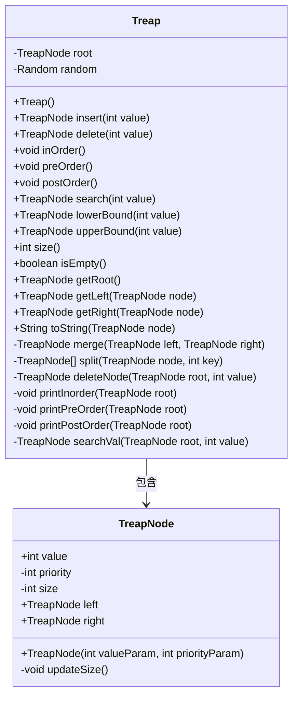

# 基础信息

|      |      |
|------|------|
| 名称 | Treap |
| 编码语言 | .java |
| 代码路径 | Java/src/main/java/com/thealgorithms/datastructures/trees/Treap.java |
| 包名 | com.thealgorithms.datastructures.trees |
| 依赖项 | ['java.util.Random'] |
| 概述说明 | Treap类结合二叉搜索树和堆，支持增删查遍历操作。 |

# 说明

Treap类是一种结合了二叉搜索树和堆特性的混合数据结构，能够高效地支持多种操作。它通过维护二叉搜索树的排序性质和堆的优先级性质，实现了元素的快速插入、删除和搜索。此外，Treap还支持遍历操作，能够按照特定顺序访问所有元素。这种结构在保持平衡性的同时，提供了较高的操作效率，适用于需要频繁动态更新的场景。

# 类列表 Class Summary

| 名称   | 类型  | 说明 |
|-------|------|-------------|
| Treap | class | Treap类实现二叉搜索树和堆的混合结构，支持插入、删除、搜索、遍历等操作。 |

## 类 Treap

|      |      |
|------|------|
| 访问范围 | public |
| 类型 | class |
| 名称 | Treap |
| 说明 | Treap类实现二叉搜索树和堆的混合结构，支持插入、删除、搜索、遍历等操作。 |

### UML类图

这段代码定义了一个 `Treap` 类，它是一种结合了二叉搜索树和堆特性的数据结构。`Treap` 类包含一个内部类 `TreapNode`，用于表示树中的节点。`Treap` 类提供了插入、删除、搜索、遍历等操作，并且通过 `merge` 和 `split` 方法来维护树的平衡。`TreapNode` 类则负责存储节点的值、优先级、子树大小以及左右子节点的引用。整个设计通过随机优先级来保持树的平衡性，从而实现高效的插入和删除操作。

### 内部方法调用关系图

```mermaid
graph TD
    A["类Treap"]
    B["内部类TreapNode"]
    C["属性: int value"]
    D["属性: int priority"]
    E["属性: int size"]
    F["属性: TreapNode left"]
    G["属性: TreapNode right"]
    H["构造方法: TreapNode(int valueParam, int priorityParam)"]
    I["方法: void updateSize()"]
    J["属性: TreapNode root"]
    K["属性: Random random"]
    L["构造方法: Treap()"]
    M["方法: TreapNode merge(TreapNode left, TreapNode right)"]
    N["方法: TreapNode[] split(TreapNode node, int key)"]
    O["方法: TreapNode insert(int value)"]
    P["方法: TreapNode delete(int value)"]
    Q["方法: TreapNode deleteNode(TreapNode root, int value)"]
    R["方法: void inOrder()"]
    S["方法: void printInorder(TreapNode root)"]
    T["方法: void preOrder()"]
    U["方法: void printPreOrder(TreapNode root)"]
    V["方法: void postOrder()"]
    W["方法: void printPostOrder(TreapNode root)"]
    X["方法: TreapNode search(int value)"]
    Y["方法: TreapNode searchVal(TreapNode root, int value)"]
    Z["方法: TreapNode lowerBound(int value)"]
    AA["方法: TreapNode upperBound(int value)"]
    AB["方法: int size()"]
    AC["方法: boolean isEmpty()"]
    AD["方法: TreapNode getRoot()"]
    AE["方法: TreapNode getLeft(TreapNode node)"]
    AF["方法: TreapNode getRight(TreapNode node)"]
    AG["方法: String toString(TreapNode node)"]

    A --> B
    B --> C
    B --> D
    B --> E
    B --> F
    B --> G
    B --> H
    B --> I
    A --> J
    A --> K
    A --> L
    A --> M
    A --> N
    A --> O
    A --> P
    P --> Q
    A --> R
    R --> S
    A --> T
    T --> U
    A --> V
    V --> W
    A --> X
    X --> Y
    A --> Z
    A --> AA
    A --> AB
    A --> AC
    A --> AD
    A --> AE
    A --> AF
    A --> AG
```

这段代码定义了一个`Treap`类，它是一个结合了二叉搜索树和堆的数据结构。`TreapNode`是`Treap`的内部类，表示树中的节点，包含值、优先级、子树大小以及左右子节点。`Treap`类提供了插入、删除、搜索、遍历等操作，并且通过`merge`和`split`方法维护树的平衡。流程图展示了类及其方法的层级关系，帮助理解代码的结构和功能。

### 字段列表 Field List

| 名称  | 类型  | 说明 |
|-------|-------|------|
| root | TreapNode | Treap类包含一个私有根节点root。 |
| random = new Random() | Random | 声明并初始化一个随机数生成器实例。 |

### 方法列表 Method List

| 名称  | 类型  | 说明 |
|-------|-------|------|
| printInorder | void | 中序遍历Treap树，输出节点值。 |
| search | TreapNode | TreapNode搜索方法，通过root查找指定值。 |
| getLeft | TreapNode | 获取Treap节点的左子节点。 |
| getRoot | TreapNode | 获取Treap树的根节点。 |
| printPostOrder | void | 后序遍历Treap树并打印节点值。 |
| getRight | TreapNode | 获取指定节点的右子节点。 |
| lowerBound | TreapNode | 在Treap树中查找不小于给定值的最小节点。 |
| upperBound | TreapNode | 查找大于指定值的第一个节点。 |
| delete | TreapNode | 删除指定值的Treap节点并返回根节点。 |
| preOrder | void | 前序遍历方法，输出树结构并打印根节点。 |
| isEmpty | boolean | 检查根节点是否为空，返回布尔值。 |
| size | int | 该方法返回二叉树节点总数，若根节点为空则返回0。 |
| searchVal | TreapNode | 私有方法在Treap树中递归查找指定值的节点。 |
| printPreOrder | void | 递归前序遍历Treap树并打印节点值。 |
| deleteNode | TreapNode | 删除Treap树中指定值的节点，并更新树结构。 |
| postOrder | void | 该方法以后序遍历方式打印二叉树节点，并用大括号包围输出。 |
| inOrder | void | 该方法按中序遍历打印二叉树节点值，输出格式为花括号包裹。 |
| insert | TreapNode | Treap插入操作：若根为空则新建节点，否则分裂树并插入新节点后合并。 |
| toString | String | 生成TreapNode节点的字符串表示，包含值、优先级、子树大小及左右子节点。 |
| merge | TreapNode | 合并两个Treap节点，按优先级决定合并顺序并更新大小。 |
| split | TreapNode[] | TreapNode分裂方法，根据key值递归分割节点，更新子树大小并返回结果数组。 |

