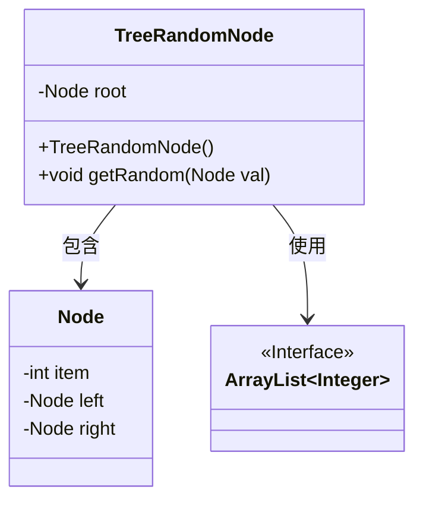
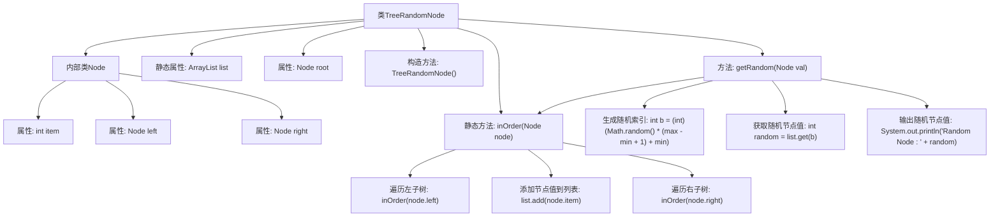

# 基础信息

|      |      |
|------|------|
| 名称 | TreeRandomNode |
| 编码语言 | .java |
| 代码路径 | Java/src/main/java/com/thealgorithms/datastructures/trees/TreeRandomNode.java |
| 包名 | com.thealgorithms.datastructures.trees |
| 依赖项 | ['java.util.ArrayList'] |
| 概述说明 | 二叉树中序遍历后随机输出一个节点值。 |

# 说明

在二叉树的中序遍历过程中，所有节点的值被依次存储在一个列表中。中序遍历的顺序是先访问左子树，然后访问根节点，最后访问右子树。完成遍历后，存储的节点值列表将包含所有节点的值，并按照中序遍历的顺序排列。最终，从该列表中随机选择一个节点值进行输出。这种方法确保了输出的节点值是从整个二叉树中均匀随机选取的，且符合中序遍历的顺序特性。

# 类列表 Class Summary

| 名称   | 类型  | 说明 |
|-------|------|-------------|
| TreeRandomNode | class | 二叉树中序遍历存储节点值，随机输出一个节点值。 |

## 类 TreeRandomNode

|      |      |
|------|------|
| 访问范围 | public |
| 类型 | class |
| 名称 | TreeRandomNode |
| 说明 | 二叉树中序遍历存储节点值，随机输出一个节点值。 |

### UML类图

类图描述：
`TreeRandomNode` 类包含一个内部类 `Node`，用于表示二叉树的节点。`TreeRandomNode` 类通过 `getRandom` 方法从二叉树中随机选择一个节点值，并依赖于 `ArrayList<Integer>` 来存储中序遍历的结果。`Node` 类包含节点值 `item` 以及左右子节点 `left` 和 `right`。`TreeRandomNode` 类的 `getRandom` 方法通过中序遍历将节点值存储在 `ArrayList` 中，然后随机选择一个索引并输出对应的节点值。

### 内部方法调用关系图

这段代码定义了一个`TreeRandomNode`类，其中包含一个内部类`Node`，用于表示二叉树的节点。`TreeRandomNode`类通过`inOrder`方法对二叉树进行中序遍历，并将节点值存储在静态列表`list`中。`getRandom`方法通过生成随机索引从列表中获取一个随机节点值并输出。代码的核心功能是从二叉树中随机选择一个节点并输出其值。

### 字段列表 Field List

| 名称  | 类型  | 说明 |
|-------|-------|------|
| root | Node | 节点根对象。 |
| list = new ArrayList<>() | ArrayList<Integer> | 创建一个存储整数的动态数组列表。 |

### 方法列表 Method List

| 名称  | 类型  | 说明 |
|-------|-------|------|
| getRandom | void | 从二叉树中随机获取一个节点值并输出。 |
| inOrder | void | 中序遍历二叉树，先左子节点，再当前节点，最后右子节点。 |

