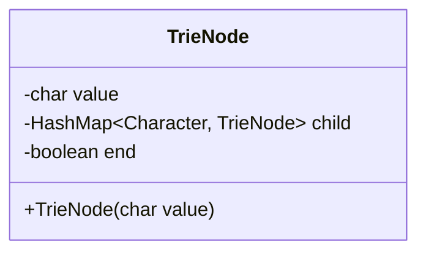
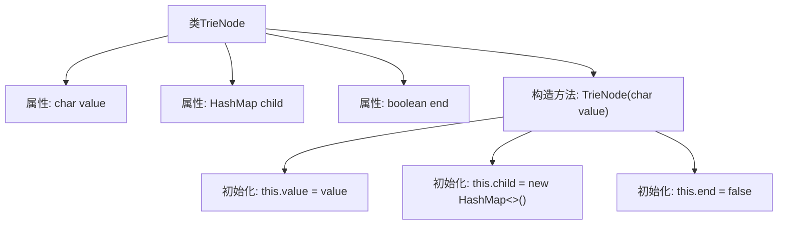
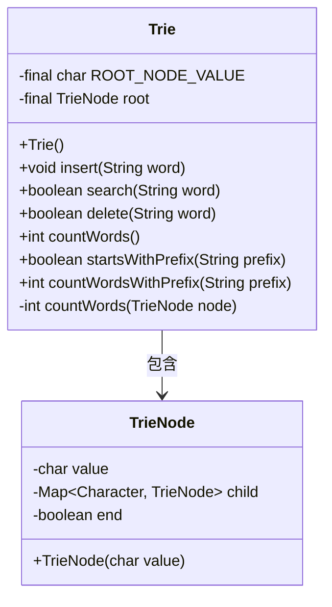
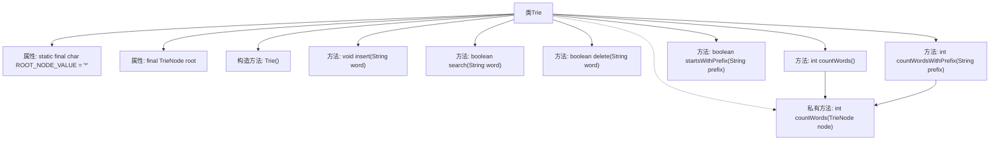

# 基础信息

|      |      |
|------|------|
| 名称 | Trie |
| 编码语言 | .java |
| 代码路径 | Java/src/main/java/com/thealgorithms/datastructures/trees/Trie.java |
| 包名 | com.thealgorithms.datastructures.trees |
| 依赖项 | ['java.util.HashMap'] |
| 概述说明 | TrieNode类含字符、子节点映射和结束标志。Trie类实现插入、搜索、删除、计数及前缀匹配。 |

# 说明

TrieNode类包含字符值、子节点哈希映射和结束标志，用于表示Trie树的节点结构。Trie类实现了插入、搜索、删除、计数及前缀匹配功能，支持在Trie树中进行单词的插入、查找、删除操作，以及统计单词数量和查找具有特定前缀的单词。

# 类列表 Class Summary

| 名称   | 类型  | 说明 |
|-------|------|-------------|
| TrieNode | class | TrieNode类，包含字符值、子节点哈希映射和结束标志。 |
| Trie | class | Trie类实现插入、搜索、删除、计数及前缀匹配功能。 |

## 类 TrieNode

|      |      |
|------|------|
| 访问范围 | None |
| 类型 | class |
| 名称 | TrieNode |
| 说明 | TrieNode类，包含字符值、子节点哈希映射和结束标志。 |

### UML类图

这段代码定义了一个 `TrieNode` 类，用于表示字典树（Trie）中的一个节点。每个节点包含一个字符值 `value`，一个用于存储子节点的 `HashMap`，以及一个布尔值 `end` 用于标记当前节点是否为某个单词的结尾。`TrieNode` 类的构造函数用于初始化节点的字符值，并创建一个空的 `HashMap` 来存储子节点，同时将 `end` 标记设置为 `false`。这个类主要用于构建字典树数据结构，适用于高效的字符串存储和检索操作。

### 内部方法调用关系图

这段代码定义了一个名为 `TrieNode` 的类，用于表示字典树中的一个节点。每个节点包含一个字符值 `value`，一个用于存储子节点的 `HashMap` `child`，以及一个布尔值 `end` 来标记当前节点是否为某个单词的结尾。构造方法 `TrieNode(char value)` 用于初始化节点的属性，包括设置字符值、创建空的子节点映射以及将 `end` 标记为 `false`。

### 字段列表 Field List

| 名称  | 类型  | 说明 |
|-------|-------|------|
| value | char | 定义字符变量value。 |
| end | boolean | 布尔变量结束声明。 |
| child | HashMap<Character, TrieNode> | 哈希映射存储字符与Trie节点的对应关系。 |

### 方法列表 Method List

| 名称  | 类型  | 说明 |
|-------|-------|------|

## 类 Trie

|      |      |
|------|------|
| 访问范围 | public |
| 类型 | class |
| 名称 | Trie |
| 说明 | Trie类实现插入、搜索、删除、计数及前缀匹配功能。 |

### UML类图

### 描述
这段代码实现了一个Trie（前缀树）数据结构，用于高效地存储和检索字符串。`Trie`类包含一个根节点`root`，并通过`insert`方法插入单词，`search`方法查找单词，`delete`方法删除单词，`countWords`方法统计单词数量，`startsWithPrefix`方法检查前缀是否存在，`countWordsWithPrefix`方法统计以特定前缀开头的单词数量。`TrieNode`类表示Trie中的节点，包含字符值、子节点映射和标记是否为单词结尾的标志。

### 内部方法调用关系图

这段代码定义了一个Trie（前缀树）数据结构，用于高效地存储和检索字符串。Trie类包含一个根节点，并提供了插入、搜索、删除、计数单词、检查前缀是否存在以及计数以特定前缀开头的单词等功能。每个方法通过遍历Trie节点来实现其功能，其中`countWords`方法是一个递归方法，用于统计Trie中的单词数量。

### 字段列表 Field List

| 名称  | 类型  | 说明 |
|-------|-------|------|
| root | TrieNode | 私有且不可变的Trie根节点。 |
| ROOT_NODE_VALUE = '*' | char | 私有静态常量ROOT_NODE_VALUE值为'*'。 |

### 方法列表 Method List

| 名称  | 类型  | 说明 |
|-------|-------|------|
| countWords | int | 方法countWords返回根节点的单词计数。 |
| countWords | int | 递归计算Trie树节点中的单词总数。 |
| countWordsWithPrefix | int | 方法统计前缀匹配的单词数量。 |
| insert | void | Trie树插入方法，逐字符遍历并更新节点，标记单词结束。 |
| search | boolean | 搜索单词在Trie树中是否存在，遍历字符并检查结束标志。 |
| startsWithPrefix | boolean | 检查字符串前缀是否存在于Trie树中。 |
| delete | boolean | 该方法从Trie树中删除指定单词，成功返回true，否则返回false。 |

