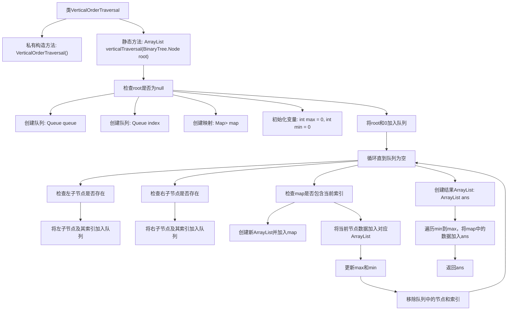

# 基础信息

|      |      |
|------|------|
| 名称 | VerticalOrderTraversal |
| 编码语言 | .java |
| 代码路径 | Java/src/main/java/com/thealgorithms/datastructures/trees/VerticalOrderTraversal.java |
| 包名 | com.thealgorithms.datastructures.trees |
| 依赖项 | ['java.util.ArrayList', 'java.util.HashMap', 'java.util.LinkedList', 'java.util.Map', 'java.util.Queue'] |
| 概述说明 | 垂直遍历二叉树，按列输出节点值。 |

# 说明

垂直遍历二叉树是一种遍历方式，按照节点的列位置输出节点值。具体来说，将二叉树的根节点位置定义为列0，左子节点的列位置减1，右子节点的列位置加1。遍历时，按照列的顺序从左到右输出节点值，同一列内的节点按从上到下的顺序输出。这种遍历方式能够清晰地展示二叉树在垂直方向上的结构，适用于需要按列分析或处理节点值的场景。

# 类列表 Class Summary

| 名称   | 类型  | 说明 |
|-------|------|-------------|
| VerticalOrderTraversal | class | 垂直遍历二叉树，按列输出节点值。 |


## 类 VerticalOrderTraversal

|      |      |
|------|------|
| 访问范围 | public final |
| 类型 | class |
| 名称 | VerticalOrderTraversal |
| 说明 | 垂直遍历二叉树，按列输出节点值。 |


### UML类图

```mermaid
classDiagram
    class VerticalOrderTraversal {
        -VerticalOrderTraversal()
        +ArrayList~Integer~ verticalTraversal(BinaryTree.Node root)
    }

    class BinaryTree {
        <<Interface>>
        +Node
    }

    class Node {
        -int data
        -Node left
        -Node right
    }

    class ArrayList~T~ {
        +addAll(Collection~? extends T~ c) boolean
    }

    class Queue~T~ {
        +offer(T e) boolean
        +peek() T
        +poll() T
        +isEmpty() boolean
    }

    class LinkedList~T~ {
        // Implements Queue
    }

    class HashMap~K, V~ {
        +containsKey(Object key) boolean
        +put(K key, V value) V
        +get(Object key) V
    }

    VerticalOrderTraversal --> BinaryTree : 依赖
    BinaryTree --> Node : 依赖
    VerticalOrderTraversal --> ArrayList~Integer~ : 依赖
    VerticalOrderTraversal --> Queue~BinaryTree.Node~ : 依赖
    VerticalOrderTraversal --> Queue~Integer~ : 依赖
    VerticalOrderTraversal --> HashMap~Integer, ArrayList~Integer~~ : 依赖
    Queue~BinaryTree.Node~ --> LinkedList~BinaryTree.Node~ : 实现
    Queue~Integer~ --> LinkedList~Integer~ : 实现
```

### 描述
`VerticalOrderTraversal` 类用于实现二叉树的垂直遍历。通过使用两个队列分别存储节点和其对应的垂直索引，以及一个哈希表来映射索引与节点值的列表，最终按垂直顺序返回所有节点的值。`BinaryTree` 接口定义了二叉树的节点结构，`Node` 类表示二叉树的节点，包含数据、左子节点和右子节点。`Queue` 接口及其实现类 `LinkedList` 用于管理节点和索引的队列，`HashMap` 用于存储索引与节点值的映射关系。


### 内部方法调用关系图



**描述：**  
该代码实现了一个二叉树的垂直遍历。通过使用两个队列分别存储节点和它们的垂直索引，以及一个映射来存储每个索引对应的节点值。代码首先检查根节点是否为空，然后初始化队列和映射。在循环中，代码处理每个节点的左右子节点，更新索引，并将节点值存储在映射中。最后，代码遍历映射中的所有索引，将节点值按垂直顺序存储在结果列表中并返回。

### 字段列表 Field List

| 名称  | 类型  | 说明 |
|-------|-------|------|

### 方法列表 Method List

| 名称  | 类型  | 说明 |
|-------|-------|------|
| verticalTraversal | ArrayList<Integer> | 垂直遍历二叉树，按列存储节点值。 |


