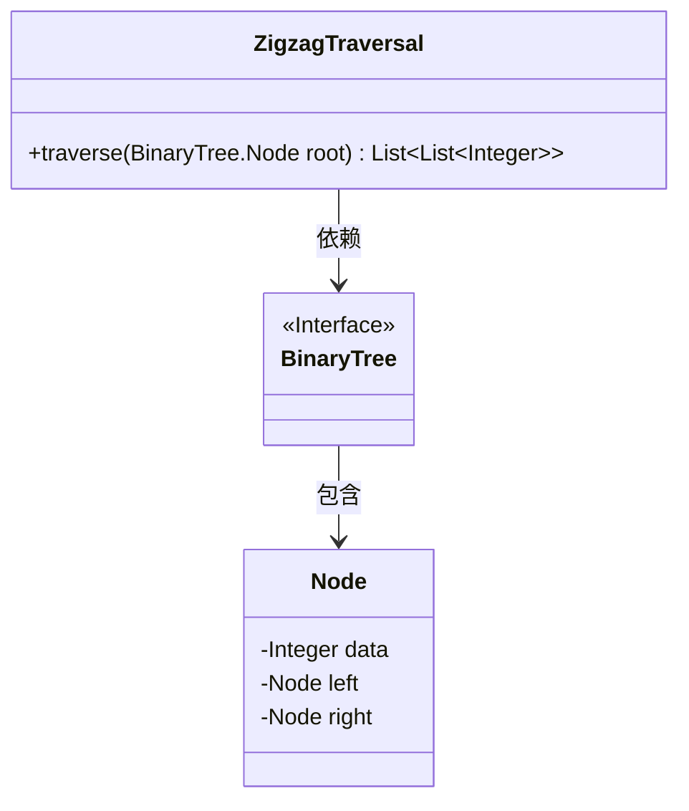
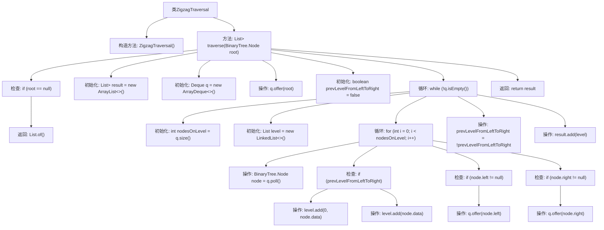

# 基础信息

|      |      |
|------|------|
| 名称 | ZigzagTraversal |
| 编码语言 | .java |
| 代码路径 | Java/src/main/java/com/thealgorithms/datastructures/trees/ZigzagTraversal.java |
| 包名 | com.thealgorithms.datastructures.trees |
| 依赖项 | ['java.util.ArrayDeque', 'java.util.ArrayList', 'java.util.Deque', 'java.util.LinkedList', 'java.util.List'] |
| 概述说明 | ZigzagTraversal类实现二叉树锯齿形层序遍历。 |

# 说明

ZigzagTraversal类用于实现二叉树的锯齿形层序遍历。该遍历方法在每一层交替改变遍历方向，先从左到右，再从右到左，依此类推。通过这种方式，可以按照锯齿形的顺序访问二叉树的所有节点。该类的实现通常涉及使用队列或双端队列来管理节点的访问顺序，并确保在每一层结束时切换遍历方向。这种方法能够有效地遍历二叉树，并在特定应用场景中提供有序的节点访问序列。

# 类列表 Class Summary

| 名称   | 类型  | 说明 |
|-------|------|-------------|
| ZigzagTraversal | class | ZigzagTraversal类实现二叉树的锯齿形层序遍历。 |

## 类 ZigzagTraversal

|      |      |
|------|------|
| 访问范围 | public final |
| 类型 | class |
| 名称 | ZigzagTraversal |
| 说明 | ZigzagTraversal类实现二叉树的锯齿形层序遍历。 |

### UML类图

**描述：**
这段代码实现了一个二叉树的“之字形”遍历算法。`ZigzagTraversal`类包含一个静态方法`traverse`，该方法接收二叉树的根节点作为参数，并返回一个包含每层节点数据的列表。遍历时，奇数层从左到右，偶数层从右到左。`BinaryTree`接口表示二叉树结构，`Node`类表示二叉树的节点，包含数据、左子节点和右子节点。`ZigzagTraversal`依赖于`BinaryTree`接口，而`BinaryTree`接口包含`Node`类。

### 内部方法调用关系图

这段代码实现了一个二叉树的“之字形”遍历（Zigzag Traversal）。它使用了一个队列来逐层遍历二叉树的节点，并在每一层交替改变遍历方向（从左到右或从右到左）。最终，它返回一个包含每层节点数据的列表。流程图展示了从初始化到遍历、条件判断、数据添加和最终返回结果的完整过程。

### 字段列表 Field List

| 名称  | 类型  | 说明 |
|-------|-------|------|

### 方法列表 Method List

| 名称  | 类型  | 说明 |
|-------|-------|------|
| traverse | List<List<Integer>> | 二叉树层序遍历，交替从左到右和从右到左输出节点值。 |

