# 基础信息

|      |      |
|------|------|
| 名称 | trees |
| 编码语言 | .java |
| 代码路径 | Java/src/main/java/com/thealgorithms/datastructures/trees |
| 包名 | Java.src.main.java.com.thealgorithms.datastructures.trees |
| 概述说明 | 二叉搜索树、AVL树、红黑树等数据结构实现插入、删除、查找及遍历功能，确保高效管理和数据检索。 |

# 说明

## 概述
该代码模块主要涉及多种树形数据结构的实现和操作，包括二叉搜索树（BST）、AVL树、红黑树、线段树、四叉树、Trie树、Treap等。这些数据结构广泛应用于算法和数据处理的各个领域，提供了高效的插入、删除、查找、遍历等操作。模块中的代码涵盖了递归和迭代两种实现方式，并针对不同的业务场景提供了优化的解决方案。例如，二叉搜索树通过迭代或递归实现插入、删除和查找操作；AVL树和红黑树通过自平衡机制确保树的高度平衡；线段树和惰性线段树则专注于区间查询和更新操作的高效处理。

## 主要业务场景
1. **二叉搜索树（BST）**：用于高效管理有序数据，支持插入、删除、查找等操作，适用于需要快速检索和动态更新的场景。
2. **AVL树和红黑树**：自平衡二叉搜索树，适用于需要频繁插入和删除操作且对树的高度平衡有严格要求的场景，如数据库索引、内存管理等。
3. **线段树和惰性线段树**：用于处理区间查询和更新操作，适用于需要频繁进行区间求和、最值查询等操作的场景，如统计分析和动态规划。
4. **四叉树和KD树**：用于空间数据的划分和查询，适用于地理信息系统（GIS）、图像处理等需要高效处理多维数据的场景。
5. **Trie树**：用于字符串的快速检索和前缀匹配，适用于字典、自动补全等需要高效处理字符串的场景。
6. **Treap**：结合了二叉搜索树和堆的特性，适用于需要频繁动态更新的场景，如优先级队列、任务调度等。
7. **Fenwick树（树状数组）**：用于高效处理数组的更新和查询操作，适用于需要频繁进行单点更新和区间查询的场景，如动态统计和区间求和。
8. **树的遍历和对称性检查**：用于分析和处理树的结构，适用于树的序列化、反序列化、对称性判断等场景。
9. **树的边界和垂直遍历**：用于按特定顺序访问树的节点，适用于需要按列或边界结构处理节点的场景，如树的图形化展示和分析。

这些业务场景涵盖了从基础的数据管理到复杂的空间数据处理，展示了树形数据结构在算法和数据处理中的广泛应用和强大功能。

### 包内部结构视图

```mermaid
graph TD
    trees --> BSTIterative.java
    trees --> CreateBinaryTreeFromInorderPreorder.java
    trees --> ZigzagTraversal.java
    trees --> AVLSimple.java
    trees --> KDTree.java
    trees --> CheckIfBinaryTreeBalanced.java
    trees --> AVLTree.java
    trees --> GenericTree.java
    trees --> PostOrderTraversal.java
    trees --> SplayTree.java
    trees --> InorderTraversal.java
    trees --> SameTreesCheck.java
    trees --> BSTRecursiveGeneric.java
    trees --> CheckBinaryTreeIsValidBST.java
    trees --> BSTFromSortedArray.java
    trees --> LCA.java
    trees --> PreOrderTraversal.java
    trees --> CeilInBinarySearchTree.java
    trees --> BinaryTree.java
    trees --> LevelOrderTraversal.java
    trees --> LazySegmentTree.java
    trees --> SegmentTree.java
    trees --> QuadTree.java
    trees --> Trie.java
    trees --> nearestRightKey.java
    trees --> PrintTopViewofTree.java
    trees --> Treap.java
    trees --> BSTRecursive.java
    trees --> TreeRandomNode.java
    trees --> RedBlackBST.java
    trees --> FenwickTree.java
    trees --> BoundaryTraversal.java
    trees --> VerticalOrderTraversal.java
    trees --> CheckTreeIsSymmetric.java
```

该流程图展示了`trees`目录下的所有文件结构。`trees`作为根节点，直接连接到多个文件，每个文件代表不同的树结构或算法实现。这些文件涵盖了二叉搜索树、AVL树、线段树、四叉树等多种数据结构的实现，以及各种树的遍历和操作算法。

# 文件列表 File List

| 名称   | 类型  | 说明 |
|-------|------|-------------|
| [KDTree.java](KDTree.md) | file | KDTree支持构建、插入、删除、搜索、查找最值和最近邻点操作。 |
| [CreateBinaryTreeFromInorderPreorder.java](CreateBinaryTreeFromInorderPreorder.md) | file | 前序中序遍历构建二叉树的两种方法。 |
| [BinaryTree.java](BinaryTree.md) | file | 二叉树类实现插入、删除、查找及遍历操作。 |
| [BSTFromSortedArray.java](BSTFromSortedArray.md) | file | 将有序数组转换为平衡二叉搜索树。 |
| [SameTreesCheck.java](SameTreesCheck.md) | file | SameTreesCheck类通过队列层次遍历检查两棵二叉树是否相同。 |
| [CheckTreeIsSymmetric.java](CheckTreeIsSymmetric.md) | file | 静态方法用于检查二叉树是否对称。 |
| [RedBlackBST.java](RedBlackBST.md) | file | 红黑树实现插入、删除、旋转及修复操作。 |
| [PrintTopViewofTree.java](PrintTopViewofTree.md) | file | 定义二叉树节点类，实现顶部视图打印功能，使用BFS遍历记录水平距离。 |
| [VerticalOrderTraversal.java](VerticalOrderTraversal.md) | file | 垂直遍历二叉树，按列输出节点值。 |
| [BoundaryTraversal.java](BoundaryTraversal.md) | file | 边界遍历算法按序返回二叉树的左边界、叶节点和右边界。 |
| [FenwickTree.java](FenwickTree.md) | file | FenwickTree类实现树状数组，支持更新和查询功能。 |
| [TreeRandomNode.java](TreeRandomNode.md) | file | 二叉树中序遍历后随机输出一个节点值。 |
| [BSTRecursive.java](BSTRecursive.md) | file | BSTRecursive类实现二叉搜索树的递归插入、删除和查找功能。 |
| [Treap.java](Treap.md) | file | Treap类结合二叉搜索树和堆，支持增删查遍历操作。 |
| [nearestRightKey.java](nearestRightKey.md) | file | NearestRightKey类生成随机树，查找最接近输入值的右节点。NRKTree类实现二叉树，支持插入操作。 |
| [Trie.java](Trie.md) | file | TrieNode类含字符、子节点映射和结束标志。Trie类实现插入、搜索、删除、计数及前缀匹配。 |
| [QuadTree.java](QuadTree.md) | file | Point类含x、y坐标；BoundingBox类含中心点、半宽，可检测点在内及框相交；四叉树类含边界、容量、点列表及子节点，支持插入、查询点及细分区域。 |
| [SegmentTree.java](SegmentTree.md) | file | SegmentTree类实现线段树，支持区间求和与单点更新。 |
| [LazySegmentTree.java](LazySegmentTree.md) | file | 惰性线段树支持区间更新和查询，时间复杂度O(log n)。 |
| [LevelOrderTraversal.java](LevelOrderTraversal.md) | file | 实现二叉树层序遍历并打印指定层级节点。 |
| [CeilInBinarySearchTree.java](CeilInBinarySearchTree.md) | file | CeilInBinarySearchTree类提供getCeil方法，查找二叉搜索树中大于等于指定键的最小节点。 |
| [PreOrderTraversal.java](PreOrderTraversal.md) | file | 递归和迭代方法实现二叉树前序遍历。 |
| [LCA.java](LCA.md) | file | Java实现树的最低公共祖先算法。 |
| [CheckBinaryTreeIsValidBST.java](CheckBinaryTreeIsValidBST.md) | file | 验证二叉树是否为有效的二叉搜索树。 |
| [BSTRecursiveGeneric.java](BSTRecursiveGeneric.md) | file | 递归二叉搜索树支持增删查和遍历操作。 |
| [InorderTraversal.java](InorderTraversal.md) | file | InorderTraversal类支持递归和迭代的二叉树中序遍历。 |
| [SplayTree.java](SplayTree.md) | file | SplayTree类实现伸展树，支持插入、删除、查找及三种遍历操作。 |
| [PostOrderTraversal.java](PostOrderTraversal.md) | file | 递归和迭代方法实现二叉树后序遍历。 |
| [GenericTree.java](GenericTree.md) | file | 通用树类提供创建、显示、计算、查找、遍历及删除叶子节点等功能。 |
| [AVLTree.java](AVLTree.md) | file | AVL树实现插入、删除、搜索及平衡功能。 |
| [CheckIfBinaryTreeBalanced.java](CheckIfBinaryTreeBalanced.md) | file | 递归和迭代方法检查二叉树平衡性。 |
| [AVLSimple.java](AVLSimple.md) | file | AVL树实现，支持插入、显示、旋转及平衡操作。 |
| [ZigzagTraversal.java](ZigzagTraversal.md) | file | ZigzagTraversal类实现二叉树锯齿形层序遍历。 |
| [BSTIterative.java](BSTIterative.md) | file | BSTIterative类实现二叉搜索树的插入、删除和查找功能。 |

