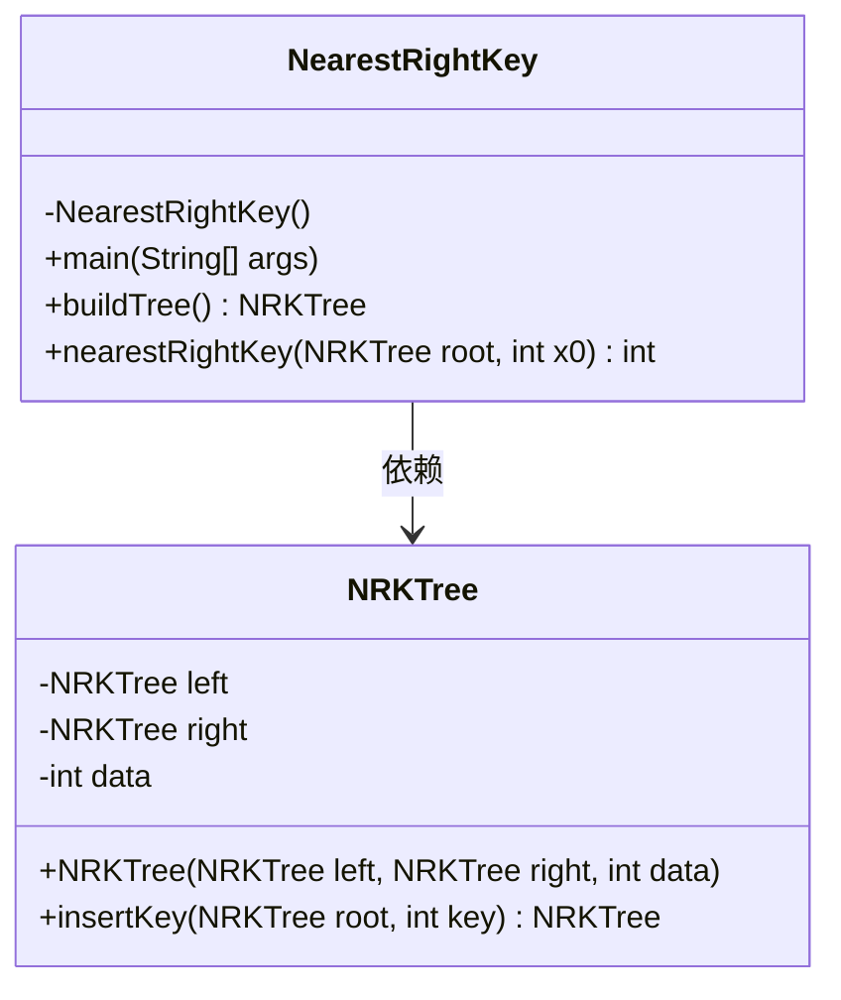
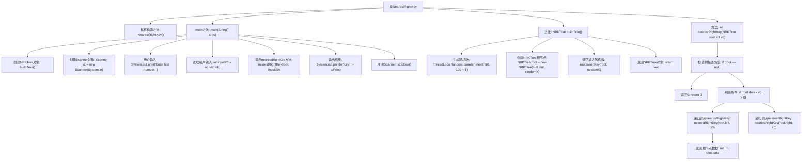
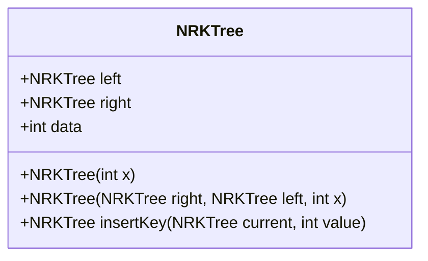
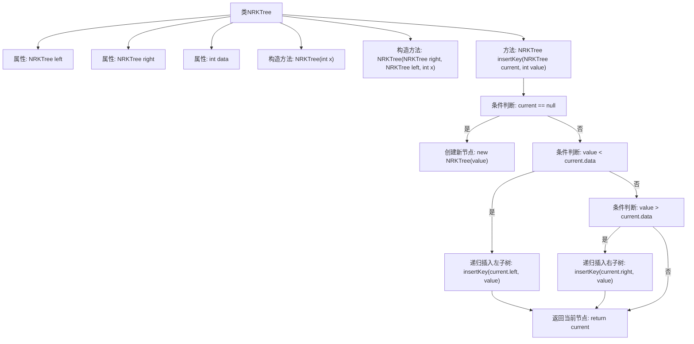

# 基础信息

|      |      |
|------|------|
| 名称 | nearestRightKey |
| 编码语言 | .java |
| 代码路径 | Java/src/main/java/com/thealgorithms/datastructures/trees/nearestRightKey.java |
| 包名 | com.thealgorithms.datastructures.trees |
| 依赖项 | ['java.util.Scanner', 'java.util.concurrent.ThreadLocalRandom'] |
| 概述说明 | NearestRightKey类生成随机树，查找最接近输入值的右节点。NRKTree类实现二叉树，支持插入操作。 |

# 说明

NearestRightKey类用于生成随机树并查找最接近输入值的右节点。NRKTree类实现二叉树结构，包含左右子节点和数据，支持插入操作。NearestRightKey通过NRKTree构建树，并在树中搜索与输入值最接近的右节点。NRKTree提供二叉树的基本功能，包括节点插入和结构维护，确保树的有效性和可操作性。

# 类列表 Class Summary

| 名称   | 类型  | 说明 |
|-------|------|-------------|
| NearestRightKey | class | NearestRightKey类生成随机树并查找最接近输入值的右节点。 |
| NRKTree | class | NRKTree类实现二叉树结构，包含左右子节点和数据，支持插入操作。 |

## 类 NearestRightKey

|      |      |
|------|------|
| 访问范围 | final |
| 类型 | class |
| 名称 | NearestRightKey |
| 说明 | NearestRightKey类生成随机树并查找最接近输入值的右节点。 |

### UML类图

**描述：**
`NearestRightKey` 类是一个工具类，用于在二叉树中查找最接近给定值的右侧键。它包含一个私有的构造函数，确保无法实例化该类。`main` 方法用于从用户输入中获取值并输出结果。`buildTree` 方法生成一个包含随机数据的二叉树，`nearestRightKey` 方法则递归地遍历树以找到最接近的右侧键。`NRKTree` 类表示二叉树的节点，包含左子节点、右子节点和数据，并提供了插入新键的方法。

### 内部方法调用关系图

这段代码定义了一个名为 `NearestRightKey` 的类，主要功能是构建一个随机生成的二叉树，并查找给定值 `x0` 的最近右键。代码通过递归方式遍历树结构，判断当前节点数据与 `x0` 的差值，决定向左或向右递归查找。最终输出找到的最近右键值。

### 字段列表 Field List

| 名称  | 类型  | 说明 |
|-------|-------|------|

### 方法列表 Method List

| 名称  | 类型  | 说明 |
|-------|-------|------|
| main | void | Java程序：构建树，输入数字，查找并打印最近右键值。 |
| nearestRightKey | int | 查找树中大于x0的最小值，返回结果。 |
| buildTree | NRKTree | 构建NRKTree，随机生成1000个0到100的整数并插入树中。 |

## 类 NRKTree

|      |      |
|------|------|
| 访问范围 | None |
| 类型 | class |
| 名称 | NRKTree |
| 说明 | NRKTree类实现二叉树结构，包含左右子节点和数据，支持插入操作。 |

### UML类图

该代码定义了一个名为 `NRKTree` 的类，表示一个二叉树的节点。每个节点包含一个整型数据 `data` 和两个指向左右子节点的引用 `left` 和 `right`。类中提供了两个构造函数，分别用于初始化节点数据和子节点。`insertKey` 方法用于在树中插入一个新节点，根据值的大小递归地将其插入到左子树或右子树中。该类的主要功能是构建和维护一个二叉搜索树。

### 内部方法调用关系图

这段代码定义了一个二叉搜索树（BST）的类 `NRKTree`，包含两个构造方法和一个插入方法。构造方法用于初始化树的节点，而 `insertKey` 方法则用于在树中插入新节点。流程图展示了 `insertKey` 方法的执行过程，包括递归插入左子树或右子树，以及返回当前节点的逻辑。整个过程确保了二叉搜索树的有序性。

### 字段列表 Field List

| 名称  | 类型  | 说明 |
|-------|-------|------|
| data | int | 定义了一个公共整型变量data。 |
| right | NRKTree | 定义了一个名为NRKTree的公共右子树变量。 |
| left | NRKTree | NRKTree对象的左子节点声明。 |

### 方法列表 Method List

| 名称  | 类型  | 说明 |
|-------|-------|------|
| insertKey | NRKTree | NRKTree插入键值方法，递归插入小于左子树，大于右子树。 |

