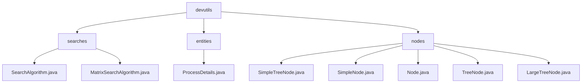

# 基础信息

|      |      |
|------|------|
| 名称 | devutils |
| 编码语言 | .java |
| 代码路径 | Java/src/main/java/com/thealgorithms/devutils |
| 包名 | Java.src.main.java.com.thealgorithms.devutils |
| 概述说明 | 该模块包含搜索算法、进程管理和树节点管理的实现，适用于多种业务场景。 |

# 说明

## 概述
该代码模块主要包含与搜索算法、进程管理和树形数据结构相关的实现。模块提供了基础的搜索算法接口以及针对矩阵的搜索算法实现，适用于多种业务场景。此外，模块还包含用于描述进程详细信息的类，以及围绕树形数据结构的节点管理类，支持不同复杂度的树形数据处理需求。整体设计注重灵活性和复用性，适用于需要处理搜索、进程管理和层级结构的应用场景。

## 主要业务场景
1. **基础搜索**：`SearchAlgorithm.java` 文件定义了通用的搜索算法接口或实现，适用于在数组、列表等线性数据结构中进行元素查找。
2. **矩阵搜索**：`MatrixSearchAlgorithm.java` 文件提供了针对二维矩阵的搜索算法实现，适用于在矩阵中查找特定元素或满足特定条件的元素，例如在图像处理、游戏开发或数据分析中应用。
3. **进程管理**：`ProcessDetails` 类用于描述进程的详细信息，包含进程ID、到达时间、执行时间、等待时间、周转时间和优先级等属性，便于进程的管理和调度。
4. **简单链表节点管理**：`SimpleNode` 类用于表示链表节点，支持节点数据的存储和下一节点的引用操作，适用于简单的链表数据结构管理。
5. **基础树节点管理**：`TreeNode` 类提供了基础的树节点功能，包括父节点引用和节点深度信息，适用于需要处理层级结构的场景。
6. **简单树节点扩展**：`SimpleTreeNode` 类在 `TreeNode` 的基础上扩展了左子节点和右子节点的引用，适用于二叉树的构建和操作。
7. **复杂树节点管理**：`LargeTreeNode` 类进一步增强了节点的管理功能，支持多子节点的操作，适用于需要处理复杂树形结构的场景，如多叉树或森林结构。
8. **泛型数据支持**：所有节点类均基于 `Node` 抽象类的泛型设计，支持多种数据类型的存储和操作，增强了代码的灵活性和复用性。

### 包内部结构视图

该流程图展示了`devutils`目录下的层级结构，包含`searches`、`entities`和`nodes`三个子目录。`searches`目录下有两个Java文件，`entities`目录下有一个Java文件，`nodes`目录下有五个Java文件。每个子目录及其文件都清晰地展示了它们之间的层级关系。

# 文件列表 File List

| 名称   | 类型  | 说明 |
|-------|------|-------------|
| [nodes](nodes/_module.md) | package | 多个Java类扩展Node类，支持树形和链表数据结构，提供初始化、数据访问和节点管理功能。 |
| [entities](entities/_module.md) | package | ProcessDetails类包含进程ID、到达时间、执行时间、等待时间、周转时间和优先级。 |
| [searches](searches/_module.md) | package | 输入内容为空，无法生成总结描述。 |

