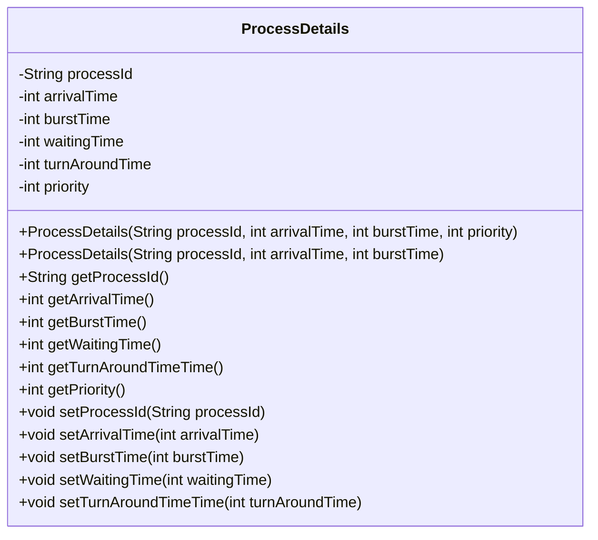

# 基础信息

|      |      |
|------|------|
| 名称 | ProcessDetails |
| 编码语言 | .java |
| 代码路径 | Java/src/main/java/com/thealgorithms/devutils/entities/ProcessDetails.java |
| 包名 | com.thealgorithms.devutils.entities |
| 依赖项 | [] |
| 概述说明 | ProcessDetails类包含进程ID、到达时间、执行时间、等待时间、周转时间和优先级。 |

# 说明

ProcessDetails类用于描述进程的详细信息，包含多个关键属性。进程ID用于唯一标识每个进程。到达时间记录进程进入系统的时间点。执行时间表示进程完成所需的时间长度。等待时间反映进程在系统中等待执行的时间。周转时间是从进程到达系统到完成的总时间。优先级用于确定进程的执行顺序，优先级高的进程优先执行。这些属性共同提供了进程在系统中的全面信息，便于管理和调度。

# 类列表 Class Summary

| 名称   | 类型  | 说明 |
|-------|------|-------------|
| ProcessDetails | class | ProcessDetails类包含进程ID、到达时间、执行时间、等待时间、周转时间和优先级等属性。 |

## 类 ProcessDetails

|      |      |
|------|------|
| 访问范围 | public |
| 类型 | class |
| 名称 | ProcessDetails |
| 说明 | ProcessDetails类包含进程ID、到达时间、执行时间、等待时间、周转时间和优先级等属性。 |

### UML类图

**描述：**  
`ProcessDetails` 类用于表示进程的详细信息，包括进程ID、到达时间、执行时间、等待时间、周转时间和优先级。该类提供了两个构造函数，分别用于初始化带有优先级和不带优先级的进程。此外，类中还包含了多个getter和setter方法，用于获取和设置进程的各项属性。该类主要用于模拟进程调度算法中的进程信息管理。

### 内部方法调用关系图

```mermaid
graph TD
    A["类ProcessDetails"]
    B["属性: String processId"]
    C["属性: int arrivalTime"]
    D["属性: int burstTime"]
    E["属性: int waitingTime"]
    F["属性: int turnAroundTime"]
    G["属性: int priority"]
    H["构造方法: ProcessDetails(String processId, int arrivalTime, int burstTime, int priority)"]
    I["构造方法: ProcessDetails(String processId, int arrivalTime, int burstTime)"]
    J["方法: String getProcessId()"]
    K["方法: int getArrivalTime()"]
    L["方法: int getBurstTime()"]
    M["方法: int getWaitingTime()"]
    N["方法: int getTurnAroundTimeTime()"]
    O["方法: int getPriority()"]
    P["方法: void setProcessId(String processId)"]
    Q["方法: void setArrivalTime(int arrivalTime)"]
    R["方法: void setBurstTime(int burstTime)"]
    S["方法: void setWaitingTime(int waitingTime)"]
    T["方法: void setTurnAroundTimeTime(int turnAroundTime)"]

    A --> B
    A --> C
    A --> D
    A --> E
    A --> F
    A --> G
    A --> H
    A --> I
    A --> J
    A --> K
    A --> L
    A --> M
    A --> N
    A --> O
    A --> P
    A --> Q
    A --> R
    A --> S
    A --> T
```

这段代码定义了一个名为`ProcessDetails`的类，用于表示进程的详细信息。类中包含多个属性，如进程ID、到达时间、执行时间、等待时间、周转时间和优先级等。类提供了两个构造方法，分别用于初始化带优先级和不带优先级的进程。此外，类中还提供了多个getter和setter方法，用于获取和设置各个属性的值。这段代码的主要作用是封装进程的详细信息，并提供对这些信息的访问和修改接口。

### 字段列表 Field List

| 名称  | 类型  | 说明 |
|-------|-------|------|
| processId | String | 定义一个私有字符串类型的变量processId。 |
| burstTime | int | 私有整型变量存储进程执行时间。 |
| turnAroundTime | int | 私有整型变量表示周转时间。 |
| waitingTime | int | 私有整型变量，用于存储等待时间。 |
| arrivalTime | int | 定义私有整型变量arrivalTime。 |
| priority | int | 定义一个私有的整型变量priority。 |

### 方法列表 Method List

| 名称  | 类型  | 说明 |
|-------|-------|------|
| setArrivalTime | void | 设置到达时间的方法，参数为arrivalTime。 |
| getBurstTime | int | 获取任务执行时间的方法。 |
| setTurnAroundTimeTime | void | 设置周转时间的公共方法，接受整数参数。 |
| setWaitingTime | void | 设置等待时间的公共方法，接受整型参数。 |
| getPriority | int | 获取优先级的公共方法，返回整数值。 |
| getTurnAroundTimeTime | int | 获取周转时间的整型值。 |
| setProcessId | void | 设置进程ID的方法。 |
| getProcessId | String | 获取进程ID的方法。 |
| getArrivalTime | int | 获取到达时间的方法。 |
| setBurstTime | void | 设置任务执行时间的公共方法。 |
| getWaitingTime | int | 获取等待时间的方法，返回整型值。 |

